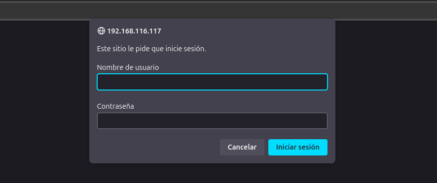
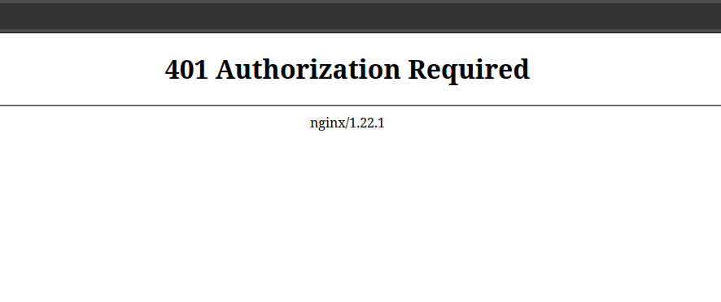
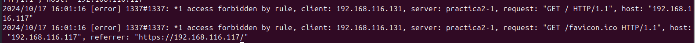
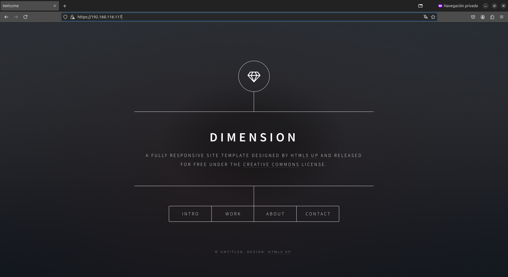

# Práctica 2.2 – Autenticación en Nginx

## Requisitos antes de comenzar la práctica

!!! warning "Atención"
    - No iniciar esta practica hasta haber completado la [práctica2.1](Practica2.1.md)

## Introducción

En el contexto de una transacción HTTP, la autenticación de acceso básica es un método diseñado para permitir a un navegador web, u otro programa cliente, proveer credenciales en la forma de usuario y contraseña cuando se le solicita una página al servidor.

La autenticación básica, como su nombre lo indica, es la forma más básica de autenticación disponible para las aplicaciones Web. Fue definida por primera vez en la especificación HTTP en sí y no es de ninguna manera elegante, pero cumple su función.

Este tipo de autenticación es el tipo más simple disponible péro adolece de importantes problemas de seguridad que no la hacen recomendable en muchas situaciones. No requiere el uso ni de cookies, ni de identificadores de sesión, ni de página de ingreso. 

## Paquetes necesarios

Para esta práctica vamos a necesitar **openssl** para la creación de las claves.

Para estar seguros listaremos las aplicaciones instaladas y mostraremos solo openssl, con el siguiente comando:

```bash
dpkg -l | grep openssl
```

En caso de no tenerlo, lo instalaremos con el siguiente comando

```bash
sudo apt install openssl
```

---

## Creación de usuarios y contraseñas para el acceso web

Para la creación de usuarios y contraseñas necesitaremos crear un archivo oculto llamado **".htpasswd"** en el directorio de configuración /etc/nginx donde 
guardaremos nuestros usuarios y contraseñas.

A continuación crearemos 2 usuarios, uno con tu nombre de usuario y otro con tu primer apellido con los siguientes comandos:

```bash
sudo sh -c "echo -n 'vuestro_nombre:' >> /etc/nginx/.htpasswd"
```

Se vería así:


Y para la creación de la contraseña,

```
sudo sh -c "openssl passwd -apr1 >> /etc/nginx/.htpasswd"
```


Este proceso se podrá repetir para tantos usuarios como haga falta.

- Para comprobar que el usuario y la contraseña aparecen cifrados en el fichero deberemos introducir el siguiente comando:

```bash
cat /etc/nginx/.htpasswd
```

## Configurando el servidor Nginx para usar autenticación básica

Para configurar el servidor Nginx para usar autenticación básica
editaremos la configuración del server block sobre el cual queremos aplicar la restricción de acceso:

```bash
sudo nano /etc/nginx/sites-available/nombre_web
```

Lo primero será decidir qué recursos estarán protegidos. Nginx permite añadir restricciones a nivel de servidor o en un location (directorio o archivo) específico. Para nuestro ejemplo inicial vamos a proteger la raíz, la página principal de nuestro sitio.

Utilizaremos la directiva **```auth_basic```** dentro del location y le pondremos el nombre a nuestro dominio 
que será mostrado al usuario al solicitar las credenciales. Por último, configuramos Nginx para que utilice el
fichero que previamente hemos creado con la **```directiva auth_basic_user_file```** : 


```nginx
    location / {
    auth_basic  "Área restringida";
    auth_basic_user_file    /etc/nginx/.htpasswd;
        try_files $uri $uri/ =404;
    }
```

En nuestro caso al tener configurado el sitio web con https añadiremos este bloque en el apartado de https,
ya que http, se encarga de reenviar automáticamente la petición a https:


Una vez terminada la configuración deberemos reiniciar el servicio para que se aplique la nueva configuración:

```bash
sudo systemctl restart nginx.service
```

## Probando la nueva configuración

!!! note "Comprobación 1"
    Comprueba desde tu máquina física/anfitrión que puedes acceder a ```http://nombre-sitio-web``` y que se te solicita autenticación

- Para esto abriremos una ventana de navegación e intentaremos acceder a la web y como podemos ver solicita la autenticación



!!! note "Comprobación 2"
    Comprueba que si decides cancelar la autenticación, se te negará el acceso al sitio con un error. ¿Qué error es?

- Sí cancelamos la autenticación, saldrá el error 401 Authorization Required



### Tareas 

!!! question "Tarea1"
    - Intenta entrar primero con un usuario erróneo y luego con otro correcto. Puedes ver todos los sucesos y registros en los logs access.log y error.log

    - Adjunta una captura de pantalla de los logs donde se vea que intentas entrar primero con un usuario inválido y con otro válido. Indica dónde podemos ver los errores de usuario inválido o no encontrado, así como donde podemos ver el número de error que os aparecía antes

- Primero intentamos entrar con un usuario llamado pepe péro este al ser erróneo no nos deja acceder quedan reflejados en ambos .log
    posteriormente si intentamos acceder con el usuario correcto si nos dejara.


!!! question "Tarea2"
    Borra las dos líneas que hacen referencia a la autenticación básica en el location del directorio raíz. Tras ello, añade un nuevo location debajo con la autenticación básica para el archivo/sección contact.html únicamente. 

- Para esto borraremos las líneas que hace referencia a la autenticación básica en el location del directorio raíz, tras ello añadiremos el siguiente bloque

```nginx
location /contact.html {
    auth_basic  "Área restringida";
    auth_basic_user_file    /etc/nginx/.htpasswd;
}
```

### Combinación de la autenticación básica con la restricción de acceso por IP

La autenticación básica HTTP puede ser combinada de forma efectiva con la restricción de acceso por dirección IP. Se pueden implementar dos escenarios:

    Un usuario debe estar ambas cosas, autenticado y tener una IP válida

    Un usuario debe o bien estar autenticado, o bien tener una IP válida

Veamos cómo lo haríamos:

    Como permitir o denegar acceso sobre una IP concreta (directivas **allow** y **deny**, respectivamente). Dentro del block server o archivo de configuración del dominio web: 

```nginx
location /api {
    deny 192.168.1.2;
    allow 192.168.1.1/24;
    allow 127.0.0.1;
    deny all;
}
```
El acceso se garantizará a la IP 192.168.1.1/24, excluyendo a la dirección 192.168.1.2.

Hay que tener en cuenta que las directivas allow y deny se irán aplicando en el orden en el que aparecen el archivo.

Aquí aplican sobre la location /api (esto es solo un ejemplo de un hipotético directorio o archivo), pero podrían aplicar sobre cualquiera, incluida todo el sitio web, la location raíz /.

La última directiva deny all quiere decir que por defecto denegaremos el acceso a todo el mundo. Por eso hay que poner los allow y deny más específicos justo antes de esta, porque al evaluarse en orden de aparición, si los pusiéramos debajo se denegaría el acceso a todo el mundo, puesto que deny all sería lo primero que se evaluaría.

Combinar la restricción IP y la autenticación HTTP con la directiva **satisfy**.

Si establecemos el valor de la directiva a “all”, el acceso se permite si el cliente satisface ambas condiciones (IP y usuario válido). Si lo establecemos a “any”, el acceso se permite si se satisface al menos una de las dos condiciones.

```nginx
location/api{
    satisfy all;
    
    deny 192.168.1.2;
    allow 192.168.1.1/24;
    allow 127.0.0.1;
    deny all;

    auth_basic  "Administrator's Area';
    auth_basic_usr_file conf/htpasswd;
}
```

## Tareas

!!! question "Tarea 1"
    Configura Nginx para que no deje acceder con la IP de la máquina anfitriona al directorio raíz de una de tus dos webs. Modifica su server block o archivo de configuración. Comprueba como se deniega el acceso: 

Para denegar el acceso a nuestra maquina anfitriona modificaríamos el bloque ```location /``` quedando así:

```nginx
location / {
    deny 192.168.116.131/24;

    try_files $uri $uri/ =404;
}
```

Al intentar acceder desde el navegador nos mostrará este error:


Y en error.log quedaría reflejado así:



!!! question "Tarea2"
    Configura Nginx para que desde tu máquina anfitriona se tenga que tener tanto una IP válida como un usuario válido, ambas cosas a la vez, y comprueba que sí puede acceder sin problemas

Para conseguir esto modificaremos el bloque ```location /{}``` para que nuestra ip sea válida y un usuario válido

```nginx
location / {
    satisfy all;

    allow 192.168.116.131/24;
    deny all;

    auth_basic  "Área restringida";
    auth_basic_user_file    /etc/nginx/.htpasswd;
    try_files $uri $uri/ =404;
}
```

Tras esto intentaremos acceder a nuestra web y como podemos ver nos deja.




## Cuestiones finales

!!! note "Cuestión 1"
    Supongamos que yo soy el cliente con la IP 172.1.10.15 e intento acceder al directorio web_muy_guay de mi sitio web, equivocándome al poner el usuario y contraseña. ¿Podré acceder?¿Por qué?

    ```nginx
    location /web_muy_guay {
        #...
        satisfy all;    
        deny  172.1.10.6;
        allow 172.1.10.15;
        allow 172.1.3.14;
        deny  all;
        auth_basic "Cuestión final 1";
        auth_basic_user_file conf/htpasswd;
    }
    ```

- No podré acceder, ya que a pesar de que mi IP está permitida, al no introducir bien el usuario y tener la directiva satisfy all no cumplo los requisitos

!!! note "Cuestión 2"
    Supongamos que yo soy el cliente con la IP 172.1.10.15 e intento acceder al directorio web_muy_guay de mi sitio web, introduciendo correctamente usuario y contraseña. ¿Podré acceder? ¿Por qué?

    ```nginx
    location /web_muy_guay {
        #...
        satisfy all;    
        deny  all;
        deny  172.1.10.6;
        allow 172.1.10.15;
        allow 172.1.3.14;

        auth_basic "Cuestión final 2: The revenge";
        auth_basic_user_file conf/htpasswd;
    }
    ```

- No podré acceder, ya que mi IP no está permitida, pues la configuración cuenta con una directiva para denegar mi acceso.

!!! note "Cuestión 3"
    Supongamos que yo soy el cliente con la IP 172.1.10.15 e intento acceder al directorio web_muy_guay de mi sitio web, introduciendo correctamente usuario y contraseña. ¿Podré acceder? ¿Por qué?

    ```nginx
    location /web_muy_guay {
        #...
        satisfy any;    
        deny  172.1.10.6;
        deny 172.1.10.15;
        allow 172.1.3.14;

        auth_basic "Cuestión final 3: The final combat";
        auth_basic_user_file conf/htpasswd;
    }
    ```

- Si podré acceder, ya que a pesar de que IP no está permitida, la configuración cuenta con la directiva satisfy any, entonces al introducir el usuario correctamente cumplo los requisitos para establecer la conexión.

!!! note "Cuestión 4"
    A lo mejor no sabéis que tengo una web para documentar todas mis excursiones espaciales con Jeff, es esta: Jeff Bezos y yo

    Supongamos que quiero restringir el acceso al directorio de proyectos porque es muy secreto, eso quiere decir añadir autenticación básica a la URL:Proyectos

    Completa la configuración para conseguirlo:

    ```nginx
    server {
    listen 80;
    listen [::]:80;
    root /var/www/freewebsitetemplates.com/preview/space-science;
    index index.html index.htm index.nginx-debian.html;
    server_name freewebsitetemplates.com www.freewebsitetemplates.com;
    location              {

        try_files $uri $uri/ =404;
        }
    }
    ```

- Para eso añadiremos configuraremos un nuevo location para ello:

```nginx
    server {
    listen 80;
    listen [::]:80;
    root /var/www/freewebsitetemplates.com/preview/space-science;
    index index.html index.htm index.nginx-debian.html;
    server_name freewebsitetemplates.com www.freewebsitetemplates.com;
    location  / {
        try_files $uri $uri/ =404;
        }

    location /project.html {
        satisfy all;

        allow 192.168.116.131/24;
        deny all;

        auth_basic  "Área restringida";
        auth_basic_user_file    /etc/nginx/.htpasswd;
        }
    }
```
