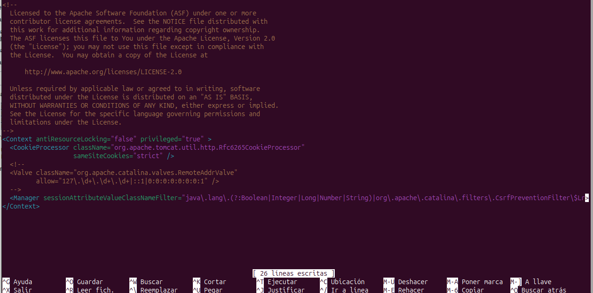
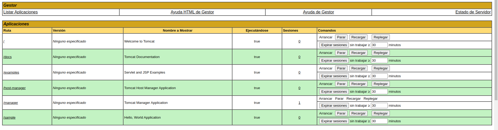
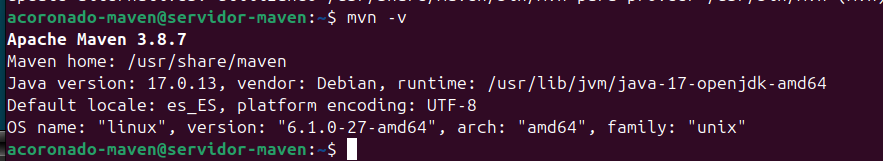
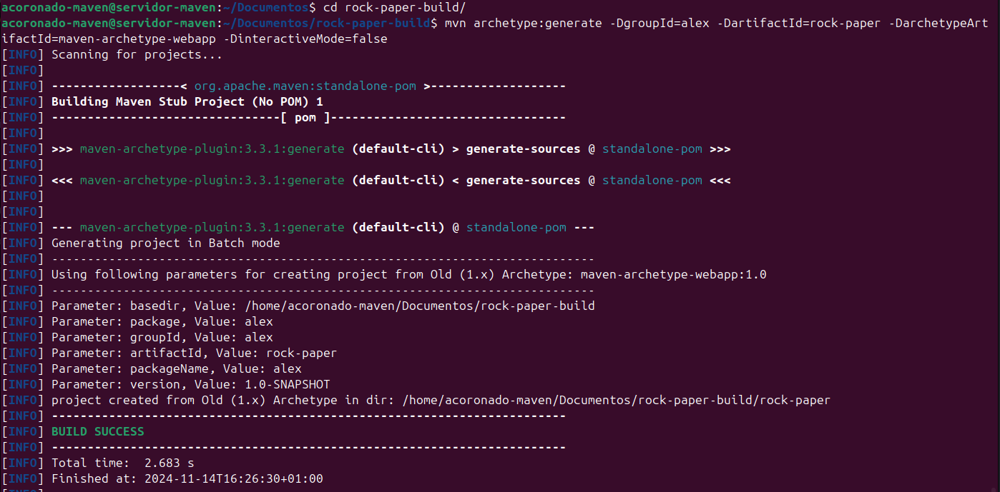
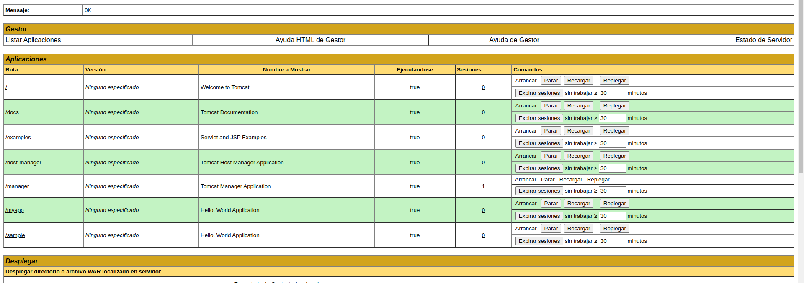

# Práctica 3.1: Instalación de Tomcat y despliegue con Maven

## Introducción

La presente práctica tiene como objetivo guiar a través del proceso de instalación, configuración y puesta en marcha de Apache Tomcat en un entorno de trabajo. Durante esta práctica, se detallarán los pasos necesarios para la descarga, instalación y configuración básica de Tomcat, junto con la puesta en funcionamiento del servidor y la implementación de una aplicación de prueba para verificar su correcto funcionamiento. También se explorarán configuraciones básicas de seguridad y optimización del servidor, que son esenciales en un entorno de producción.

## Instalación Tomcat

Nosotros para la instalación de Tomcat lo haremos de la siguiente manera:

Lo primero que haremos sera comprobar si existen actualizaciones para nuestro equipo mediante el comando: 


```bash
sudo apt update
```

Tras esto instalaremos UFW(https://linuxhint.com/debian_firewalls_ufw/) para poder abrir el puerto 8080 el cual es usado por defecto para mostrar las páginas web con el comando: ```sudo ufw allow 8080```


Tras esto procederemos a installar java con el siguiente comando

```bash
sudo apt install openjdk-17-jdk -y
```

Una vez se haya completado la instalación deberemos comprobar que se ha instalado correctamente esto lo podremos hacer mediante el comando: **```java -version```**


A continuación de la instalación de Java procederemos a la instalación de tomcat para esto descargaremos el archivo tar.gz de la web usando el siguiente comando.

```bash
wget https://dlcdn.apache.org/tomcat/tomcat-10/v10.1.33/bin/apache-tomcat-10.1.33.tar.gz
```


Tras esto crearemos el usuario y grupo con el que Tomcat 10 se ejecutara como servicio:

```bash
sudo useradd -U -m -d /opt/tomcat -k /dev/null -s /bin/false tomcat
```

Descomprimimos el paquete que acabamos de descarga en la ruta que hemos establecido como directorio personal del usuario tomcat:

```bash
sudo tar xf apache-tomcat-10.1.33.tar.gz -C /opt/tomcat/
```

Tras esto le asignamos la propiedad de estos archivos al usuario tomcat

```bash
sudo chown tomcat: /opt/tomcat/ -R
```

Como el subdirectorio que se acaba de crear contiene números de versión en su nombre, podemos renombrarlo o crear un enlace simbólico sin números de versión, para facilitar la instalación y mantenimiento:

```bash
sudo ln -s /opt/tomcat/apache-tomcat-10.1.24/ /opt/tomcat/apache-tomcat
```

A continuación crearemos el archivo de unidad para Systemd:

```bash
sudo nano /etc/systemd/system/tomcat10.service
```

Y lo rellenamos con el siguiente contenido

```bash
[Unit]
Description=Tomcat 10.1 servlet container para Debian 12 Bookworm
After=network.target
[Service]
Type=forking
User=tomcat
Group=tomcat
Environment="JAVA_OPTS=-Djava.security.egd=file:///dev/urandom"
Environment="CATALINA_BASE=/opt/tomcat/apache-tomcat"
Environment="CATALINA_HOME=/opt/tomcat/apache-tomcat"
Environment="CATALINA_PID=/opt/tomcat/apache-tomcat/temp/tomcat.pid"
Environment="CATALINA_OPTS=-Xms512M -Xmx1024M -server -XX:+UseParallelGC"
ExecStart=/opt/tomcat/apache-tomcat/bin/startup.sh
ExecStop=/opt/tomcat/apache-tomcat/bin/shutdown.sh
[Install]
WantedBy=multi-user.target
```

Tras esto iniciamos el servicio con ```sudo systemctl start tomcat10``` y posteriormente comprobamos su estado para ver si todo ha ido bien


Por ultimo comprobaremos si podemos acceder a Tomcat desde un navegador en este caso nos conectaremos desde la máquina anfitriona desde el navegador mediante la url ```http://[IP-MAQUINA-VIRTUAL]:8080```

Y si todo funciona deberia de mostrarnos algo así:


Ahora para poder acceder al area de administración deberemos crear un usuario en ```sudo nano /opt/tomcat/apache-tomcat/conf/tomcat-users.xml```. En mi caso creare el usuario:

```xml
<role rolename="admin"/>
<role rolename="admin-gui"/>
<role rolename="manager"/>
<role rolename="manager-gui"/>

<user username="acoronado" password="usuario123" roles="admin,admin-gui,manager,manager-gui"/>
```

Ahora instalaremos el panel de control para tomcat, en este caso al contar con la versión 10 lo haremos de la siguiente manera:

```zsh
sudo apt install tomcat10-admin
```

Las aplicaciones administrativas, /manager tiene restringido el acceso permitiendo únicamente conexiones locales. Para permitir acceso desde red, útil para subir los archivos .war desde nuestra máquina anfitriona deberemos editar el archivo context.xml

```
sudo nano /opt/tomcat/apache-tomcat/webapps/manager/META-INF/context.xml
```

Buscamos la clausula valve y la encerramos en un bloque de comentarios



Y reiniciamos el servicio tomcat. Ahora si intentasemos acceder al manager deberia permitinos iniciar sesión con las credenciales anteriormente creadas.


Una vez introducidas las credenciales deberiamos de ver un menu como este en el cual podemos administrar nuestro servidor.


## Despliegue manual mediante la GUI de administración

Para desplegar un archivo [WAR](https://tomcat.apache.org/tomcat-6.0-doc/appdev/sample/) usando el panel de administración seguiremos estos pasos: 

1. Iniciaremos sesión con la cuenta que hemos creado anteriormente.
2. Buscamos el apartado donde nos permite desplegar un WAR manualmente, selecionamos nuestro archivo y lo desplegamos.


Tras subir el archivo, en la ruta de aplicaciones se mostrara y podremos acceder a el.




## Despliegue con Maven

### Instalación de Maven

Para instalar Maven usaremos el gestor de paquetes APT. 


Lo primero que haremos sera comprobar si existen actualizaciones para nuestro equipo mediante el comando: 


```bash
sudo apt update
```

E instalamos Maven

```bash
sudo apt install maven
```

Para compprobar que todo ha ido correctamente, podemos ver la versión instalada de Maven:

```bash
mvn -v
```


### Configuración de Maven

Para poder realizar despliegues en nuestro Tomcat previamente instalado, necesitamos realizar la configuración adecuada para Maven.

!!! Warning "Tomcat9"
  Esto solo funcionara si tenemos instalada la versión 9 de tomcat o anteriores.

1. En primer lugar crearemos un usuario nuevo en tomcat con solo el rol manager-script para permitir que Maven se autentique contra Tomcat y pueda realizar el despliegue

```xml
<role rolename="manager-script"/>

<user username="acoronado-deploy" password="usuario" roles="manager-script"/>
```


2.Editar el archivo /etc/maven/settings.xml para indicarle a Maven, un identificador para el servidor sobre el que vamos a desplegar (no es más que un nombre, ponedle el nombre que consideréis), así como las credenciales. Todo esto se hará dentro del bloque servers del XML:

```xml
<server>
  <id>Tomcat.P.3.1</id>
  <username>acoronado-deploy</username>
  <password>usuario</password>
</server>
```

Por último clonaremos este proyecto para desplegarlo con maven
```git clone https://github.com/cameronmcnz/rock-paper-scissors.git```

3. Una vez clonado deberemosmodificar el POM del proyecto para que haga referencia a que el despliegue se realice con el plugin de Maven para Tomcat

```xml
<build>
  <finalName>rock-deploy</finalName> #


  <plugins> 
  <plugin>
  <groupId>org.apache.tomcat.maven</groupId>
  <artifactId>tomcat7-maven-plugin</artifactId>
  <version>2.2</version>
  <configuration>
      <url>http://localhost:8080/manager/text</url> #


      <server>Tomcat.P.3.1</server> #


      <path>/myapp</path> #


  </configuration>
  </plugin>
  </plugins>
</build>
```

### Despliegue

Para desplegar el proyecto que tenemos configurado deberemos crear una carpeta vacia y situarnos en ella. Una vez en ella ejecutaremos el comando: 

```
mvn archetype:generate -DgroupId=alex -DartifactId=rock-paper -DarchetypeArtifactId=maven-archetype-webapp -DinteractiveMode=false
```

Tras esto deberia de verse que la build fue exitosa



Tras generar esta aplicación, los comandos finales que se utilizan en Maven para desplegar, volver a desplegar o desplegar una aplicación, son:

- ```mvn tomcat7:deploy```
- ```mvn tomcat7:redeploy```
- ```mvn tomcat7:undeploy```

