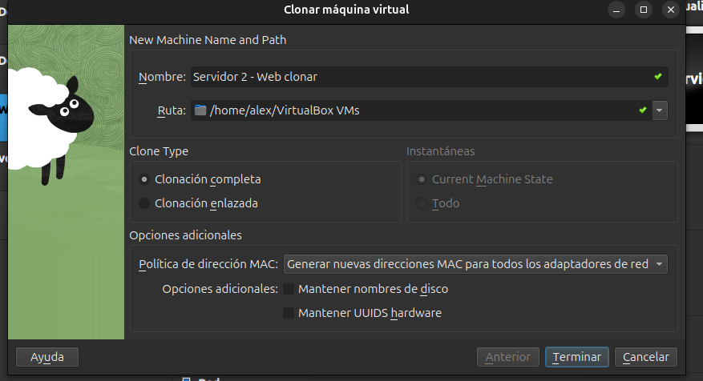
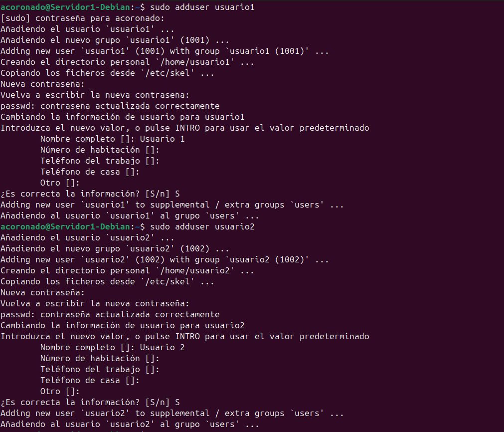
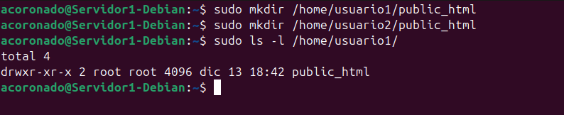
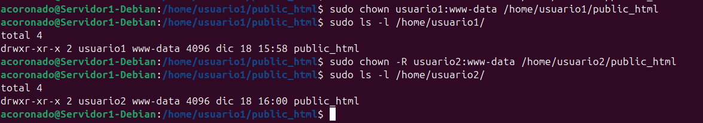
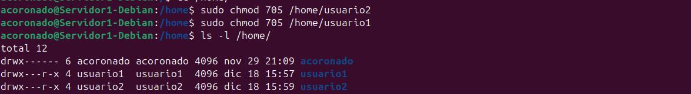
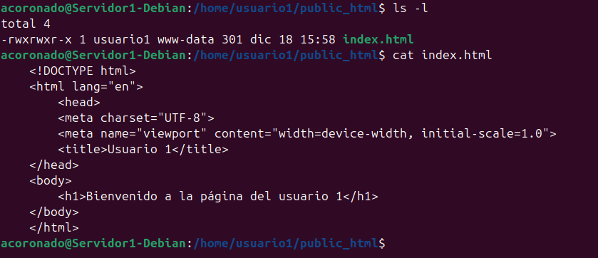
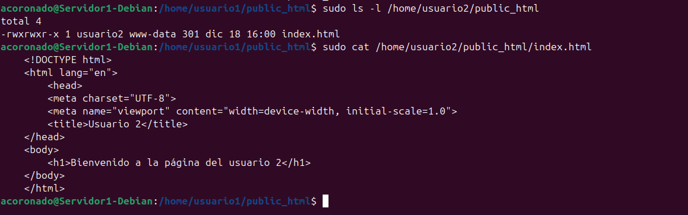
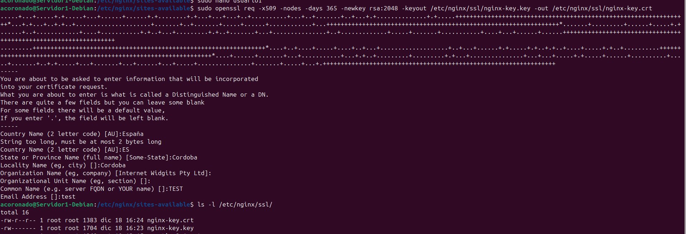
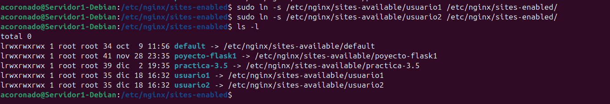

# **Práctica de Ampliación**

En esta práctica lo que haremos será configurar Nginx para que utilice hosts virtuales para alojar
múltiples sitios web en un solo servidor y que cada host virtual apunte al directorio public_html
de distintos usuarios del sistema operativo Debian. De esta manera, cada usuario podrá gestionar 
su propio sitio web desde su carpeta personal.

## **1. Instalación de Nginx**

Para agilizar este proceso simplemente clonaremos una de las máquinas virtuales de las prácticas anteriores.
Clonaremos la que tiene Nginx instalado y tenga pocas configuraciones aplicadas en mi caso será una de las máquinas virtuales
que usamos como servidor web para el servidor proxy.




!!! warning "Importante"
    Recordad que deberemos seleccionar la opción de generar una nueva dirección MAC para la máquina virtual
    para que todo funcione correctamente.

## **2. Creación de usuarios**

Tras completar la clonación deberemos crear 2 usuarios para esta práctica. En este caso los llamaremos usuario1 y usuario2 paro eso
ejecutaremos los siguientes comandos.

```bash
sudo adduser usuario1
sudo adduser usuario2
```



Además durante la creación de usuarios, se nos pedirá que le asignemos una contraseña a los nuevo usuarios, a parte de otras opciones
de configuración más.

### **2.1 Creación de carpetas public_html**

Una vez que hayamos creado los usuarios deberemos crear las carpetas `public_html` en los directorios personales de usuario1 y usuario2
para ello usaremos los siguientes comandos:

```bash
sudo mkdir /home/usuario1/public_html
sudo mkdir /home/usuario2/public_html
```




Y cuando hayamos creado estas carpetas le cambiaremos los propietarios para que puedan usarlas los usuarios correspondientes.

```
sudo chown usuario1:www-data /home/usuario1/public_html
sudo chown usuario2:www-data /home/usuario2/public_html
```



También en la carpeta home le daremos permisos al resto de usuarios para que puedan leer y ejecutar archivos en los directorios 
personales de los usuarios con el fin de permitirle a nginx acceder a los archivos html



### **2.2 Creación HTML básico**

A continuación dentro de las carpetas `public_html` crearemos un html básico para que nginx pueda mostrar
algo cuando nos conectemos, además nos permitirá identificar a qué usuario pertenece la página a la que nos conectamos.

Para eso usaremos los siguientes html los cuales nombraremos como index.html:


=== "usuario 1"

    ```html
    <!DOCTYPE html>
    <html lang="en">
        <head>
        <meta charset="UTF-8">
        <meta name="viewport" content="width=device-width, initial-scale=1.0">
        <title>Usuario 1</title>
    </head>
    <body>
        <h1>Bienvenido a la página del usuario 1</h1>
    </body>
    </html>
    ```

=== "usuario 2"

    ```html
    <!DOCTYPE html>
    <html lang="en">
        <head>
        <meta charset="UTF-8">
        <meta name="viewport" content="width=device-width, initial-scale=1.0">
        <title>Usuario 2</title>
    </head>
    <body>
        <h1>Bienvenido a la página del usuario 2</h1>
    </body>
    </html>
    ```





!!! warning "Permisos"
    Es importante que tras la creación de estos archivos comprobemos los archivos con los que se han creado
    y en caso de que no permitan a otros usuarios ejecutar el archivo deberemos ejecutar el siguiente comando
    para cambiar los permisos del archivo:
    ```
    sudo chmod 775 index.html
    ```

## **3. Configuración NGINX**

### **3.1 Creación claves SSL**

En este apartado le añadiremos a nuestro servidor una capa de seguridad necesaria. Haremos que todos nuestros sitios web alojados hagan uso de certificados SSL y se acceda a ellos por medio de HTTPS.

Para esto primero tendremos que generar un clave SSL con el siguiente comando, esta opción solo es válida si solo necesitas cifrado sin preocuparte por las advertencias de los navegadores sobre la validez del certificado:

```bash
sudo openssl req -x509 -nodes -days 365 -newkey rsa:2048 -keyout /etc/nginx/ssl/nginx-key.key -out /etc/nginx/ssl/nginx-key.crt
```



### **3.2 Archivos de configuración NGINX**

Tras haber creado los usuarios y haberlos configurado procederemos a crear las configuraciones de nginx para cada sitio para esto 
crearemos un archivo de configuración para cada usuario

=== "Usuario 1"

    ```nginx
    server {
        listen 443 ssl;
        server_name usuario1 www.usuario1;

        ssl_certificate /etc/nginx/ssl/nginx-key.crt;
        ssl_certificate_key /etc/nginx/ssl/nginx-key.key;

        ssl_protocols TLSv1.2 TLSv1.3;
        ssl_ciphers 'ECDHE-ECDSA-AES128-GCM-SHA256:ECDHE-RSA-AES128-GCM-SHA256:ECDHE-ECDSA-AES256-GCM-SHA384:ECDHE-RSA-AES256-GCM-SHA384';
        ssl_prefer_server_ciphers on;
        ssl_session_cache shared:SSL:10m;

        access_log /var/log/nginx/usuario1.access.log;
        error_log /var/log/nginx/usuario1.error.log;


        root /home/usuario1/public_html;
        index index.html;

        location / {
            try_files $uri $uri/ =404;
        }
    }
    ```

=== "Usuario 2"

    ```nginx
    server {
        listen 443 ssl;
        server_name usuario2 www.usuario2;

        ssl_certificate /etc/nginx/ssl/nginx-key.crt;
        ssl_certificate_key /etc/nginx/ssl/nginx-key.key;

        access_log /var/log/nginx/usuario2.access.log;
        error_log /var/log/nginx/usuario2.error.log;


        ssl_protocols TLSv1.2 TLSv1.3;
        ssl_ciphers 'ECDHE-ECDSA-AES128-GCM-SHA256:ECDHE-RSA-AES128-GCM-SHA256:ECDHE-ECDSA-AES256-GCM-SHA384:ECDHE-RSA-AES256-GCM-SHA384';
        ssl_prefer_server_ciphers on;
        ssl_session_cache shared:SSL:10m;

        root /home/usuario2/public_html;
        index index.html;

        location / {
            try_files $uri $uri/ =404;
        }
    }
    ```


Tras esto crearemos los enlaces simbólicos en `etc/nginx/sites-enabled` para que indicarle a nginx que estos archivos
de configuración están activos.

```bash
sudo ln -s /etc/nginx/sites-available/usuario1 /etc/nginx/sites-enabled/
sudo ln -s /etc/nginx/sites-available/usuario2 /etc/nginx/sites-enabled/
```



Y por último reiniciaremos el servicio de nginx para que se apliquen los cambios.

```bash
sudo systemctl restart nginx
```

## **4. Configuración equipo Anfitrión**

Por último, configuraremos el archivo `hosts` de nuestra máquina anfitriona para poder conectarnos
a estas webs, para esto modificaremos el siguiente archivo `/etc/hosts`:

```
sudo nano /etc/hosts
```

En donde añadiremos la ip y el nombre del dominio:

```
192.168.116.144 usuario1 www.usuario1
192.168.116.144 usuario2 www.usuario2
```

Ahora intentaremos conectarnos mediante el navegador y este nos lanzará una advertencia de que el sitio no es seguro esto se debe a que hemos
autofirmado los certificados SSL, porque ignoraremos esta advertencia.

Y como podemos ver ambas páginas se muestran perfectamente.


