# **Práctica 5.1 - Ejercicios de Git y Github**

## **Repositorio DEAW**

1. Crear un repositorio en vuestro Github llamado DEAW

    - Para crear un repositorio en github nos iremos al inicio y haremos clic en new:

    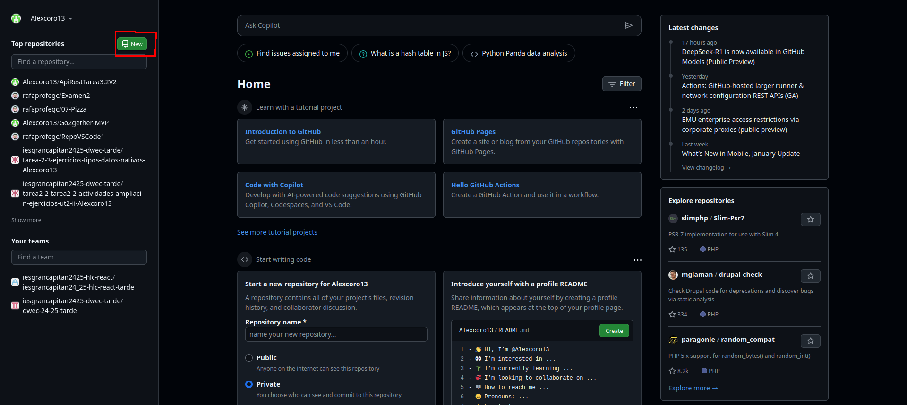

    - Tras esto nos aparecerá la página para crear el repositorio en github

    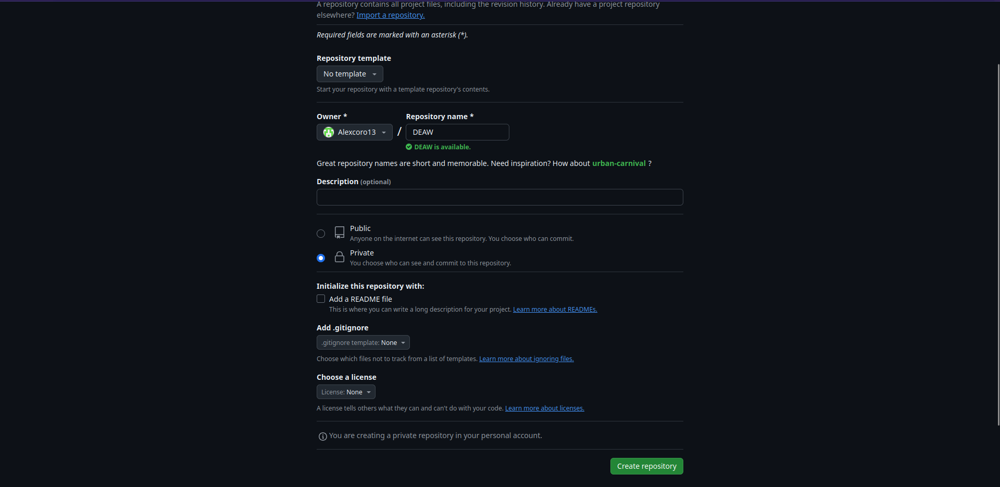

2. Clonar vuestro repositorio en local

    - Para clonar nuestro repositorio en local deberemos ejecutar el siguiente comando:

    ```
    git clone (url del repositorio)
    ```

    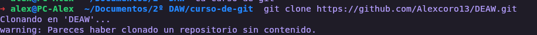


## **README**

1. Crear(si no lo habeis hecho ya) en vuestro repositorio local un documento README.md

	- Para crear un archivo README.md usaremos el siguiente comando:

	```bash
	nano README.md
	```

	Y añadiremos un pequeño texto al mismo.

	

## **Commit Inicial**

1. Realizar un commit inicial con el comentario `Comenzamos con los ejercicios de Git`

	- Para hacer un commit primero necesitamos añadir los archivos a los que queramos incluir
	en el commit.

	```
	git add README.md
	```

	- Y así habremos preparado el archivo el README.md para el commit.

	```
	git commit -m "Comenzamos con los ejercicios de Git
	```

	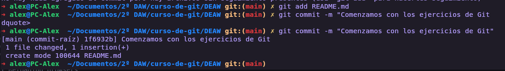

## **Push inicial**

1. Subir los cambios al repositorio remoto

	```
	git push
	```
	
	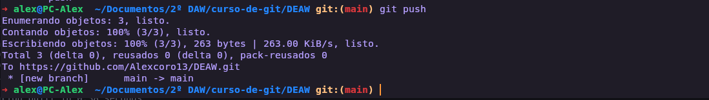

## **Ignorar archivos**

1. Crear en el repositorio local un fichero llamado privado.txt.
	- Crearemos el fichero con `nano` y lo dejaremos vacío

	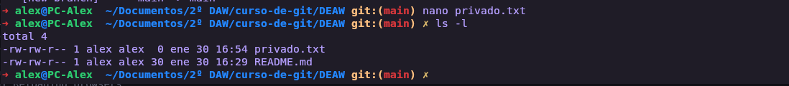

2. Crear en el repositorio local una carpeta llamada privada.

	- Y para crear la carpeta lo haremos con `mkdir`

	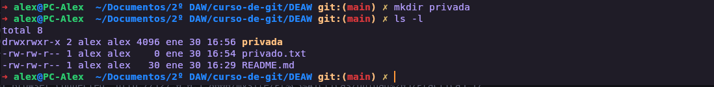

3. Realizar los cambios oportunos para que tanto el archivo como la carpeta sean ignorados por git.

	- Una vez que tenemos los archivos creados necesitaremos crear un archivo llamado `.gitignore` 
	en donde incluiremos los archivos y directorios anteriores para excluirlos.

	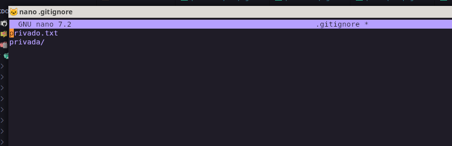

## **Añadir fichero 1.txt**

1. Añadir fichero `1.txt` al repositorio local.

	- Ahora creamos el archivo y lo añadimos con git add

	```
	git add 1.txt
	```

	

## **Crear el tag v0.1**

1. Crea un tag llamado **v0.1**

	```
	git tag V0.1
	```

	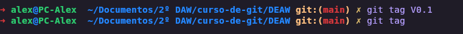

## **Subir el tag v0.1**

1. Subir los cambios al repositorio remoto.

	- Para subir el tag v0.1 usaremos el siguiente comando

	```
	git push --tags
	```

	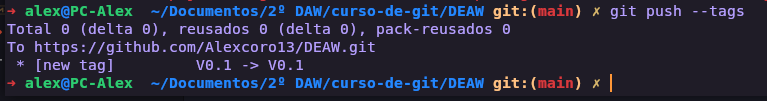


## **Cuenta de github**

1. Poner una foto en vuestro perfil de GitHub

	- Para cambiar la foto de perfil deberemos ir a configuración de github y hacer clic en cambiar foto

	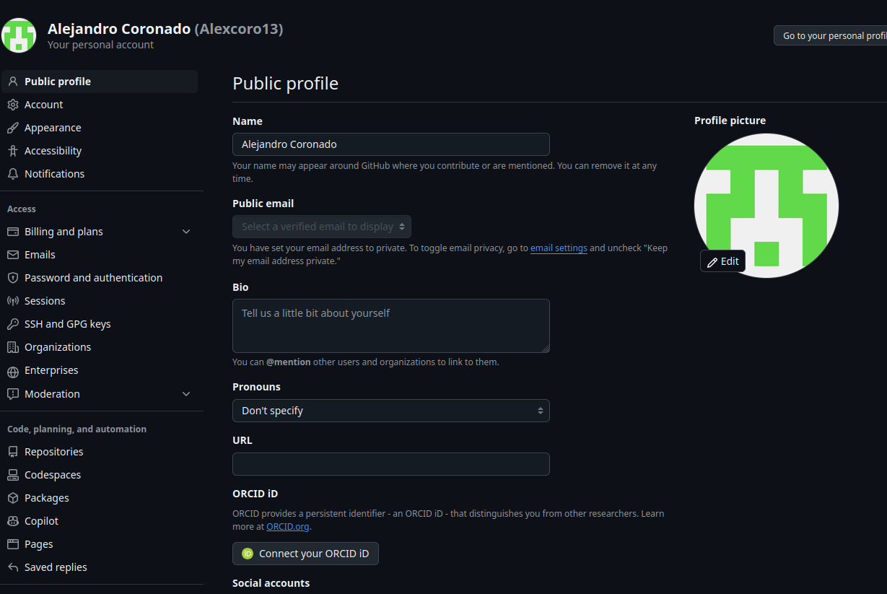

	Y como podemos ver ya hemos cambiado la foto

	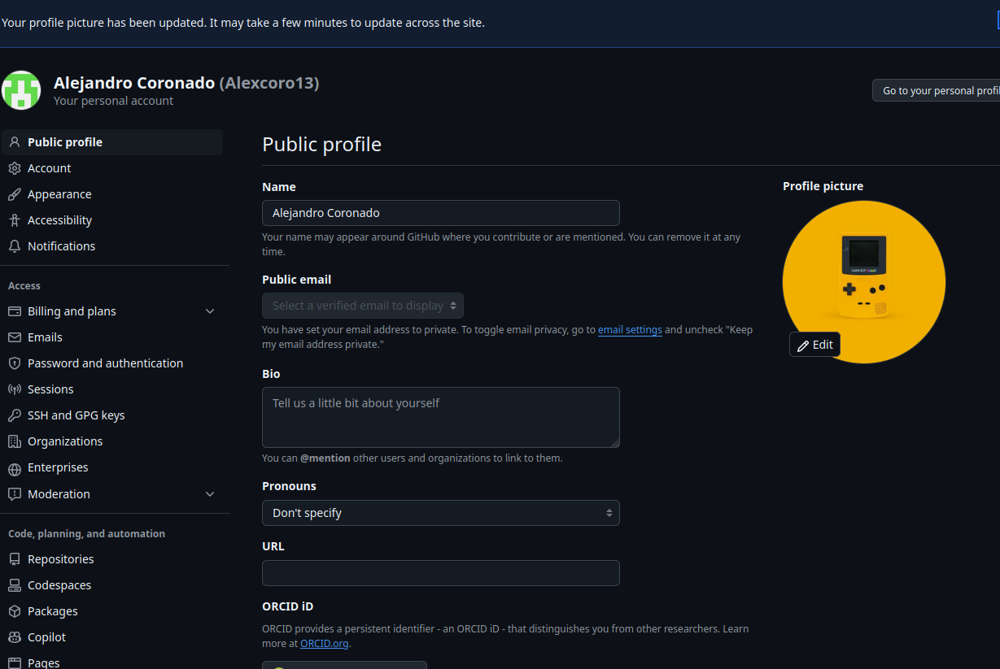


2. Poner el doble factor de autentificación en vuestra cuenta de Github

	- Para añadir el doble factor de autentificación deberemos irnos al apartado de 
	contraseñas y autenticación, en donde añadiremos los métodos de autenticación de doble factor que queramos.

	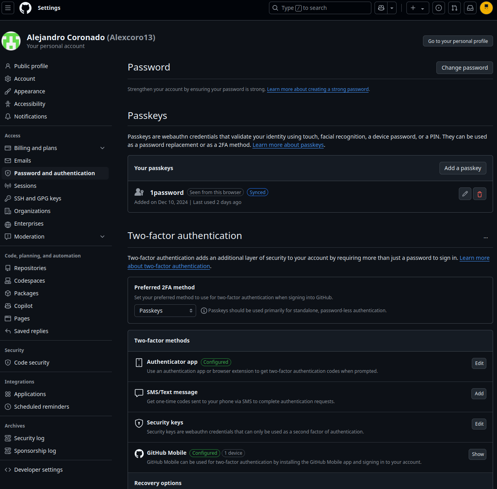

## **Uso social de github**

1. Preguntar los nombres de usuario de GitHub de 2 de tus compañeros de clase, búscalos, y síguelos.

	- Buscamos los usuarios y le damos a seguir:

	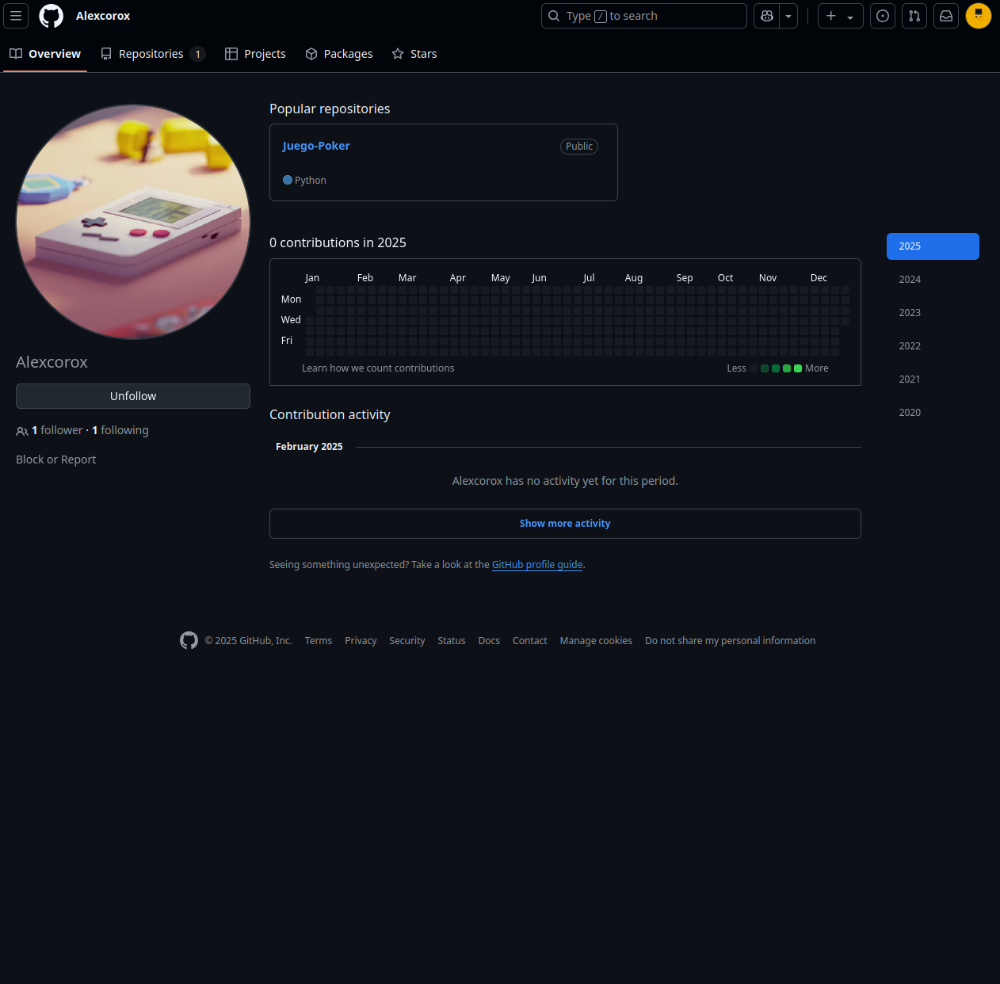

	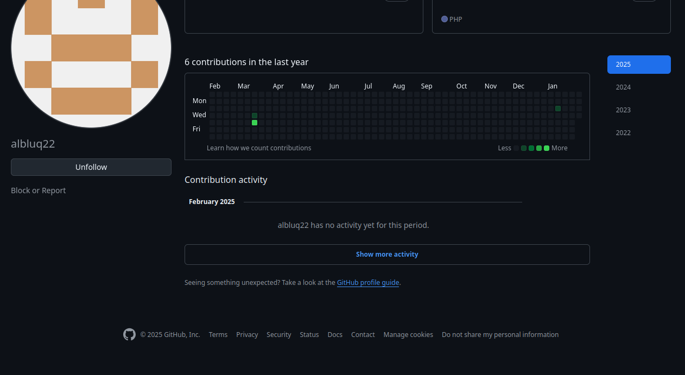

2. Seguir los repositorios DEAW del resto de tus compañeros.

	- Dentro del repositorio, le daremos a watch all activity y ya estaremos 
	siguiendo el repositorio

	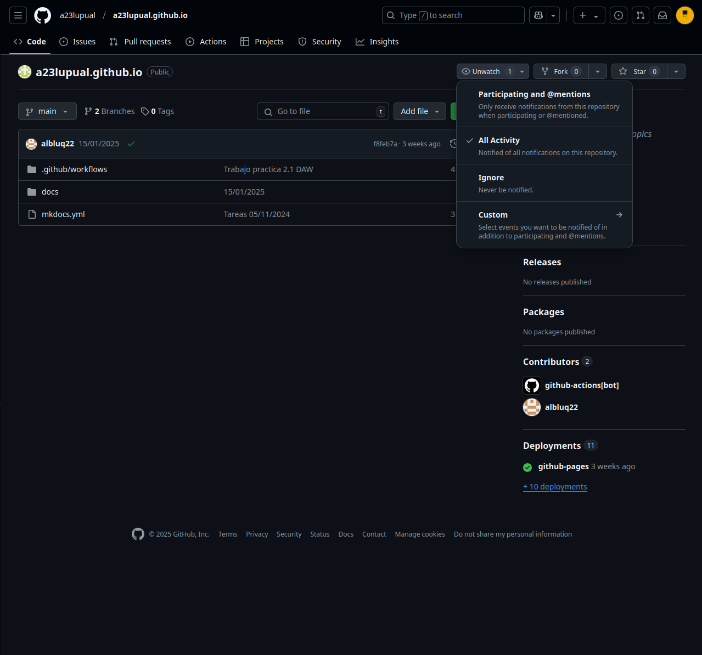

	Y para seguir al resto seria igual.

3. Añadir una estrella a los repositorios DEAW del resto de tus compañeros.

	- Para dar una estrella haremos clic en star y así habremos dado una estrella

	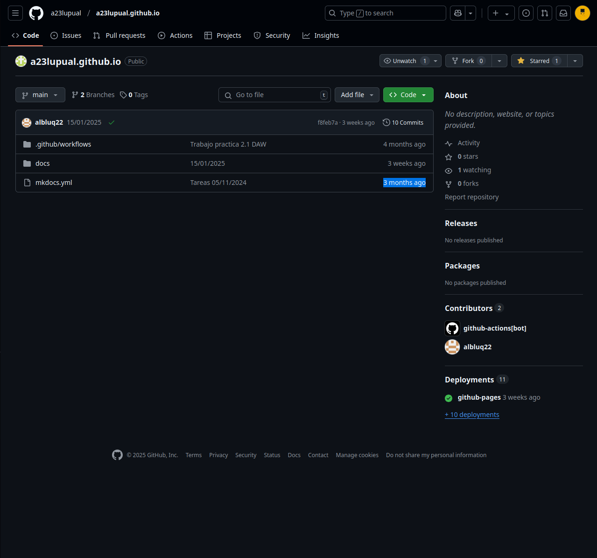


## **Crear una tabla**

1. Crear una tabla en el fichero README.md con la información de varios de tus compañeros de clase:

	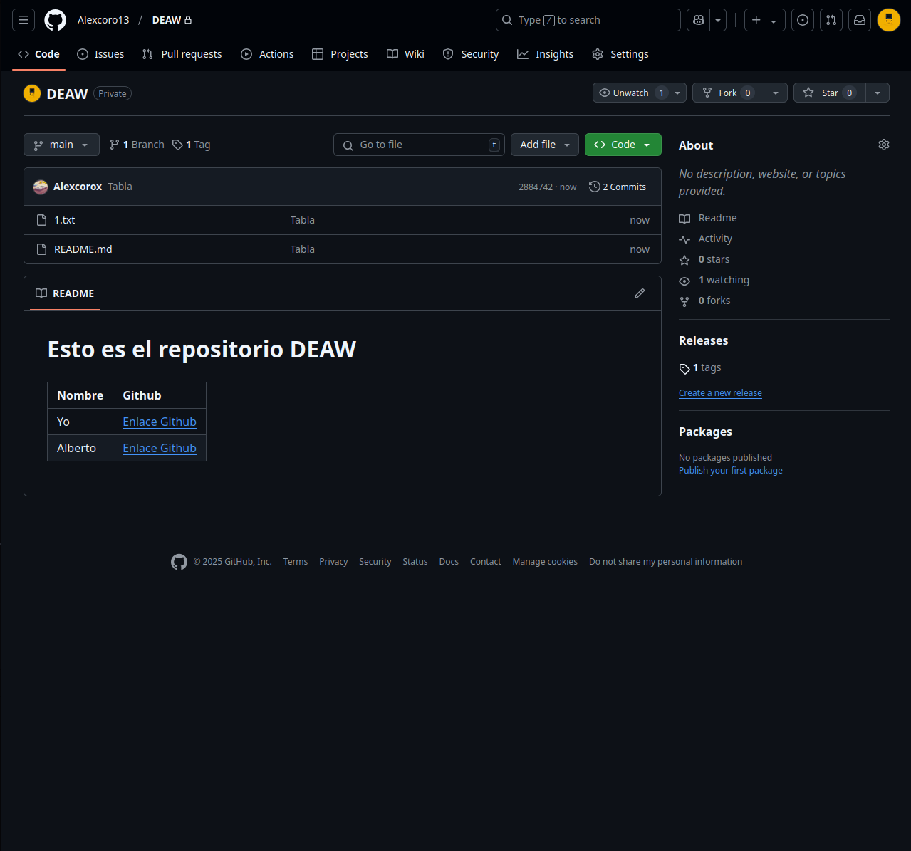

## **Colaboradores**

1. Poner a un compañero como colaborador en el repositorio **DEAW**

	- Para añadir un colaborador deberemos ir a `settings` dentro del repositorio.
	Una vez dentro iremos a colaboradores y haremos clic en añadir personas

	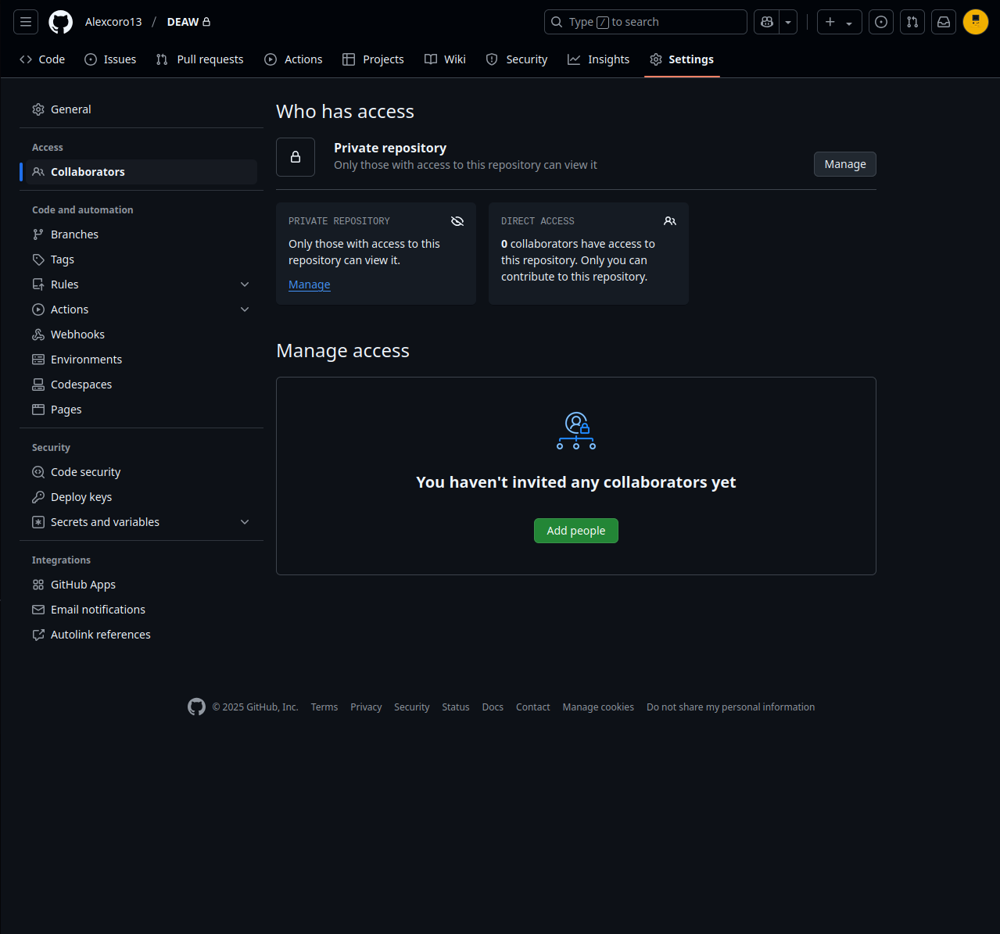

	

	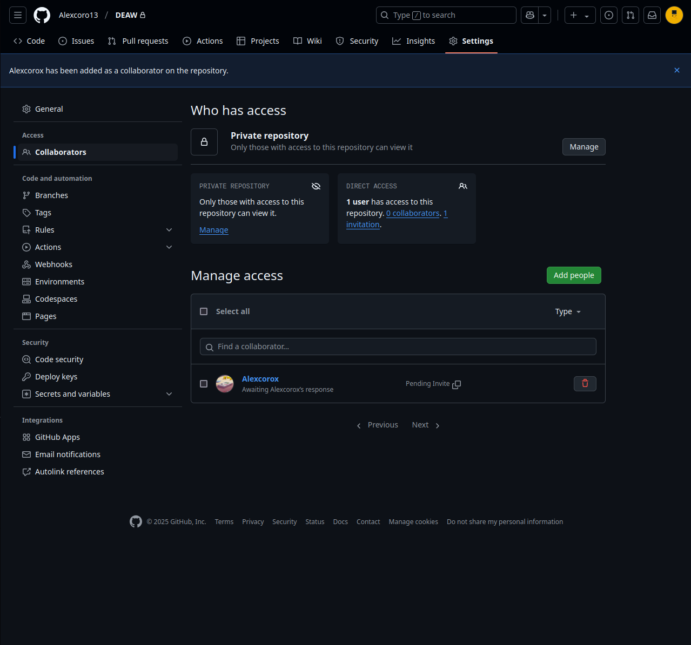

## **Crear una rama v0.2**

1. Crear una rama `v0.2`.

	- Para crear una rama nueva lo haremos con la siguiente rama

	```
	git branch v0.2
	```

2. Posiciona tu carpeta de trabajo en esta rama.

	!!! warning "Atención"
		Antes de hacer un cambio de rama deberemos tener todos los cambios 
		confirmados en el repositorio.

	- Para cambiar de rama deberemos usar el siguiente comando:

	```
	git checkout nombre_rama
	```

	

## **Añadir fichero 2.txt**

1. Añadir un fichero 2.txt en la rama v0.2

	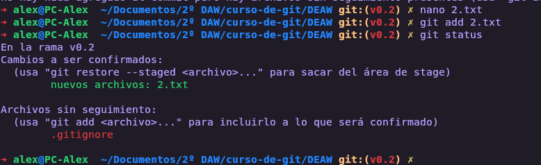

## **Crear rama remota v0.2**

1. Subir los cambios al repositorio remoto

	- Para subir la rama v0.2 usaremos el siguiente comando.

	```
	git push --set-upstream origin v0.2
	```

	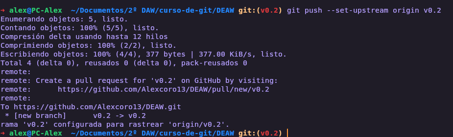

## **Merge directo**

1. Posicionarse en la rama `main`
2. Hacer un merge de la rama v0.2 en la rama master

	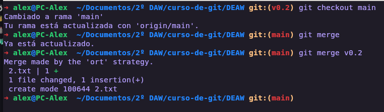

## **Merge con conflicto**

1. En la rama `master` poner `Hola` en el fichero `1.txt` y hacer commit
	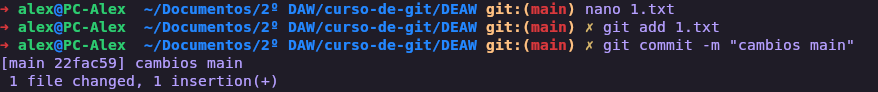

2. Posicionarse en la rama v0.2 y poner Adios en el fichero "1.txt" y hacer commit.
	

3. Posicionarse de nuevo en la rama master y hacer un merge con la rama v0.2

	- Una vez que hemos hecho los cambios en cada rama hacemos un merge y nos indicara que hay un conflicto.

	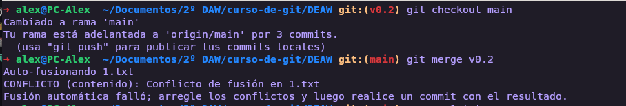

	- Para resolverlo nos iremos al archivo y nos quedaremos con los cambios de la rama que queramos	

	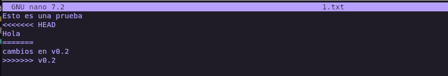

	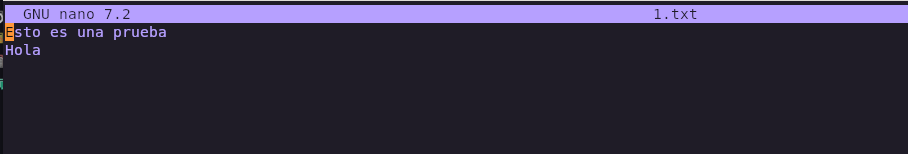

	- Una vez que hemos dejado el archivo con los cambios correctos y realizamos un commit

	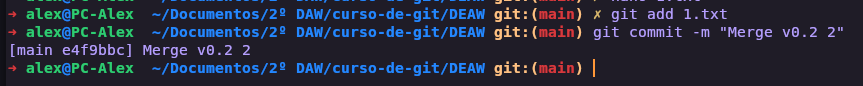

## **Listado de ramas**

1. Listar las ramas con merge y las ramas sin merge.

	- Para listar las ramas con merge usaremos el siguiente comando:

	```
	git branch --merged
	```

	- Para listar las ramas sin merge usaremos el siguiente comando:

	```
	git branch --no-merged
	```

	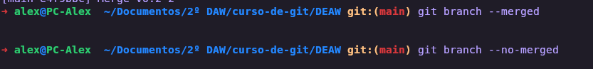

## **Arreglar conflicto**

	- El conflicto anterior ha sido arreglado en el 3 apartado de `Merge con conflicto`

## **Borrar rama**

1. Crear un tag v0.2
2. Borrar la rama v0.2

	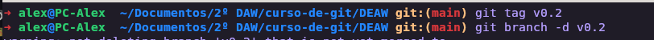

## **Listado de cambios**

1. Listar los distintos commits con sus ramas y sus tags.

	- Para listar los cambios usaremos el comando:

	```
	git log --oneline --graph --decorate --all
	```

	- Y nos mostrará algo así

	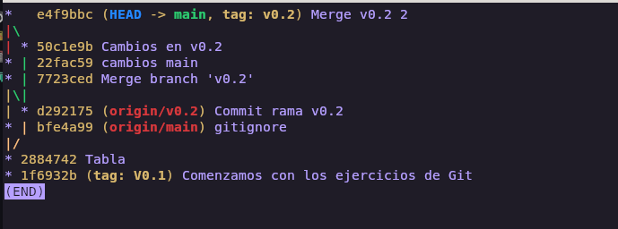

## **Ejercicios Git y Github II**

## **Ejercicios de creación y actualización de repositorios**

## **Ejercicio 1**

1. Configurar Git definiendo el nombre del usuario, el correo electrónico y activar el coloreado de salida.

	- Para configurar el nombre de usuario usaremos el comando:

	```
	git config user.name nombre_usuario
	```

	- Para configurar el email de usuario usaremos el comando:

	```
	git config user.email email_usuario
	```

	- Y por último configuraremos el coloreado de salida.

	```
	git config color.ui auto
	```

	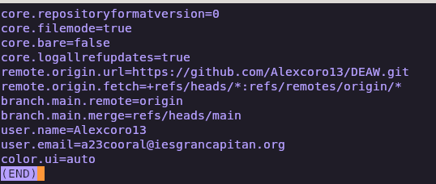

## **Ejercicio 2**

1. Crear un repositorio nuevo con el nombre libro y mostrar su contenido

	- Usaremos los siguientes comandos para crear el repositorio libro:

	```
	mkdir libro
	cd libro
	git init
	```

	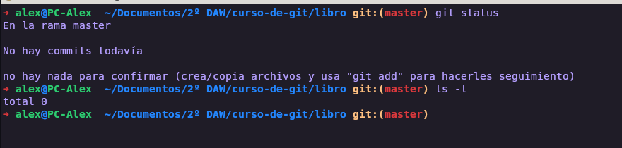

## **Ejercicio 3**

1. Comprobar el estado del repositorio.

	- Como hemos podido ver en la anterior captura el repositorio está vacío

2. Crear un fichero `indice.txt` con el siguiente contenido:

	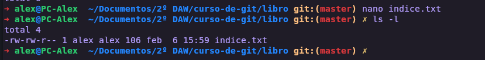

3. Comprobar de nuevo el estado del repositorio.

	```
	git status
	```

	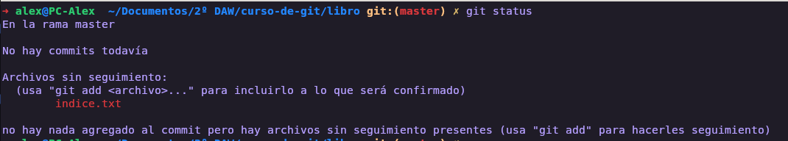

4. Añadir el fichero a la zona de intercambio temporal.

 	```
	git add indice.txt
	```

5. Volver a comprobar una vez más el estado del repositorio.

	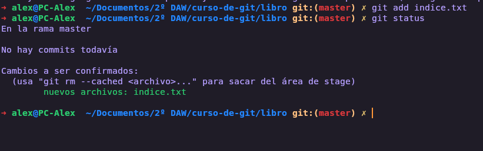

## **Ejercicio 4**

1. Realizar un commit de los últimos cambios con el mensaje “Añadido índice del libro.” y ver el estado del repositorio.

	```
	git commit -m "Añadido índice del libro"
	```

## **Ejercicio 5**

1. Cambiar el fichero `indice.txt` para que contenga lo siguiente:


2. Mostrar los cambios con respecto a la última versión guardada en el repositorio.

	```
	git diff indice.txt
	```

	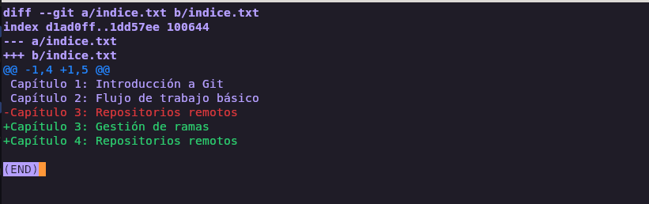

3. Hacer un commit de los cambios con el mensaje "Añadido capítulo 3 sobre gestión de ramas"

	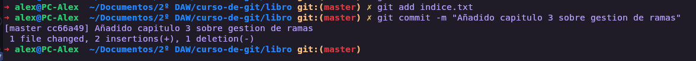

## **Ejercicio 6**

1. Mostrar los cambios de la última versión del repositorio con respecto a la anterior.

	```
	git diff HEAD~1 HEAD
	```

	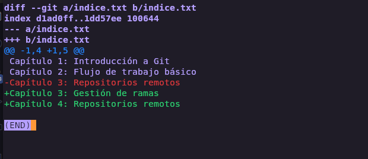

2. Cambiar el mensaje del último commit por "Añadido capítulo 3 sobre gestión de ramas al índice"

	```
	git commit --amend -m "Añadido capítulo 3 sobre gestión de ramas al índice."
	```
	

	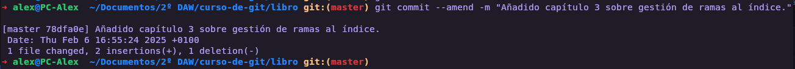

3. Volver a mostrar los últimos cambios del repositorio.

	- Esto lo haremos con el mismo comando que en el primer apartado

	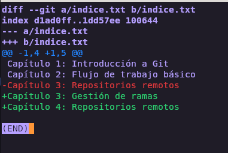

## **Ejercicios de manejo del historial de cambios**

## **Ejercicio 1**

1. Mostrar el historial de cambios del repositorio.

	- Para mostrar el historial de cambios del repositorio lo haremos con el siguiente comando

	```
	git log
	```

	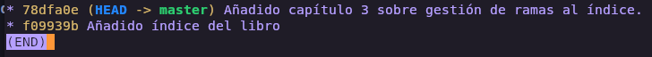

2. Crear la carpeta capítulos y crear dentro de ella el fichero capitulo1.txt con el siguiente texto.

	`El flujo de trabajo básico con Git consiste en: 1- Hacer cambios en el repositorio. 2- Añadir los cambios a la zona de intercambio temporal. 3- Hacer un commit de los cambios.`

	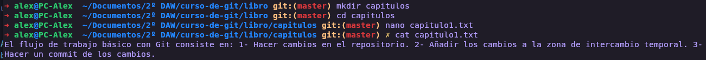

3. Añadir los cambios a la zona de intercambio temporal.

	

4. Hacer un commit de los cambios con el mensaje "Añadido capítulo 1." Volver a mostrar de cambios del repositorio.

	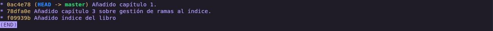

## **Ejercicio 2**

1. Crear el fichero `capitulo2.txt` en la carpeta capítulos con el siguiente texto.

	`El flujo de trabajo básico con Git consiste en: 1- Hacer cambios en el repositorio. 2- Añadir los cambios a la zona de intercambio temporal. 3- Hacer un commit de los cambios.`

	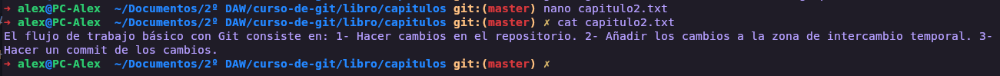

2. Añadir los cambios a la zona de intercambio temporal.

	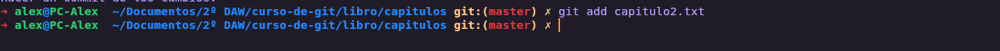

3. Hacer un commit de los cambios con el mensaje “Añadido capítulo 2.”

	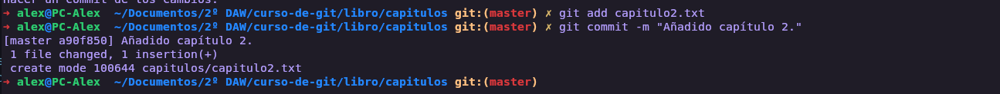

4. Mostrar las diferencias entre la última versión y dos versiones anteriores.

	- Para mostrar las diferencias entre la última versión y dos versiones anteriores lo haremos con el siguiente comando:

	```
	git diff HEAD~2 HEAD
	```

	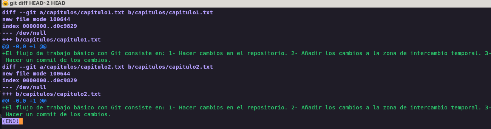

## **Ejercicio 3**

1. Crear el fichero capitulo3.txt en la carpeta capítulos con el siguiente texto.

	`	Git permite la creación de ramas lo que permite tener distintas versiones del mismo proyecto y trabajar de manera simultanea en ellas.`

	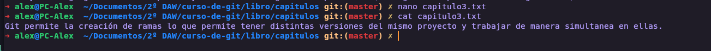

2. Añadir los cambios a la zona de intercambio temporal.

	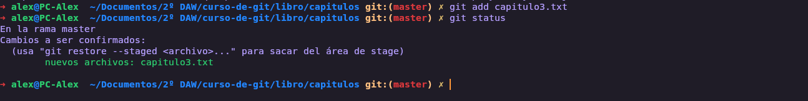

3. Hacer un commit de los cambios con el mensaje “Añadido capítulo 3.”

	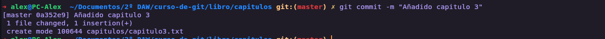

4. Mostrar las diferencias entre la primera y la última versión del repositorio.

	- Para hacer esto necesitamos primero tenemos que saber el ID del primer commit:

	```
	git log
	```

	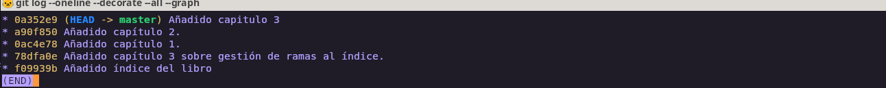

	- Y el ID que vemos a la izquierda es el ID de cada commit en este caso el número 1 es `f09939b`.

	- Ahora hacemos la diferencia con este comando:

	```
	git diff f09939b HEAD
	```

	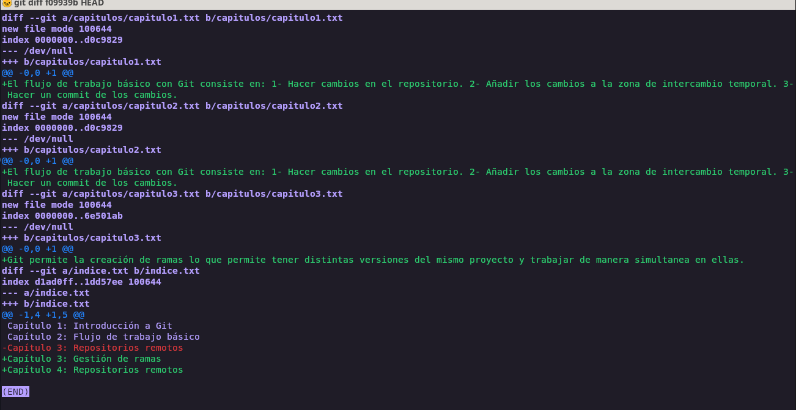

## **Ejercicio 4**

1. Añadir al final del fichero `indice.txt` la siguiente línea:

	`Capítulo 5: Conceptos avanzados`

	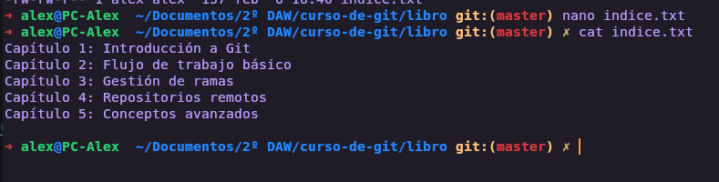

2. Añadir los cambios a la zona de intercambio temporal.

	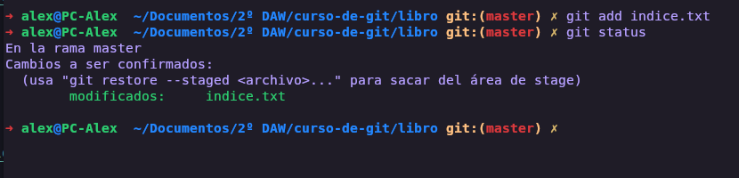

3. Hacer un commit de los cambios con el mensaje “Añadido capítulo 5 al índice.”.

	

4. Mostrar quién ha hecho cambios sobre el fichero `indice.txt`.

	- Para mostrar quién ha hecho los cambios usaremos

	```
	git blame indice.txt
	```

	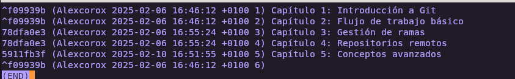

## **Ejercicios de deshacer cambios**

## **Ejercicio 1**

1. Eliminar la última línea del fichero `indice.txt` y guardarlo.

	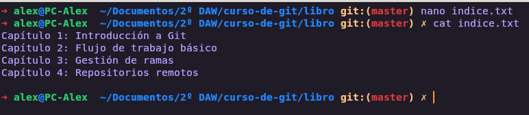

2. Comprobar el estado del repositorio.

	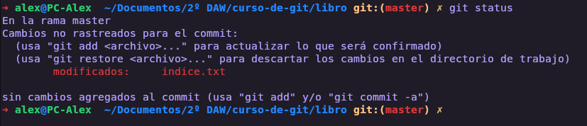

3. Deshacer los cambios realizados en el fichero `indice.txt` para volver a la versión anterior del fichero.

	- Para deshacer los cambios usaremos el siguiente comando:

	```
	git restore indice.txt
	```

	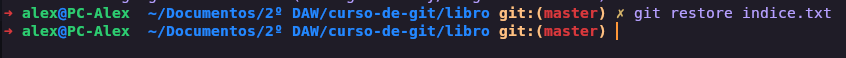

4. Volver a comprobar el estado del repositorio.

	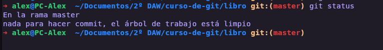

## **Ejercicio 2**

1. Eliminar la última línea del fichero `indice.txt` y guardarlo.

	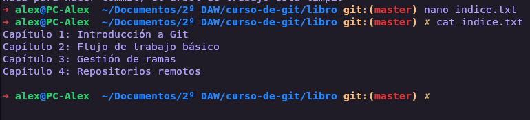

2. Añadir los cambios a la zona de intercambio temporal.

3. Comprobar de nuevo el estado del repositorio.

	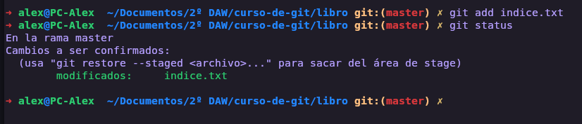

4. Quitar los cambios de la zona de intercambio temporal, pero mantenerlos en el directorio de trabajo.

	- Para quitar los cambios de la zona de intercambio, pero mantenerlos en el directorio de trabajo usaremos el siguiente comando:

	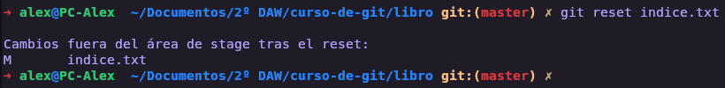

5. Comprobar de nuevo el estado del repositorio.

	

6. Deshacer los cambios realizados en el fichero `indice.txt` para volver a la versión anterior del fichero.

	```
	git restore indice.txt
	```

7. Volver a comprobar el estado del repositorio.

	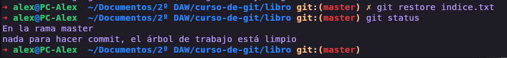

## **Ejercicio 3**

1. Eliminar la última línea del fichero `indice.txt` y guardarlo.

	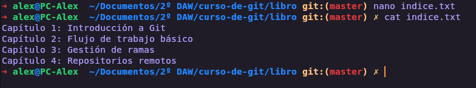

2. Eliminar el fichero `capitulos/capitulo3.txt`.

3. Añadir un fichero nuevo `capitulos/capitulo4.txt` vacío.

4. Añadir los cambios a la zona de intercambio temporal.

5. Comprobar de nuevo el estado del repositorio.

	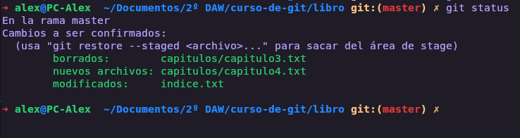

6. Quitar los cambios de la zona de intercambio temporal, pero mantenerlos en el directorio de trabajo.

	- Para hacer esto usaremos los siguientes comandos:

	```git
	git restore --staged indice.txt
	git restore --staged capitulos/capitulo4.txt
	git restore --staged capitulos/capitulo3.txt
	```

	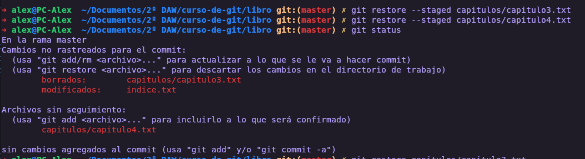

7. Comprobar de nuevo el estado del repositorio.

8. Deshacer los cambios realizados para volver a la versión del repositorio.

	- Aquí usaremos el mismo comando que en el apartado 6 pero sin la opción `--staged`. Y para deshacer los cambios del capitulo4 usaremos este comando.

	```
	rm capitulos/capitulo4.txt
	```

	- Usamos rm en vez de git rm o restore, porque este archivo no está guardado en ningún commit de git.

9. Volver a comprobar el estado del repositorio.

	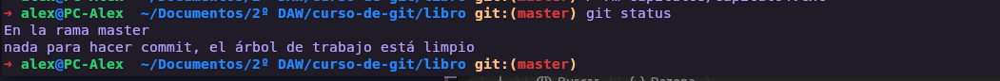

## **Ejercicio 4**

1. Eliminar la última línea del fichero `indice.txt` y guardarlo.

	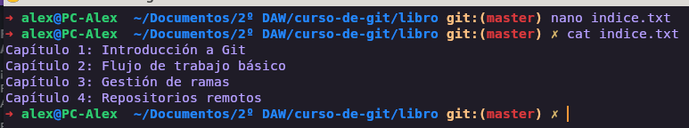

2. Eliminar el fichero `capitulos/capitulo3.txt`.

	```
	rm capitulos/capitulo3.txt
	```

	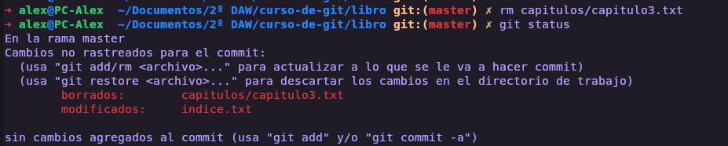

3. Añadir los cambios a la zona de intercambio temporal y hacer un commit con el mensaje “Borrado accidental.”

	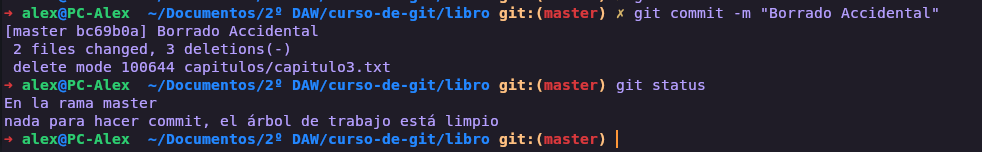

4. Comprobar el historial del repositorio.

	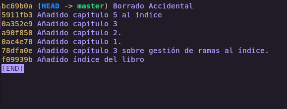

5. Deshacer el último commit pero mantener los cambios anteriores en el directorio de trabajo y la zona de intercambio temporal.

	- Para mantener los cambios y borrar el commit, deberemos usar el siguiente comando:

	```
	git reset --soft HEAD~1
	```

	- El parámetro soft nos permite mantener los cambios y solo deshace el commit.

	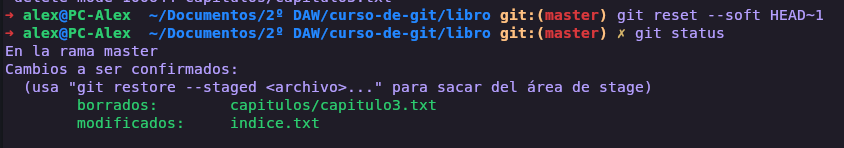

6. Comprobar el historial y el estado del repositorio.

	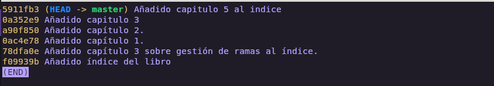

7. Volver a hacer el commit con el mismo mensaje de antes.

	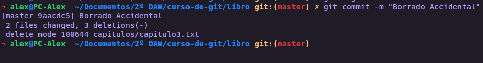

8. Deshacer el último commit y los cambios anteriores del directorio de trabajo volviendo a la versión anterior del repositorio.

	- Ahora usaremos el parámetro `--hard`en vez de `--soft` para que el directorio vuelve a estar como el último commit antes de borrado accidental.

	```
	git reset --hard HEAD~1
	```

	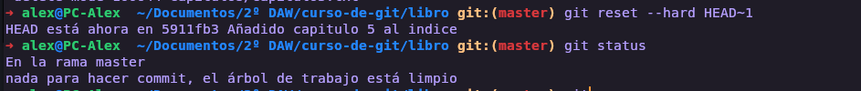

9. Comprobar de nuevo el historial y el estado del repositorio.

	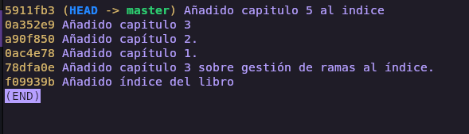

## **Ejercicios de gestión de ramas**

## **Ejercicio 1**

1. Crear una nueva rama bibliografía y mostrar las ramas del repositorio.

	-	Para crear una usaremos el comando `git branch` como se muestra abajo

	```
	git branch bibliografia
	```

	- Y para mostrar las ramas actuales usaremos:

	```
	git branch
	```


	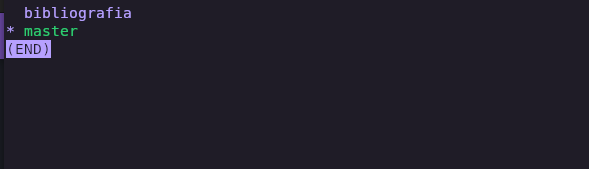

## **Ejercicio 2**

1. Crear el fichero `capitulos/capitulo4.txt` y añadir el texto siguiente

	`En este capítulo veremos cómo usar GitHub para alojar repositorios en remoto.`

3. Añadir los cambios a la zona de intercambio temporal.

	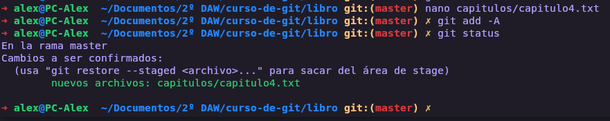

4. Hacer un commit con el mensaje “Añadido capítulo 4.”

5. Mostrar la historia del repositorio incluyendo todas las ramas.

	- Para que en log salgan todas las ramas deberemos usar el parámetro `--all`.

	```
	git log --all
	```

	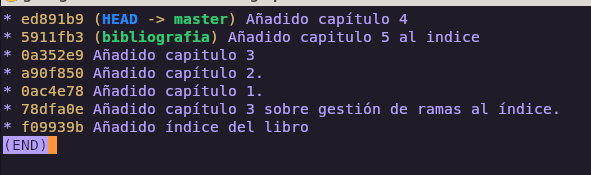

## **Ejercicio 3**

1. Cambiar a la rama bibliografía.

	- Para cambiar a la rama bibliografía lo haremos con `git checkout`

	!!! warning "Aviso"
		Para cambiar de rama deberemos tener todos los cambios confirmados en el repositorio, si no podrían ocurrir errores.

	```
	git checkout bibliografia
	```

2. Crear el fichero `bibliografia.txt` y añadir la siguiente referencia

`Chacon, S. and Straub, B. Pro Git. Apress.`

4. Añadir los cambios a la zona de intercambio temporal.

5. Hacer un commit con el mensaje “Añadida primera referencia bibliográfica.”

	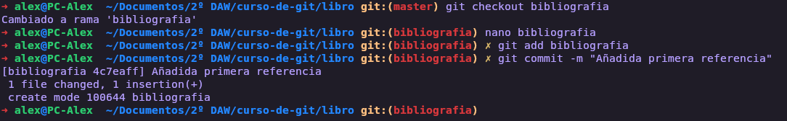

6. Mostrar la historia del repositorio incluyendo todas las ramas.

	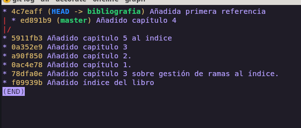

## **Ejercicio 4**

1. Fusionar la rama bibliografía con la rama master.

	- Para fusionar la rama bibliografía con la rama master primero debemos de situarnos en la rama master y luego hacer un `merge` 

	- Para cambiarnos de rama usaremos `git checkout` como anteriormente

	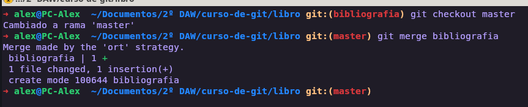

2. Mostrar la historia del repositorio incluyendo todas las ramas.

	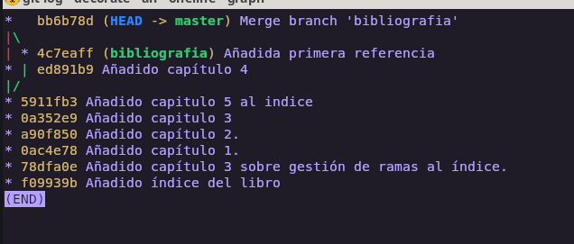


3. Eliminar la rama bibliografía.

	- Para borrar la rama bibliografía usaremos el siguiente comando

	```
	git branch -d bibliografia
	```

	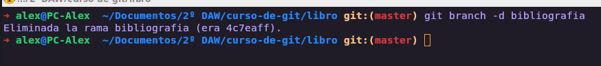

4. Mostrar de nuevo la historia del repositorio incluyendo todas las ramas.
	
	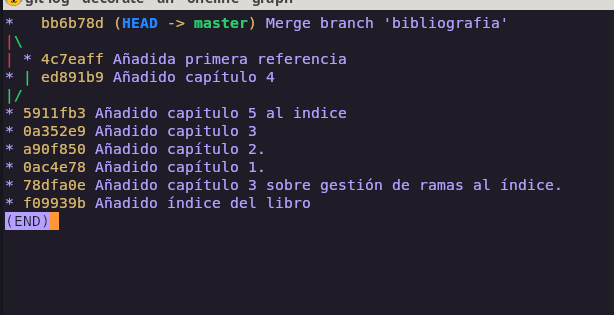

## **Ejercicio 5**

1. Crear la rama bibliografía.

2. Cambiar a la rama bibliografía.

3. Cambiar el fichero `bibliografia.txt` para que contenga las siguientes referencias:

	```
	Scott Chacon and Ben Straub. Pro Git. Apress.
	Ryan Hodson. Ry’s Git Tutorial. Smashwords (2014)
	```

5. Añadir los cambios a la zona de intercambio temporal y hacer un commit con el mensaje “Añadida nueva referencia bibliográfica.”

	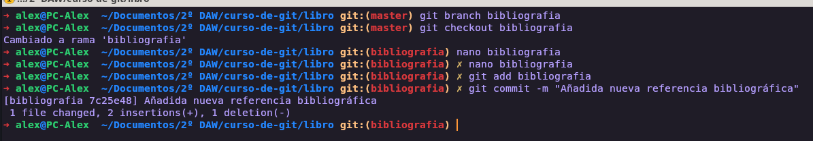

6. Cambiar a la rama master.

7. Cambiar el fichero `bibliografia.txt` para que contenga las siguientes referencias:

```
Chacon, S. and Straub, B. Pro Git. Apress.
Loeliger, J. and McCullough, M. Version control with Git. O’Reilly.
```

9. Añadir los cambios a la zona de intercambio temporal y hacer un commit con el mensaje “Añadida nueva referencia bibliográfica.”

	

10. Fusionar la rama bibliografía con la rama master.


11. Resolver el conflicto dejando el fichero `bibliografia.txt` con las referencias:

```
Chacon, S. and Straub, B. Pro Git. Apress.
Loeliger, J. and McCullough, M. Version control with Git. O’Reilly.
Hodson, R. Ry’s Git Tutorial. Smashwords (2014)
```

12. Añadir los cambios a la zona de intercambio temporal y hacer un commit con el mensaje “Resuelto conflicto de bibliografía.”

	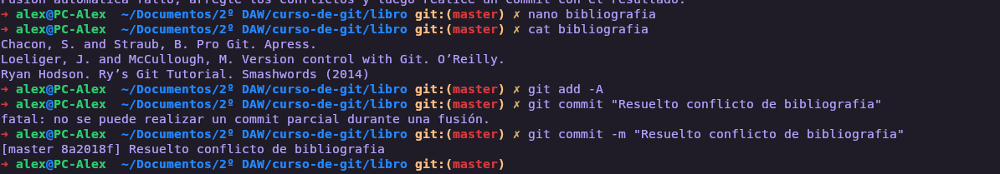

13. Mostrar la historia del repositorio incluyendo todas las ramas.

	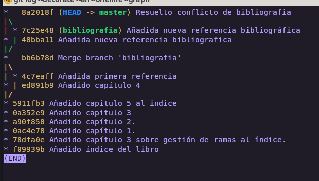

## **Ejercicios de repositorios remotos**

## **Ejercicio 1**

1. Crear un nuevo repositorio público en GitHub con el nombre libro-git.

	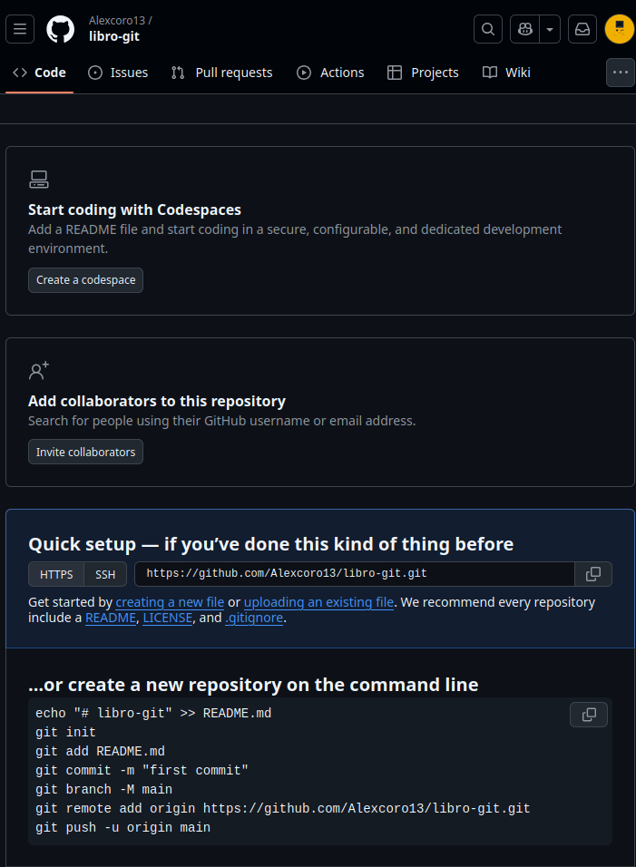

2. Añadirlo al repositorio local del libro.

3. Mostrar todos los repositorios remotos configurados

	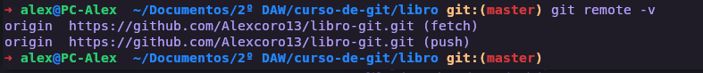

## **Ejercicio 2**

1. Añadir los cambios del repositorio local al repositorio remoto de Github.
	
	- Para submit los cambios a git deberemos usar el siguiente comando:

	```
	git push -u origin master
	```

2. Acceder a Github y comprobar que se han subido los cambios mostrando el historial de versiones.

	- Y como podemos ver, se han subido los cambios

	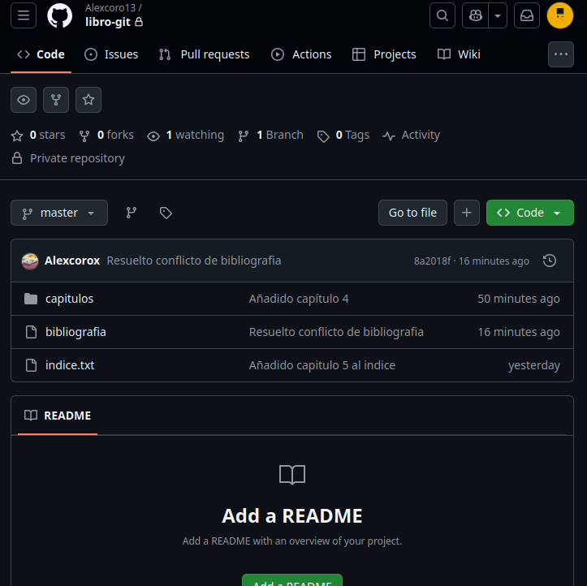

## **Ejercicio 3**

1. Colaborar en el repositorio remoto libro-git de otro usuario.

2. Clonar su repositorio libro-git.

	- Para clonar un repositorio usaremos `git clone`

	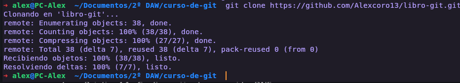

3. Añadir el fichero autores.txt que contenga el nombre del usuario y su correo electrónico.

4. Añadir los cambios a la zona de intercambio temporal.

5. Hacer un commit con el mensaje “Añadido autor.”

	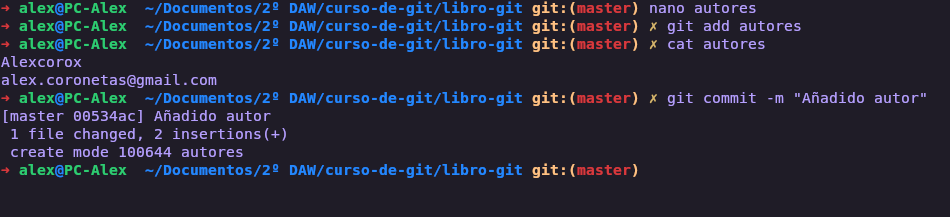

6. Subir los cambios al repositorio remoto.

	- Esta vez, como la rama en el remoto ya está creada obviaremos el parámetro `-u` en `git push`

	```
	git push
	```

	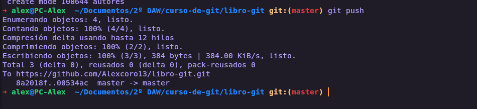

## **Ejercicio 4**

1. Hacer una bifurcación del repositorio remoto `asalber/libro-git` en GitHub.
	
	- Para lograr esto nos iremos al repositorio en github y haremos clic sobre Fork

	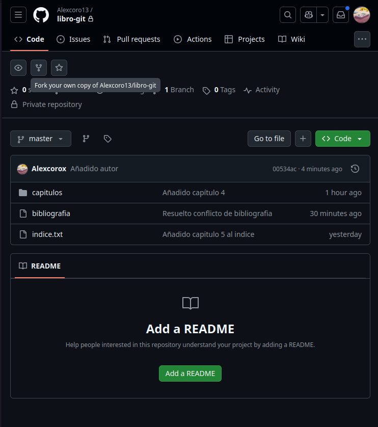

	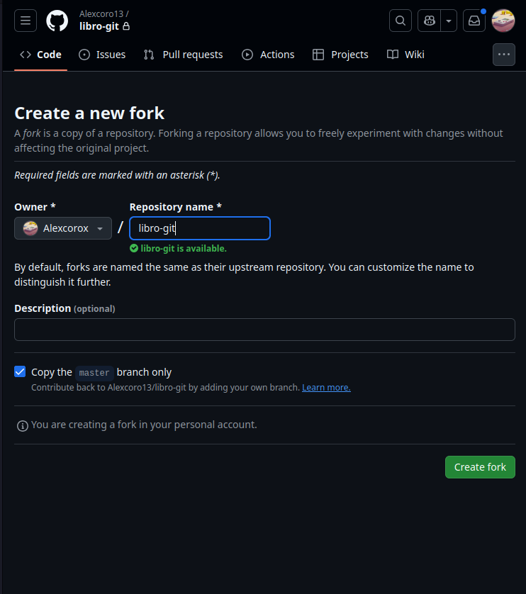

2. Clonar el repositorio creado en la cuenta de GitHub del usuario.

	```
	git clone https://github.com/Alexcorox/libro-git.git
	```

3. Crear una nueva rama autoría y activarla.

	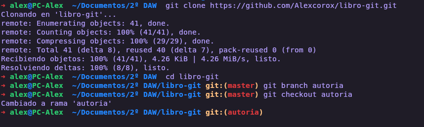

4. Añadir el nombre del usuario y su correo al fichero autores.txt.

5. Añadir los cambios a la zona de intercambio temporal.

6. Hacer un commit con el mensaje “Añadido nuevo autor.”

7. Subir los cambios de la rama autoría al repositorio remoto en GitHub.

	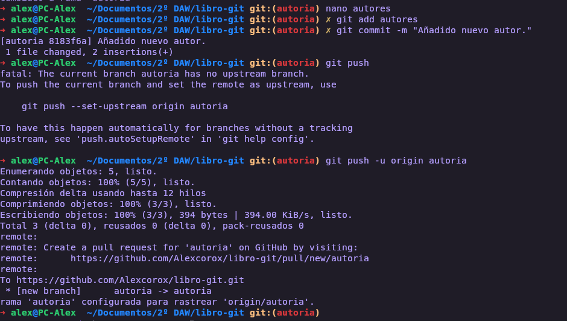

8. Hacer un Pull Request de los cambios en la rama autoría. 

	- Para crear un pull request deberemos ir al apartado pull request dentro de github y haremos clic en `create a pull request`

	

	- Seleccionamos las ramas que queremos que compare para hacer el pull request. Y como podemos observar detecta las diferencias que hay entre ellas.

	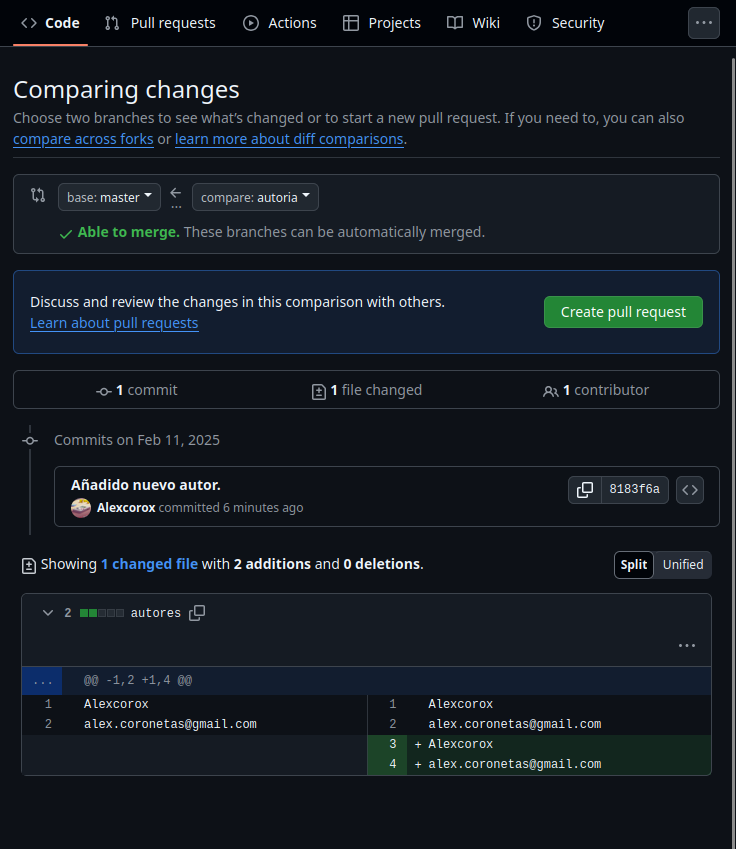

	- Le asignamos un nombre y le damos a `create pull request`.

	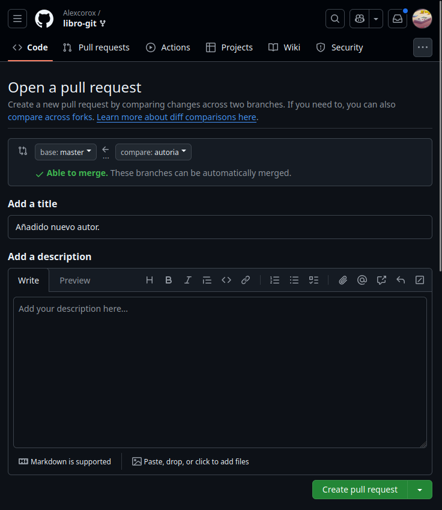

	- Una vez que hayamos completado estos pasos, habremos creado nuestro pull request

	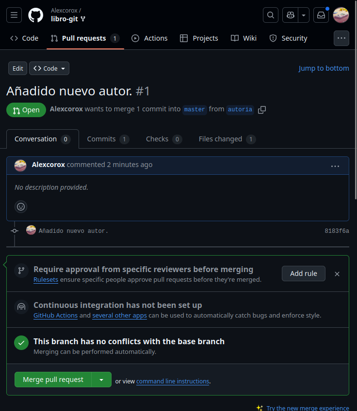
