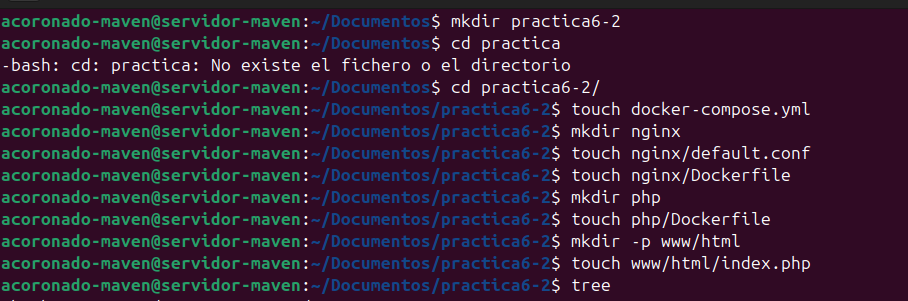
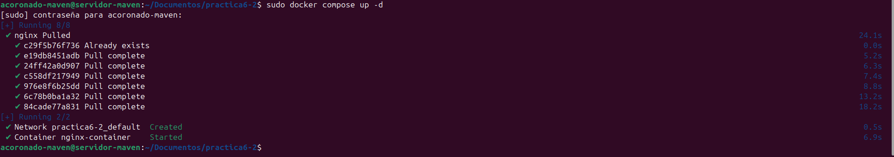
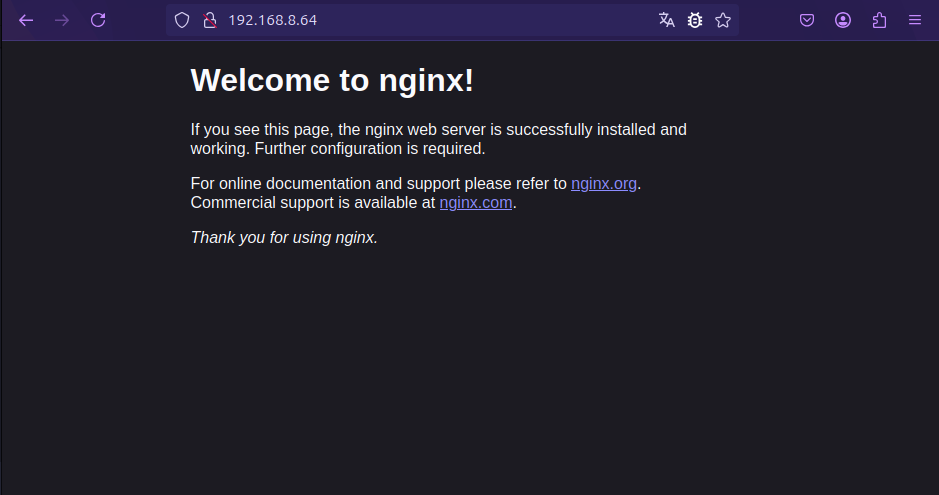
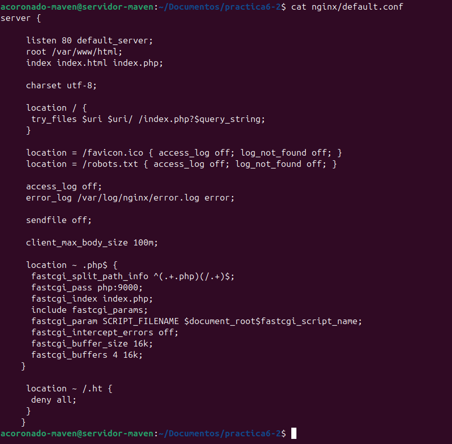
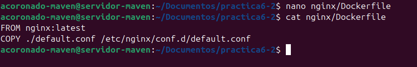
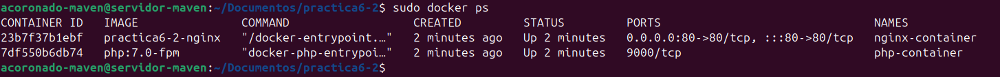
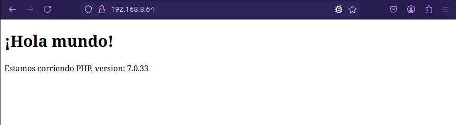
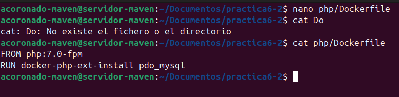
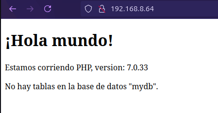

# **Práctica 6.2 - Despliegue de una aplicación PHP con Nginx y MySQL usando Docker y docker-compose**

## **Introducción**

### **¿Que es docker-compose?**

Docker Compose es una herramienta versátil que te permite definir y gestionar aplicaciones multi-contenedor de forma sencilla. Con Docker Compose, puedes describir la configuración de tu entorno de desarrollo en un archivo YAML, especificando los servicios, volúmenes y redes necesarios para tu aplicación.

Para usarlo deberemos seguir los siguientes pasos:

- Definir el entorno de nuestra aplicación con un Dockerfile para que pueda usarse en cualquier lugar.

- Definir los servicios que componen la aplicacion en `docker-compose.yml`.

- Ejecutar `docker compose up -d` para que Docker lanza la aplicación.

## **Instalación de docker-compose**

### **Proceso de dockerización de Nginx+PHP+Mysl**

#### 1. Estrucutra de directorios

En esta practica vamos a seguir la siguiente estructura de directorios para que todas las rutas que usemos funcionen: 

```
/usuario/Documentos/practica6-2/
├── docker-compose.yml
├── nginx
│   ├── default.conf
│   └── Dockerfile
├── php
│   └── Dockerfile
└── www
    └── html
        └── index.php
```

Por lo tanto vamos a ir creado estos directorios y archivos y posteriormente los iremos rellenando.

```
cd ~/Documentos
mkdir practica6-2
cd practica6-2
touch docker-compose.yml
mkdir nginx
touch nginx/default.conf
touch nginx/Dockerfile
mkdir php
touch php/Dockerfile
mkdir www/html -p
touch www/html/index.php
``` 



#### **2. Creación de un contenedor Nginx**

Para empezar, necistamos crear y correr un contenedor Nginx para que nuestra aplicación PHP se pueda mostrar en los navegadores.

Dentro de la carpeta `/usuario/home/practica6-2` debemos modificar el archiv `docker-compose.yml`

Y editamos este archivo e introducimos las siguientes lineas:

```nginx
services:
    nginx:
    image: nginx:latest
    container_name: nginx-container
    ports:
        - 80:80
```


Una vez modificado este archivo, se encargará de descargarse ña última versión de la imagen de Nginx, crear un contenedor y publicar en el puerto 80 del contenedor que también usara el 80 en la maquina anfitriona (80:80).

Iniciamos esto con:

```
docker compose up -d
```




Para comprobar que el contenedor está corriendo, deberemos ejecutar el siguiente comando:

```
docker ps
```

Y deberia de salirnos algo así


Además, si intentamos conectarnos desde el navegador de nuestra maquina anfitriona y accedemos a la dirección ip de la máquina donde esta alojado el contenedor deberia de salir página de bienvenida de nginx.



#### **3. Creación del contendor PHP**

Como ya hemos creado previamente los archivos deberemos irnos a `www/html/index.php`

Y dentro de `index.php` añadiremos el siguiente código: 


Tras esto procederemos a rellenar el archivo de configuración de nginx ubicado en `./nginx/default.conf`. Donde colocaremos la siguiente configuración.

```nginx
server {

     listen 80 default_server;
     root /var/www/html;
     index index.html index.php;

     charset utf-8;

     location / {
      try_files $uri $uri/ /index.php?$query_string;
     }

     location = /favicon.ico { access_log off; log_not_found off; }
     location = /robots.txt { access_log off; log_not_found off; }

     access_log off;
     error_log /var/log/nginx/error.log error;

     sendfile off;

     client_max_body_size 100m;

     location ~ .php$ {
      fastcgi_split_path_info ^(.+.php)(/.+)$;
      fastcgi_pass php:9000;
      fastcgi_index index.php;
      include fastcgi_params;
      fastcgi_param SCRIPT_FILENAME $document_root$fastcgi_script_name;
      fastcgi_intercept_errors off;
      fastcgi_buffer_size 16k;
      fastcgi_buffers 4 16k;
    }

     location ~ /.ht {
      deny all;
     }
    }
```



Por último modificaremos el archivo `Dockerfile` dentro de la carpeta nginx para indicarle a docker que tiene que copiar esta configuración dentro del contenedor.

Contenido:

```dockerfile
FROM nginx:latest
COPY ./default.conf /etc/nginx/conf.d/default.conf
```



Ahora editaremos nuestro archivo `docker-compose.yml` añadiendo el nuevo servicio de php y modificando el de nginx.

```dockerfile
services:
  nginx:
    build: ./nginx/
    container_name: nginx-container
    ports:
      - 80:80
    links:
      - php
    volumes:
      - ./www/html/:/var/www/html/

  php:
    image: php:7.0-fpm
    container_name: php-container
    expose:
      - 9000
    volumes:
      - ./www/html/:/var/www/html/
```


Tras estos cambios, procederemos a lanzar los contenedores con:

```
docker compose up -d
```

!!! warning "Atención"
    Recordad ejecutar `docker compose down` si no lo habeis hecho antes, para iniciar la nueva configuración.


Y una vez que los contenedores esten levantados al hacer:

```
docker ps
```

Se dberia ver algo así:



Y si ahora volvemos a acceder a la ip del a máquina virtual desde el navegador, veremos la página que hemos creado en index.php



#### **4. Creación de un contenedor para datos**

Como habeís podido observar, hemos montado el directorio `www/html` en ambos contenedores, el de nginx y el de php. Sin embargo, esta no es una forma adecuada de hacerlo. En este paso crearemos un contenedor independiente el cual será el encargado de contener los datos y lo enlzamos con el resto de contenedores.

Para logra esto deberemos modificar el archivo `docker-compose.yml`:

```dockerfile
services:
    nginx:
        build: ./nginx/
        container_name: nginx-container
        ports:
            - 80:80
        links:
            - php
        volumes_from:
            - app-data

    php:
        image: php:7.0-fpm
        container_name: php-container
        expose:
            - 9000
        volumes_from:
            - app-data

    app-data:
        image: php:7.0-fpm
        container_name: app-data-container
        volumes:
            - ./www/html/:/var/www/html/
        command: "true"
````

Tras hacer este modificación ejecutaremos el comando:

```dockerfile
docker-compose up -d
```

Y volvemos a verificar que están corriendo todos los contenedores.

```
docker ps -a
```

Deberiamos ver algo parecido a esto:


#### **5. Creación de un contendor Mysql**

En este apartado vamos a crear un contenedor con una base de datos Mysql y lo enlazaremos con el resto de contenedores.

Primero deberemos modificar el dockerfile de la carpeta php para descargar e instalar una extensión para Mysql.

Contenido del Dockerfile:

```dockerfile
FROM php:7.0-fpm
RUN docker-php-ext-install pdo_mysql
```



Y ahora deberemos modificar otra vez el archivo `docker-compose.yml` para añadir el nuevo servicio de Mysql

```dockerfile
services:
  nginx:
    build: ./nginx/
    container_name: nginx-container
    ports:
      - 80:80
    links:
      - php
    volumes_from:
      - app-data
  php:
    build: ./php/
    container_name: php-container
    expose:
      - 9000
    links:
      - mysql
    volumes_from:
      - app-data

  app-data:
    image: php:7.0-fpm
    container_name: app-data-container
    volumes:
      - ./www/html/:/var/www/html/
    command: "true"

  mysql:
    image: mysql:5.7
    container_name: mysql-container
    volumes_from:
      - mysql-data
    environment:
      MYSQL_ROOT_PASSWORD: secret
      MYSQL_DATABASE: mydb
      MYSQL_USER: myuser
      MYSQL_PASSWORD: password

  mysql-data:
    image: mysql:5.7
    container_name: mysql-data-container
    volumes:
      - /var/lib/mysql
    command: "true"
```


Tras realizar esta modificación debemos modificar el archivo `index.php` y hacer los siguientes cambios:

```php
     <!DOCTYPE html>
     <head>
      <title>¡Hola mundo!</title>
     </head>

     <body>
      <h1>¡Hola mundo!</h1>
      <p><?php echo 'Estamos corriendo PHP, version: ' . phpversion(); ?></p>
      <?
       $database ="mydb";
       $user = "myuser";
       $password = "password";
       $host = "mysql";

       $connection = new PDO("mysql:host={$host};dbname={$database};charset=utf8", $user, $password);
       $query = $connection->query("SELECT TABLE_NAME FROM information_schema.TABLES WHERE TABLE_TYPE='BASE TABLE'");
       $tables = $query->fetchAll(PDO::FETCH_COLUMN);

        if (empty($tables)) {
          echo "<p>No hay tablas en la base de datos \"{$database}\".</p>";
        } else {
          echo "<p>La base de datos \"{$database}\" tiene las siguientes tablas:</p>";
          echo "<ul>";
            foreach ($tables as $table) {
              echo "<li>{$table}</li>";
            }
          echo "</ul>";
        }
        ?>
    </body>
</html>
```


A continuación volvemos a lanzar los contenedores y verificamos que están ejecutandose:

```
docker compose up -d
docker ps -a
```


#### **6. Verificación de conexión a la base de datos**

Si ahora intentasemos acceder a la dirección de nuesta maquina, deberiamos de obtener la siguiente pantalla:



Como se puede ver la aplicación nos indicar que no hay tablas en la base de datos mydb esto se debe a que al copiar el archivo php no hemos configurado el nombre de usuario ni la contraseña.
Por lo tanto deberemos cambiar las siguientes líneas:

```
$user = "root";
$password = "secret";
```

Una vez modificado y guardado si referescamos la página deberia de salirnos las tablas indicando que la aplicación esta funcionando correctamente.


Habiendo completado asi, el despliegue de nuestra aplicación php, con mysql y nginx.