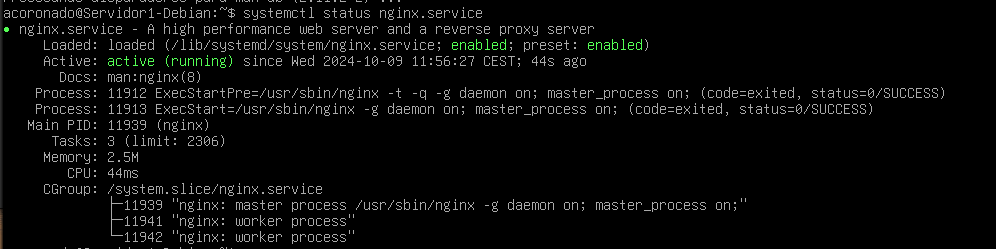
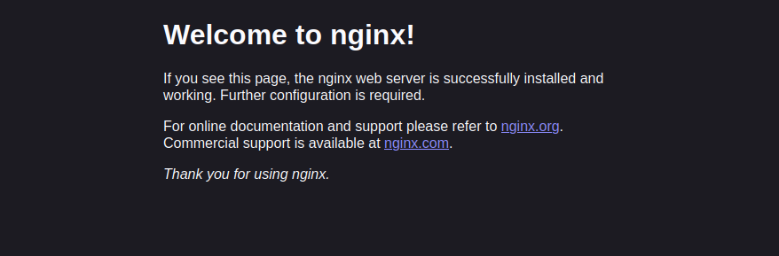
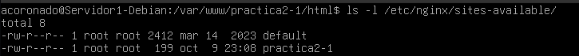
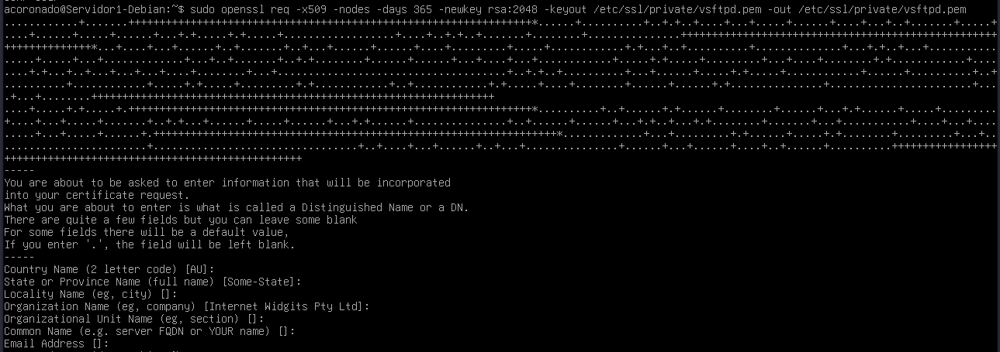
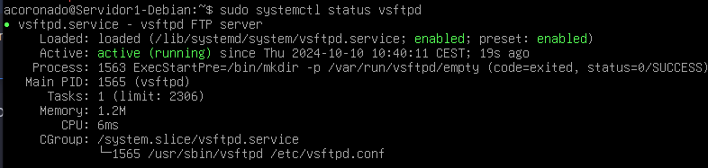
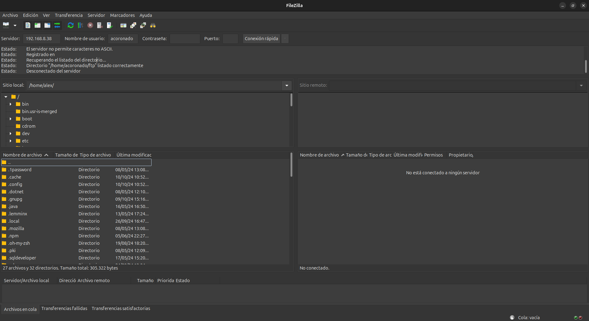
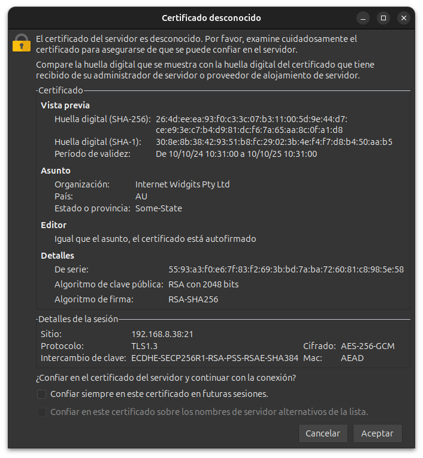
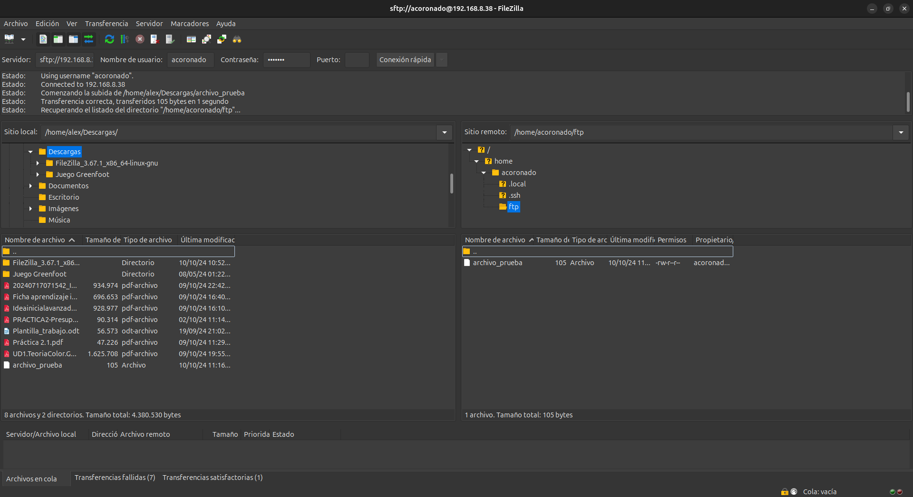
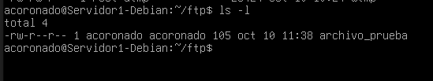

# Práctica 2.1 - Instalación y configuración de un servidor web Nginx

## Instalación servidor web Nginx

Para instalar el servidor web Nginx en nuestra máquina primero deberemos actualizar los repositorios.
Tras esto instalaremos nginx con los siguientes comandos:

```bash
sudo apt update
sudo apt install Nginx
```

Comprobamos si se ha instalado bien Nginx con el siguiente comando:

```bash
systemctl status nginx
```

En la consola debería de salir lo siguiente, si saliera verde y mostrara que está activado entonces nginx está instalado correctamente.



### Creación de la carpeta del sitio web

Al igual que en Apache, todos los archivos que formaran parte de una web se organizaran en carpetas.

Estas carpetas, típicamente están dentro de ```/var/www/```

Por lo tanto, crearemos la carpeta de nuestro sitio web, en este caso lo llamaremos Practica2-1:

```bash
sudo mkdir -p /var/www/nombre_web/html
```

Dentro de la carpeta html que hemos creado clonaremos el siguiente repositorio:

```
https://github.com/cloudacademy/static-website-example
```
!!! note "Clonar dirección"
        Para clonar ese repositorio necesitaras tener instalado git en tu equipo, para esto
        usaras el comando ```sudo apt install git``` y posteriormente ```git clone url_repo```
        para poder clonar el repositorio

Además, haremos que el propietario de esta carpeta y todo lo que haya dentro sea el usuario ```www-data``` normalmente este es el usuario del servicio web

```bash
sudo chown -R www-data:www-data /var/www/nombre_web/html
```

Y le daremos los permisos adecuados para que no nos dé un error de acceso no autorizado al entrar en el sitio web: 

```bash
sudo chmod -R 755 /var/www/nombre_web
```

Si hemos seguido bien estos pasos al hacer un ```ls -l /var/www/nombre_web``` podremos observar que está bien.


Por último para comprobar que todo está funcionando correctamente nos conectaremos a la web desde nuestro ordenador para esto en el navegador pondremos la siguiente dirección:

```
http://ip-máquina-virtual
```

Si hemos conseguido conectarnos el navegador mostrará la página web alojada en el servidor, lo que sería algo asi.



## Configuración de servidor web NGINX

Tras haber completado los pasos anteriores debemos saber que en NGINX existen 2 rutas importantes. La primera es ```sites-availabe```, la cual contiene
los archivos de configuración de los sitios web que alberga nuestro servidor. La segunda es ```sites-enabled```, la cual se parece a la anterior con la diferencia
de que contiene los archivos de los sitios web que están habilitados, es decir que funcionan en este momento.

Dentro de la carpeta ```sites-availabe``` hay un archivo de configuración por defecto llamado default, que es la página que se muestra por defecto al entrar al
servidor sin indicar ningún tipo de sitio web.

Para que NGINX presente el contenido de nuestra web, será necesario crear un bloque de servidor con las directivas correctas. Por lo tánto
crearemos un archivo nuevo en ```/etc/nginx/sites-availabe/nombre-de-tu-web```.


```bash
sudo nano /etc/nginx/sites-availabe/nombre-de-tu-web
```

Y este será el contenido del archivo 

```bash
server {
        listen 80;
        listen [::]:80;
        root /ruta/absoluta/archivo/index;
        index index.html index.htm index.nginx-debian.html;
        server_name nombre_web;
        location / {
                try_files $uri $uri/ =404;
        }
}
```

La directiva root debe ir seguida de la ruta absoluta dónde se encuentre el archivo index.html de nuestra página web. En mi caso es ```/var/www/practica2-1/html``` y
se vería algo asi:




Por último crearemos un enlace simbólico entre este archivo y la ruta de los sitios que están habilitados.

```bash
sudo ln -s /etc/nginx/sites-available/nombre_web /etc/nginx/sites-enabled/
```

Tras esto haremos ejecutaremos el comando ``` ls -l /etc/nginx/sites-enabled/``` y nos deberá salir el enlace simbólico.


Por último reiniciaremos el servidor para que se aplique la configuración

```bash
sudo systemctl restart nginx
```

## Comprobaciones

### Comprobación correcto funcionamiento

Como no contamos con un servidor DNS para que nos traduzca las ips, deberemos hacerlo manualmente. Por lo tánto
editaremos el archivo ```/etc/hosts``` de nuestro ordenador para que la IP quede asociada a la máquina virtual, nuestra directriz ```server_name```.

En mi caso al usar Linux el archivo se encuentra en ```/etc/hosts```, aunque si el sistema operativo fuese windows no habría problema,
ya que la ruta del archivo en ese caso es ```C:\Windows\System32\drivers\etc\hosts```

Al archivo le añadiremos la siguiente línea:

```
IP_SERVIDOR nombre_web
```

Tras haberla añadido debería verse algo así:


Si hemos seguido todos estos pasos y no se ha producido un error, al introducir ```http://practica2-1``` en el navegador de nuestra
máquina anfitriona este nos mostrara la página web alojada en nuestro servidor.


### Comprobar registros del servidor

Comprobad que las peticiones se están registrando correctamente en los archivos de logs, tanto las correctas como las erróneas:


- ```/var/log/nginx/acces.log```: Cada solicitud al servidor web se registra en este archivo. A no ser que Nginx este configurado para hacer algo diferente.
- ```/var/log/nginx/error.log```: Aquí queda registrado cada error de Nginx.

Y como podemos observar en acces.log ya han quedado registradas las solicitudas para conectarnos


## FTP

El FTP es un protocolo de transferencias de archivos entre sistemas. Como su nombre indica File Transfer Protocol(FTP) es un protocolo
que permite la transferencia de archivos directamente entre 2 sistemas. Últimamente, es un protocolo que se encuentra en desuso.

El protocolo FTP en sí es un protocolo inseguro, pues su información no viaja cifrada. Sin embargo, esto se solucionó en 2001,
con el protocolo SFTP, que le añade una capa de SSH para hacerlo más seguro y privado. Por lo tánto SFTP es lo mismo que FTP pero
implementando un canal seguro.

### Configurar Servidor SFTP Debian


En primer lugar instaláremos con los siguientes comandos:

```bash
sudo apt-get update
sudo apt-get install vsftpd
```

Tras instalarlo crearemos una carpeta en la siguiente ruta ```/home/usuario/ftp``` con el siguiente comando:

```bash
mkdir /home/nombre_usuario/ftp
```

Ahora crearemos los certificados de seguridad necesarios para aportar la capa de seguridad a nuestra conexión

```bash
sudo openssl req -x509 -nodes -days 365 -newkey rsa:2048 -keyout /etc/ssl/private/vsftpd.pem -out /etc/ssl/private/vsftpd.pem
```

Tras introducir este comando nos saldrá algo asi:



Una vez realizados estos pasos, procederemos a realizar la configuración de VSFTPD. Es muy simple y solamente
necesitaremos editar el archivo de configuración del servicio.

```bash
sudo nano /etc/vsftpd.conf
```

En primer lúgar buscaremos las siguientes líneas y las borraremos.

```bash
rsa_cert_file=/etc/ssl/certs/ssl-cert-snakeoil.pem
rsa_private_key_file=/etc/ssl/private/ssl-cert-snakeoil.key
ssl_enable=NO
```

Tras esto añadiremos las siguientes en su lugar:

```bash
rsa_cert_file=/etc/ssl/private/vsftpd.pem
rsa_private_key_file=/etc/ssl/private/vsftpd.pem
ssl_enable=YES
allow_anon_ssl=NO
force_local_data_ssl=YES
force_local_logins_ssl=YES
ssl_tlsv1=YES
ssl_sslv2=NO
ssl_sslv3=NO
require_ssl_reuse=NO
ssl_ciphers=HIGH

local_root=/home/nombre_usuario/ftp
```

Siendo local_root la ruta absoluta a la carpeta que creamos anteriormente en nuestro usuario, se vería algo asi:


Tras guardar los cambios reiniciaremos el servicio para que se apliquen.

```
sudo systemctl restart --now vsftpd
```

Por último realizaremos un **status** para comprobar que el servicio está funcionando correctamente

```bash
sudo systemctl status vsftpd
```

Y tendría que salir algo así:



### Comprobación correcto funcionamiento FTP

Tras haber completado todos estos pasos ya podemos conectarnos al servidor mediante FTP mediante un cliente adecuado.
En este caso usaremos Filezilla, la cual es una aplicación FTP libre y de código abierto.

La conexión se puede realizar de dos formas:


- Mediante el puerto por defecto del protocolo ***inseguro*** FTP, el 21, pero utilizando certificados que cifran el intercambio de datos convirtiéndolo así en ***seguro***

- Haciendo uso del protocolo SFTP, dedicado al intercambio de datos mediante una conexión similar a SSH, utilizando de hecho el puerto 22.

Para esto abriremos Filezilla e introduciremos los datos necesarios para realizar la conexión.




- La IP de nuestra máquina virtual en el apartado de servidor.
- El nombre de usuario de nuestra máquina virtual en el apartado Nombre de usuario.
- La contraseña de ese usuario en el apartado contraseña.
- El puerto de conexión, que será el 21 para conectarnos utilizando los certificados generados previamente en el apartado puerto.

Durante la conexión filezilla nos avisará de que el certificado es desconocido, le daremos a aceptar, ya que no es peligro pués lo hemos generado nosotros mismos:



Tras haber establecido la conexión nos conectaremos automáticamente a la carpeta ```/home/acoronado/ftp``` de la máquina virtual

Si lo que quisiéramos conectarnos por **SFTP** sería el mismo proceso, solo que el puerto sería el puerto 22

Al conectarnos Filezilla nos también nos avisará sobre la clave desconocida, le daremos aceptar y ya tendremos acceso al servidor mediante **SFTP**


Posteriorménte buscamos la carpeta de nuestro ordenador donde hemos creado un archivo .txt de prueba(en la parte izquierda de la pantalla) y en la parte derecha de la pantalla, buscaremos la carpeta donde queremos subirla. Con un doble clic o arrastrando el archivo hacia la derecha, subiremos una copia al servidor.



Y como podemos ver al hacer un ```ls -l /home/acoronado/ftp``` podemos ver que el archivo está en la máquina virtual



## HTTPS

### Configuración HTTPS para NGINX

En este apartado le añadiremos a nuestro servidor una capa de seguridad necesaria. Haremos que todos nuestros sitios web alojados hagan uso de certificados SSL y se acceda a ellos por medio de HTTPS.

Para esto primero tendremos que generar un clave SSL con el siguiente comando, esta opción solo es válida si solo necesitas cifrado sin preocuparte por las advertencias de los navegadores sobre la validez del certificado:

```bash
mkdir /etc/nginx/ssl
sudo openssl req -x509 -nodes -days 365 -newkey rsa:2048 -keyout /etc/nginx/ssl/tu_dominio.key -out /etc/nginx/ssl/tu_dominio.crt
```

Y se verá así tras generar la clave:


Tras esto deberemos ir al archivo de configuración de nuestro sitio ubicado en ```/etc/nginx/sites-availabe/practica2-1``` donde cambiaremos algunos bloques
para que se use el protocolo HTTPS.

```bash
sudo nano /etc/nginx/sites-available/practica2-1
```

En donde añadiremos el siguiente bloque **server**

```nginx
server {
    listen 443 ssl;
    server_name tu_dominio.com www.tu_dominio.com;

    ssl_certificate /etc/nginx/ssl/tu_dominio.crt;
    ssl_certificate_key /etc/nginx/ssl/tu_dominio.key;

    ssl_protocols TLSv1.2 TLSv1.3;
    ssl_ciphers 'ECDHE-ECDSA-AES128-GCM-SHA256:ECDHE-RSA-AES128-GCM-SHA256:ECDHE-ECDSA-AES256-GCM-SHA384:ECDHE-RSA-AES256-GCM-SHA384';
    ssl_prefer_server_ciphers on;
    ssl_session_cache shared:SSL:10m;

    # Resto de configuración del servidor, como root, index, location blocks...
    root /var/www/tu_dominio.com/html;
    index index.html index.htm;

    location / {
        try_files $uri $uri/ =404;
    }
}
```

Si queremos forzar que todas las peticiones http se redirijan a https deberemos añadir el siguiente bloque **server**

```bash
server {
    listen 80;
    server_name tu_dominio.com www.tu_dominio.com;

    return 301 https://$host$request_uri;
}
```

Tras esto reiniciaremos nginx con:

```bash
sudo systemctl restart nginx
```

Y revisaremos su estado:

```bash
sudo systemctl status nginx
```

Debería aparecernos así:


### Comprobaciones HTTPS

Por último comprobaremos que podemos conectarnos desde nuestra maquina anfitriona para esto en el navegador pondremos ```https://practica2-1```

Al intentar acceder firefox nos avisará de que el certificado de seguridad no es válido, y que se trata de una clave autofirmada. Pero como lo
hemos generado nosotros no hay problema solo deberemos darle ha avanzado y continuar.


Tras esto nos mostrara la pagina:


Para finalizar introduciremos en el navegador ```http://practica2-1``` para comprobar que el servidor nos redirige a HTTPS. Si todo está bien, nos mostrará
el mismo aviso anterior y nos redirija a la página usando el protocolo ***https***

---

**Alumno: Coronado Ortega, Alejandro**


