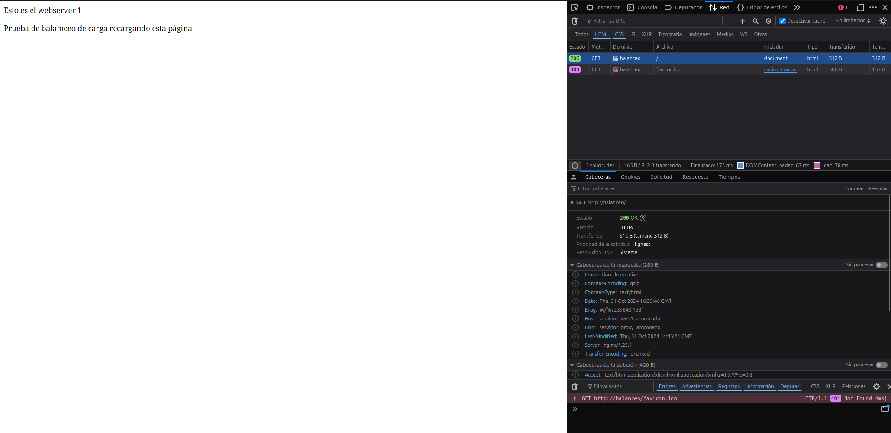
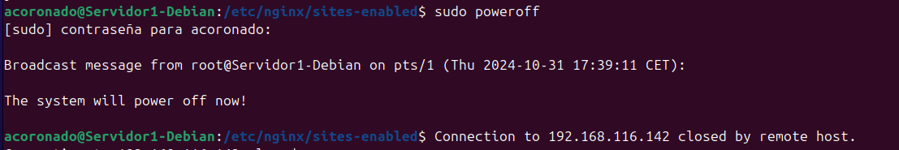

# Práctica 2.4 – Balanceo de carga con proxy inverso en Nginx


## Requisitos antes de comenzar la práctica

!!! warning "Atención"
    - No iniciar esta practica hasta haber completado la [práctica2.3](Practica2.3.md)

--- 

## Introducción

Los servidores proxys inversos y los balanceadores de carga son componentes muy importantes de una arquitectura informática cliente-servidor.

Las definiciones básicas son muy simples:

- Un proxy inverso acepta una solicitud de un cliente, y la reenvía al servidor.

- Un balanceador de carga distribuye las solicitudes entrantes del cliente entre un grupo de servidores.

### Balanceadores de carga

Los balanceadores de carga se implementan con mayor frecuencia cuando un sitio necesita varios servidores porque el volumen de solicitudes es demasiado para que un solo servidor lo maneje de manera eficiente.

Por lo general, todos los servidores alojan el mismo contenido, y el trabajo del balanceador de carga es distribuir la carga de trabajo de manera que se haga el mejor uso de la capacidad de cada servidor, evite la sobrecarga en cualquiera de ellos y dé como resultado la respuesta más rápida posible al cliente.

Un balanceador de carga también puede mejorar la experiencia del usuario al reducir la cantidad de respuestas de error que ve el cliente. Lo hace detectando cuándo los servidores caen y desviando las solicitudes de ellos a los otros servidores del grupo. En la implementación más simple, el balanceador de carga detecta el estado del servidor al interceptar las respuestas de error a las solicitudes regulares.

## Tarea

Vamos a configurar dos servidores web Nginx con dos máquinas Debian, además de reutilizar el proxy inverso Nginx configurado en la práctica anterior. Partiremos, por tanto, de la configuración de la práctica anterior añadiendo lo necesario:

- Cada servidor web presentará un sitio web específico para esta práctica
    - El webserver2 debe tener la IP asignada de forma fija mediante la configuración DHCP
- El proxy inverso que ya teníamos configurado, habrá que configurarlo para que realice el balanceo de carga que deseamos
- Realizaremos las peticiones HTTP desde el navegador web de nuestra máquina anfitriona.

Haremos las peticiones desde el navegador al proxy inverso, que las repartirá entre los dos servidores web que tenemos.

### Configuraciones


!!! warning "Borrar antiguos archivos de configuración"
    - En esta práctica ya no usaremos los archivos de la página web usada en las anteriores,
    por tanto, es recomendable eliminar los archivos de configuración que hemos estado usando
    anteriormente


#### Nginx Servidor Web 1

El primer servidor web será el servidor principal que hemos estado usando hasta ahora, donde tenemos instalado ya el servicio web.

Debemos configurar este servidor web para que sirva el siguiente ```index.html``` que debéis crear dentro de la carpeta ```/var/www/webserver1/html```:

```html
<!DOCTYPE html>
<html lang="es">
<head>
    <meta charset="UTF-8">
    <meta name="viewport" content="width=device-width, initial-scale=1.0">
    <title>Web Server 1</title>
</head>
<body>
    <header>Esto es el webserver 1</header>
    <p>Prueba de balanceo de carga recargando esta página</p>
</body>
</html>
```

El nombre del sitio web que en los archivos correspondientes en sites-availables es webserver1. En donde escribiremos la siguiente configuración.

```nginx                                                  
server {
    listen 8080;

    server_name webserver1 www.webserver1;

    root /var/www/webserver1/html;
    index index.html index.htm;

    location / {            
            add_header Host servidor_web1_acoronado;
            try_files $uri $uri/ =404;
    }
}
```

Como veis el servidor escuchara el puerto ```8080``` y le añadiremos la cabecera Host: servidor_web1_acoronado.

### Nginx Servidor 2

En este servidor web debemos realizar una configuración idéntica al servidor web 1, pero cambiando webserver1 por webserver2 (también en el index.html), así como el nombre de la cabecera añadida, que será Serv_Web2_vuestronombre

HTML:

```html                                                       
<!DOCTYPE html>
<html lang="es">
<head>
    <meta charset="UTF-8">
    <meta name="viewport" content="width=device-width, initial-scale=1.0">
    <title>Web Server 2</title>
</head>
<body>
    <header>Esto es el webserver 2</header>
    <p>Prueba de balanceo de carga recargando esta página</p>
</body>
</html>
```

Config NGINX:

```nginx
server {
        listen 8080;

        server_name webserver2 www.webserver2;

        root /var/www/webserver2/html;
        index index.html index.htm;

        location / {
                add_header Host servidor_web2_acoronado;
                try_files $uri $uri/ =404;
        }
}
```

Como podéis observar la configuración es casí idéntica, cambiando simplemente el nombre y la ruta.


### Nginx Proxy Inverso

Tras haber realizado las configuraciones anteriores, ya tendremos los 2 servidores web listos, entre los cuales vamos a distribuir
las peticiones.

Por tanto, deberemos configurar el servidor proxy para que haga uso de los servidores web y distribuya estas peticiones.

- Crearemos en sites-available el archivo de configuración ```balanceo```

El cual tendrá el siguiente formato.

```nginx
upstream backend_hosts {
            random;
            server ________:____;
            server ________:____;
}
        server {
            listen 80;
            server_name ________;      
            location / {
                proxy_pass http://backend_hosts;
            }
        }
```

Donde:


- upstream backend_hosts → son los servidores entre los que se va a repartir la carga, que son los dos que hemos configurado anteriormente.

- Aquí deberemos colocar la IP de cada servidor, así como el puerto donde está escuchando las peticiones web.

- A este grupo de servidores le ponemos un nombre, que es backend_hosts

- El parámetro random lo que hace es repartir las peticiones HTTP que llegan al proxy inverso de forma completamente aleatoria entre el grupo de servidores que se haya definido en el bloque upstream (en nuestro caso solo hay dos). 

Una vez ya configurado se vería algo así:

```nginx                                                    
upstream backend_hosts {
            random;
            server 192.168.116.117:8080;
            server 192.168.116.142:8080;
}
        server {
            listen 80;
            server_name practica2-1;
            location / {
                add_header Host servidor_web2_acoronado;
                proxy_pass http://backend_hosts;
            }
        }
```

## Comprobaciones

Si accedéis a vuestro sitio web, debéis poder seguir accediendo sin problemas.

- Comprobad dándole repetidamente a F5, que accedéis cada vez a uno de los servidores. Se os mostrará el contenido del index.html del servidor correspondiente cada vez.
- Para una doble comprobación, utilizando las herramientas de desarrollador, mostrad que la web que se os muestra coincide con la cabecera que ha añadido el servidor web en la respuesta HTTP.

Y como podemos ver el servidor proxy hace el balanceo y nos muestra, ambas páginas de los distintos servidores




### Comprobación del balanceo de carga cuando cae un servidor

Nuestro balanceador de carga está constantemente monitorizando “la salud” de los servidores web. De esta forma, si uno deja de funcionar por cualquier razón, siempre enviará las solicitudes a los que queden “vivos”. Vamos a comprobarlo:

    Para el servicio Nginx en el servidor web 1 y comprueba, de la misma forma que en el apartado anterior, que todas las solicitudes se envían ahora al servidor web 2

    Tras iniciar de nuevo Nginx en el servidor web 1, repite el proceso con el servidor web 2.

- Para esto apagaremos el primer servidor con el comando ```sudo poweroff``` 



Y como podemos ver, el servidor proxy solo nos muestra la página alojada en el servidor web 2

;

- Ahora para comprobar si apagando el segundo nos manda al primero hacemos encendemos el primero y apagamos el segundo con el comando ```poweroff```


Y como se puede ver, el servidor proxy solo nos muestra la página alojada en el servidor web 1.


## Cuestiones

!!! note "Cuestión 1"
    - Busca información de qué otros métodos de balanceo se pueden aplicar con Nginx y describe al menos 3 de ellos.

**1 Least connections (least_conn)**

- Este método distribuye el tráfico hacia el servidor que tiene la menor cantidad de conexiones activas en el momento de la petición.

**2 IP Hash (ip_hash)**

- Este método usa la dirección IP del cliente para determinar a qué servidor se debe dirigir la solicitud (Es util para mantener
la sesión del usuario, pues sus peticiones siempre se mandan al mismo servidor).

**3 Least Time (Meno tiempo)**

- Este método envía el tráfico al servidor con el menor tiempo de respuesta. Ideal para cuando se necesiten respuestas muy rápidas

!!! note "Cuestión 2"
    - Si quiero añadir 2 servidores web más al balanceo de carga, describe detalladamente qué configuración habría que añadir y dónde.

- Si quisiera añadir 2 servidores web más al balanceo de carga deberemos ir al bloque de configuración upstream backend_hosts y al igual que hicimos
anteriormente añadiremos dos líneas más de configuración:

```nginx
upstream backend_hosts {
            random;
            server 192.168.116.117:8080;
            server 192.168.116.142:8080;

            server nuevo_server1;
            server nuevo_server2;
}
```

Tras esto reiniciaremos nginx y deberíamos tener 4 servidores disponibles para hacer balanceo de carga
