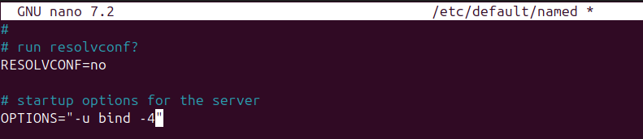
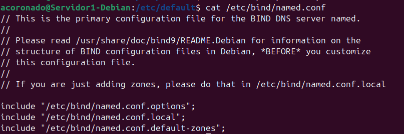
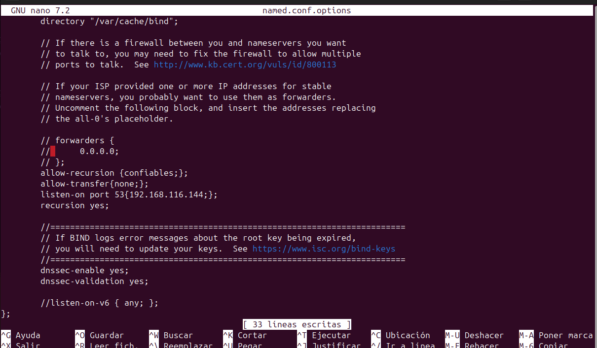
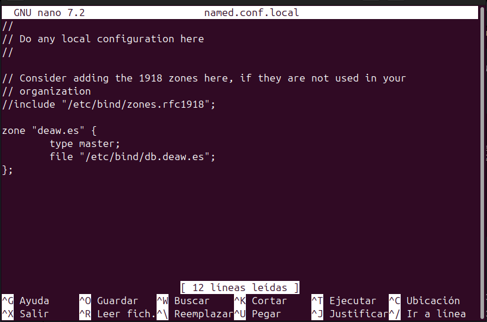
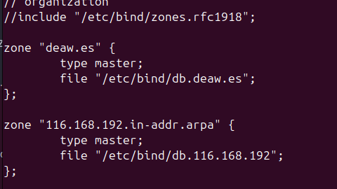
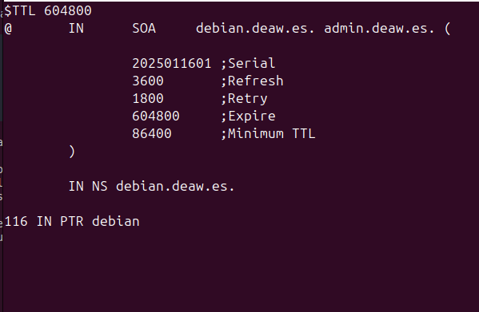
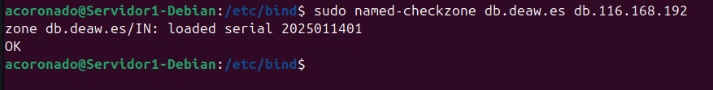
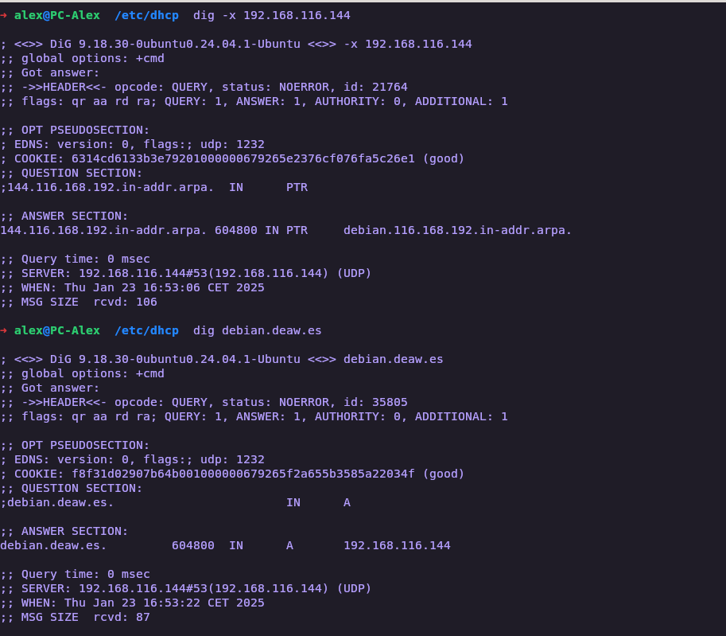
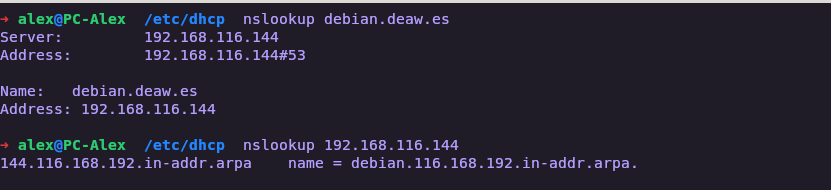

# **Práctica 4.1 - Configuración de un servidor DNS**


## **Instalación de servidor DNS**

Para esta práctica usaremos Bind una herramienta de software libre que se distribuye con la mayoría de plataformas Unix y Linux.
La version que usaremos será Bind9 la cual es la versión recomendada para usarse y es la que usaremos.

Para instalar el servidor DNS, usaremos el siguiente comando:

```
sudo apt-get install bind9 bind9utils bind9-doc 
```

## **Configuración del servidor**

En esta práctica solo usaremos IPv4, por lo tanto, debemos indicárselo a Bind, para esto deberemos irnos al su archivo general de Configuración.
Este archivo se encuentra en el siguiente directorio:

```
/etc/default/named
```

Y una vez que estemos dentro editándolo con `nano` debemos modificar siguiente línea:

```
OPTIONS = "-u bind -4"
```



A continuación nos dirigiremos al archivo principal de configuración `named.conf` el cual está en el directorio


```
/etc/bind
```

Y al consultarlo deberá salir lo siguiente:



Este archivo sirve para agrupar los diferentes directorios de configuración que usaremos a lo largo de práctica.

## **Configuración named.conf.options**

A continuación realizaremos una copia de seguridad del archivo `named.conf.options` antes de editarlo a nuestro gusto

```
sudo cp /etc/bind/named.conf.options /etc/bind/named.conf.options.backup
```


Una vez que hemos hecho la copia de seguridad del archivo
editaremos el archivo `named.conf.options` e incluiremos los siguientes contenidos:

- Por razones de seguridad, incluiremos una lista de acceso para que solo puedan acceder IP's 
autorizadas a ello, es decir vamos a limitar el acceso a nuestro servidor DNS.

Para esto, crearemos un boque con los hosts autorizados que serán los de la red `192.168.X.0/24` (la X depende de nuestra red). El bloque
de configuración debería de quedarnos algo así

```
acl confiables{
  192.168.X.0/24;
}
```


Tras realizar esta configuración, nos daremós cuenta que el servidor ya viene configurado para ser un DNS cache. 
```/var/cache/bind``` es donde se guardaran las zonas.

Por lo tanto, realizaremos las siguientes configuraciones.

- Que sólo se permitan consultas recursivas a los host autorizados
- No permitir la transferencia de zonas.
- Configurar el servidor para que escuche consultas DNS en el puerto 53(puerto por defecto) y en la IP de la máquina virtual.
- Además, comentaremos la línea que pone `listen-on-v6`{ any; };` puesto que no vamos a responder a consultas de IPV6



Ahora comprobaremos si nuestra configuración es correcta con el comando:

```
sudo named-checkconf
```


Si hay algún error, nos saldrá si no nos devolverá la linea de comandos limpia,

Reiniciamos el servicio y comprobamos su estado.


## **Configuración named.conf.local

En este archivo vamos a configurar lo relacionado con nuestras zonas. Por lo tanto, declararemos la zona "deaw.es". Por ahora solo indicaremos
que el servidor DNS es maestro para esta zona y donde estará ubicado el archivo de zona que crearemos más adelante.

```bind
zone "deaw.es" {
        type master;
        file "/etc/bind/db.deaw.es"; 
};
```



## **Creación del archivo de zona**

A continuación crearemos el archivo de zona en el directorio que hemos indicado antes.

Y su contenido sera algo así:

```
$TTL 604800
@       IN      SOA     debian.deaw.es. admin.deaw.es. (
                
                2025011601 ;Serial
                3600       ;Refresh
                1800       ;Retry
                604800     ;Expire
                86400      ;Minimum TTL
        )

        IN NS debian.deaw.es.

debian IN A 192.168.116.144
```


## **Creación del archivo de zona para la resolución inversa**

Una vez creado el archivo de zona deberemos crear uno para la resolución directa y otro para la inversa.

En primer lugar, añadiremos las líneas correspondientes a esta zona inversa en el archivo `named.conf.local`, igual que hemos 
hecho antes con la zona de resolución directa:



Y la configuración de la zona de resolución inversa:



Donde 116 es el tercer byte de la red.

## **Comprobación de las configuraciones**

A continuación vamos a comprobar la configuración de resolución directa:

```
sudo named-checkzone db.deaw.es db.18.168.192
```

Y si todo ha ido bien debería salirnos algo así:



Y para comprobar la configuración de la zona de resolución inversa:

```
sudo named-checkzone db.18.168.192 db.deaw.es
```

E igual que antes deberá mostrar algo parecido a esto para saber que todo esta bien.


Ahora lo siguiente que tenemos que hacer será reiniciar el servicio y comprobaremos su estado:


## **Comprobación de las resoluciones y de las consultas**

Ahora vamos a comprobar desde nuestra máquina anfitriona que el servidor dns está
funcionando correctamente para esto usaremos dig o nslookup, para comprobar las resoluciones directas e inversas:

=== "Comprobación usando dig"

    

=== "Comprobación usando nslookup"

    