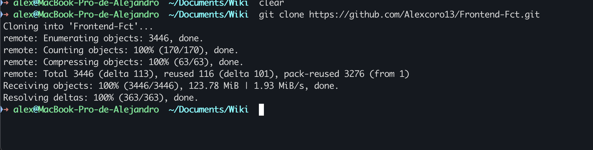
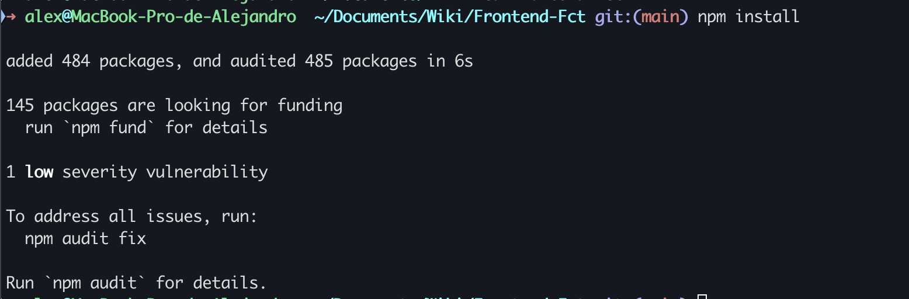
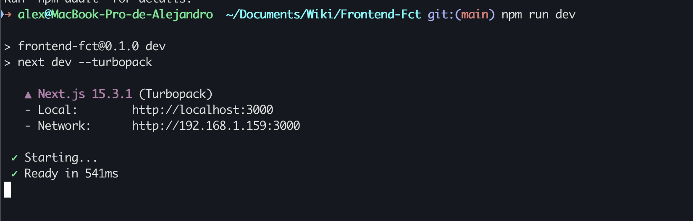
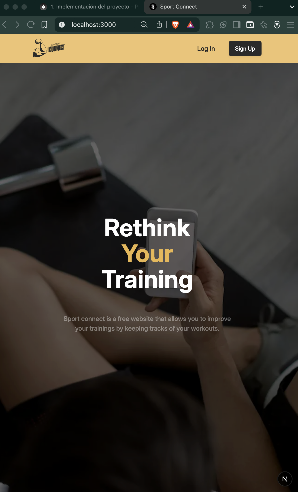
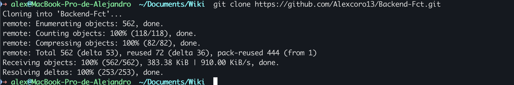
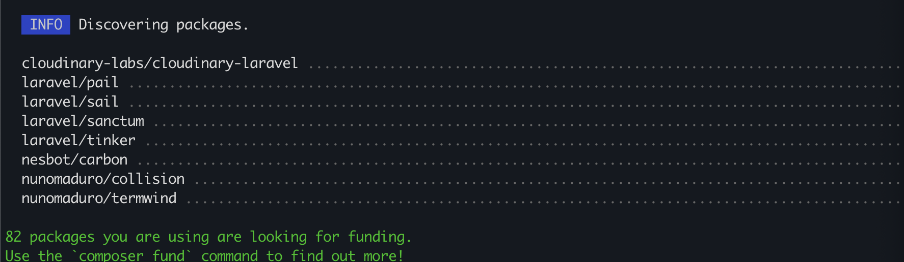
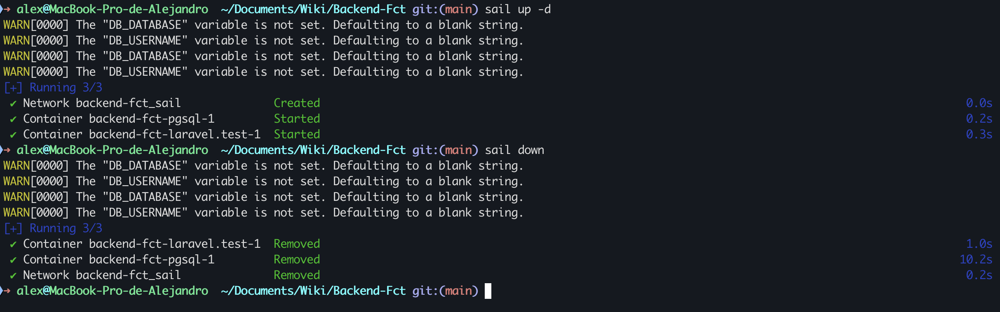

# **1. Implementación del proyecto**

El proyecto de SportConnect se divide en 2 bloques principales, el FrontEnd y el Backend cada uno con sus necesidades y requisitos

## **Instalación del frontEnd**

Para realizar una instalación local del FrontEnd primero necesitaremos clonar el repositorio.
Esto lo haremos con el siguiente comando:

```git
git clone https://github.com/Alexcoro13/Frontend-Fct.git
```



Una vez hemos clonado el repositorio entraremos en el directorio y ejecutaremos el siguiente comando:

```
npm install
```

!!!note "Nota"
    Este comando instalara todas las dependencias del proyecto y creara todos los archivos necesarios para su funcionamento



Tras instalar todas las dependencias del proyecto podremos ejecutar

```
npm run dev
```

Para ejecutar la aplicación en nuestra máquina local.



Y como podemos ver, ya estariamos ejecutando el frontend en nuestro equipo de manera local.



!!!warning "Nota"
    Como aun no hemos instalado el BackEnd solo podremos acceder a la parte publica de la web, ya que no podremos iniciar sesión ni registranos

### **Configuración archivo .env**

Tras haber instalado correctamente el FrontEnd deberemos prepara un archivo .env con la siguiente variable:

```env
NEXT_PUBLIC_API_BASE_URL = "http://localhost:80"
```

Esta variable nos permite cambiar la dirección a la que apuntan nuestra peticiones, para facilitar el desarrollo y el despliegue.

## **Instalación BackEnd**

!!!warning "Atención"
    El BackEnd de SportConenct esta desarrollado con laravel sail, para el cual es necesario tener instalado docker

Al igual que en el FrontEnd aquí tambien necesitaremos clonar el repositorio con el siguiente comando:

```git
git clone https://github.com/Alexcoro13/Backend-Fct.git
```



Una vez clonado el repositorio iremos al directorio y ejecutaremos:

```composer
composer install
```

Así composer nos instalara al igual que npm todas las dependencias del proyecto. Y nos deberia de mostrar esto.



!!!note "Alias"
    Por defecto para ejecutar comandos de sail hace falta introducir `vendor/bin/sail up -d` lo cual lo vuelve un poco tedioso. Es por esto que es recomendable establecer una alias en la configuración de tu shell ubicado en tu directorio `Home` (~/.zshrc o ~/.bashrc).

    Por lo tanto con añadir esta linea en la configuración de tu shell, podras ejecutar comandos sail mucho más facil.

    ```bash
    alias sail='sh $([ -f sail ] && echo sail || echo vendor/bin/sail)'
    ```


Ahora simplemente nos quedaría ejecutar:

```
sail up -d
```

Para lanzar los contenedores con la aplicación 
y:

```
sail down
```

Para parar los contenedores cuando queremos.



Aun que como se puede ver al lanzar los contenedores Docker nos avisa que hace falta el archivo .env para que todo funcione correctamente. Asi que pongamos con ello.

### **Configuración .env**

El proyecto por defecto tra un archivo .env de ejemplo con todas las variables que se usan, a pesar de esto para mantener la seguridad algunas variables no contienen datos reales y se necesitará cambiarlas:

```env
SAIL_XDEBUG_MODE=debug
SAIL_XDEBUG_CONFIG="client_host=host.docker.internal start_with_request=yes"

APP_NAME=sportconnect
APP_ENV=local
APP_KEY=
APP_DEBUG=true
APP_URL=http://localhost

APP_LOCALE=en
APP_FALLBACK_LOCALE=en
APP_FAKER_LOCALE=en_US

APP_MAINTENANCE_DRIVER=file
# APP_MAINTENANCE_STORE=database

PHP_CLI_SERVER_WORKERS=4

BCRYPT_ROUNDS=12

LOG_CHANNEL=stack
LOG_STACK=single
LOG_DEPRECATIONS_CHANNEL=null
LOG_LEVEL=debug

# Conexión desarrollo servicio posgresql
DB_CONNECTION=pgsql
DB_HOST=pgsql
DB_PORT=5432
DB_DATABASE=laravel
DB_USERNAME=sail
DB_PASSWORD=localhost

SESSION_DRIVER=cookie
SESSION_LIFETIME=120
SESSION_ENCRYPT=false
SESSION_PATH=/
SESSION_DOMAIN=null

BROADCAST_CONNECTION=log
FILESYSTEM_DISK=local
QUEUE_CONNECTION=database

CACHE_STORE=database
# CACHE_PREFIX=

MEMCACHED_HOST=127.0.0.1

REDIS_CLIENT=phpredis
REDIS_HOST=127.0.0.1
REDIS_PASSWORD=null
REDIS_PORT=6379

# Proveedor de correo electrónico
MAIL_MAILER=smtp
MAIL_SCHEME=null
MAIL_HOST=smtp.gmail.com
MAIL_PORT=587
MAIL_USERNAME="tucorreo"
MAIL_PASSWORD="tucontraseña"
MAIL_FROM_ADDRESS="tudirecciondecorreo"
MAIL_FROM_NAME="SportConnect"

VITE_APP_NAME="${APP_NAME}"

SANCTUM_STATEFUL_DOMAINS=localhost:3000

# Esta variable es para cuando el usuario verifica su cuenta, sea redirigido a la página de inicio
FRONTEND_URL=http://localhost:3000/home

# Configuración de Cloudinary
CLOUDINARY_UPLOAD_PRESET="cloudnary_upload_preset"

CLOUDINARY_CLOUD_NAME="cloundname"
CLOUDINARY_API_KEY="apikey"
CLOUDINARY_API_SECRET="apisecret"
```

!!!note "Variables que necesitan cambio"
    Las variables que necesitan ser cambiadas son todas las relacionadas con [`CLOUDINARY`](https://cloudinary.com/), y las variables de [`MAIL`](https://mailtrap.io/es/blog/gmail-smtp/#Paso-2-Informacion-necesaria-para-la-configuracion-de-SMTP)

Por último necesitaremos hacer un par de cosas más antes de tener nuestro BackEnd funcionando y será ejecutar los siguientes comandos

```
sail artisan migrate
sail artisan db:seed
```

Para que se creen las tablas y se poble la base de datos con información.