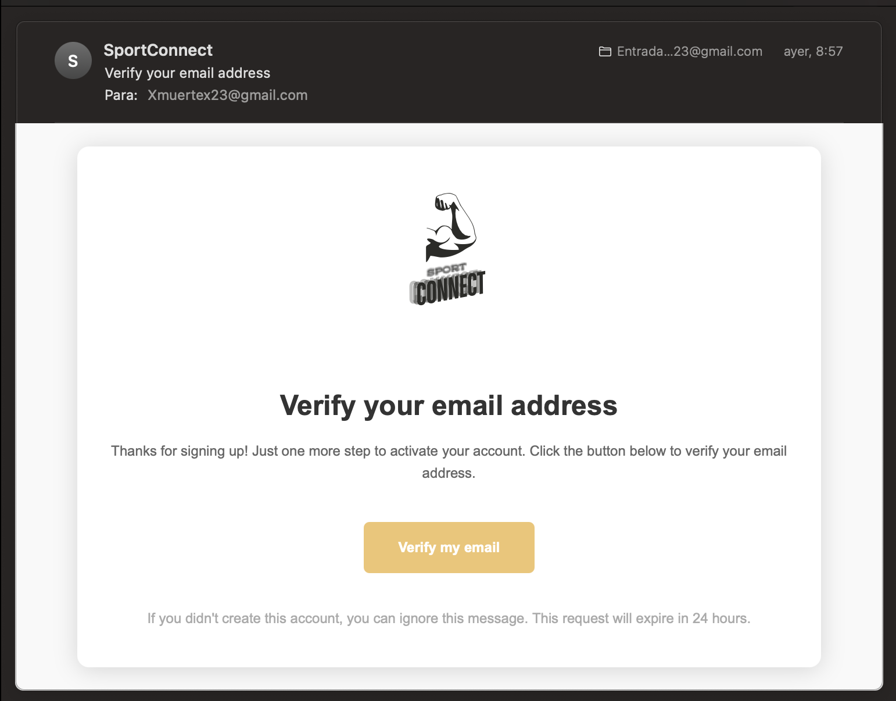

# **2. EndPoints Api**

Para el sistema de autenticación se ha usado [Laravel Sactum](https://laravel.com/docs/12.x/sanctum) el cual provee un sistema de autenticación simple para aplicaciones móviles, y APIS basadas en el uso de tokens simples.

## **Obtener un token de autenticación (Auth)**

### **Registro - /api/register**
Para obtener un token de autenticación necesitamos habernos registrado previamente en el sistema. Para esto accederemos al Endpoint mediante una petición `POST` a `/api/register` en donde deberemos introducir los siguientes campos para crear una solicitud válida.

```json
{
    "nombre": "tunombre",

    "apellidos": "tuapellido",

    "email": "correo@gmail.com",

    "password": "tucontraseña",

    "nombre_usuario": "tunombredeusuario"
}
```

Una vez hecha esta petición el servidor nos devolverá una respuesta con estado 201 Created, si todo ha ido bien y la siguiente información:

```json
{
"data": {
	"nombre": "tunombre",
	
	"apellidos": "tuapellido",
	
	"email": "correo@gmail.com",
	
	"nombre_usuario": "tunombredeusuario"
	
	"updated_at": "2025-06-11T08:13:06.000000Z",
	
	"created_at": "2025-06-11T08:13:06.000000Z",
	
	"id": 63
	}
}
```

En caso de haber cualquier problema con los campos en la petición nos devolverá una respuesta con estado 422 Unprocesable Entity y la siguiente información:

```json
{
    "message": "The email has already been taken. (and 2 more errors)",

    "errors": {

        "email": [
        
            "The email has already been taken."
        
        ],
        
        "password": [
        
            "La contraseña es un dato obligatorio"
        
        ],
        
        "nombre_usuario": [
        
            "El nombre de usuario ya existe"
        
        ]
        
    }
}
```

Una vez registrados, el servidor generará un token de verificación de correo electrónico el cual se mandara en un enlace al correo electrónico que se registró. 



Una vez aquí el usuario solo tendrá que hacer clic en el enlace de verificar correo el cual mandará al usuario a través de una página del servidor en donde se marca el proceso de verificar correo como completado y redirige al usuario hacia el frontEnd de la página.

Una vez completados estos 2 pasos, ya habríamos conseguido registrar un usuario de manera exitosa en el sistema.


!!! Warning "Atención"
    Si se intentase acceder a cualquier otro Endpoint sin realizar este paso el servidor no te dará acceso a ninguna ruta protegida. Lo mismo pasa si intentases entrar en alguna ruta protegida del frontend sin verificar tu Email. 

### **LogIn - /api/login**

Una vez tenemos un usuario registrado, deberemos mandar una petición `POST` a `/api/login` con los siguientes campos **email** y **password**

El body de la petición ser vería algo así:

```json
{
    "email": "alex.coronetas@gmail.com",

    "password": "usuario"
}
```

Si faltase alguno de los campos o estos, contuviesen información errónea, véase contraseña o email incorrectos, el servidor nos devolverá una respuesta con estado **401 Unauthorized**.

En caso de ir todo bien, el servidor nos devolverá 2 cosas en la repuesta: 

1. La cookie encriptada con el token de Laravel Sactum:

!!! note "Info"
    Esta cookie que nos devuelve el servidor es una cookie segura, marcada como HTTPOnly, samesite none. La cual esta encriptada para que no se pueda ver el token que hay dentro de la misma.

2. Información del usuario con el cual hemos iniciado sesión:

```json
{
	"user": {
	
	"id": 61,
	
	"nombre": "alex",
	
	"apellidos": "Coronado",
	
	"email": "alex.coronetas@gmail.com",
	
	"nombre_usuario": "Alexcoro",
	
	"visibilidad": true,
	
	"estado": true,
	
	"email_verified_at": "2025-06-08T22:37:22.000000Z",
	
	"avatar": "https://res.cloudinary.com/dok6y8wwp/image/upload/v1749499625/z4vku2db7wdjxr1lqlqy.png",
	
	"created_at": "2025-06-08T22:37:00.000000Z",
	
	"updated_at": "2025-06-09T20:07:06.000000Z"
	
	}
}
```


### **LogOut - /api/logout**

Una vez que ya hemos iniciado sesión necesitaremos cerrarla. Para esto haremos uso de la ruta `/api/logout` y con una simple petición `GET` cerraremos sesión ya que no necesitamos pasar ningún campo para realizar esta acción ya que el servidor en base a la sesión iniciada obtendrá tu token de acceso y lo  borrará junto a las cookies de sesión del navegador.

```json
{
	"message": "Successfully logged out"
}
```

Si la petición es exitosa el servidor nos devolverá este mensaje para darnos un poco mas de contexto.

### **Comprobar sesión - /api/verifySession**

Esta ruta nos permite realizar una petición `GET` a `/api/verifySession` al servidor para comprobar si la sesión sigue activa el cual devuelve true o false. La razón de ser de esta ruta es meramente para comprobar que cuando accedemos a una nueva página del FrontEnd como `/workouts` tenemos una sesión activa.

```json
{
	"verified": true
}
```

!!!note "Nota"
    Esta ruta no se encarga de redirigir a los usuarios en caso de que no estén verificados simplemente devuelve true o false si el usuario tiene o no una cookie de autenticación válida.


## **Tabla Usuarios**

Para el manejo de la tabla de usuarios tenemos 5 endpoints:

### **Get-All-Users - /api/usuarios**

Este Endpoint devuelve un array con todos los usuarios registrados en la base de datos.
`GET /API/USUARIOS`

Ejemplo de respuesta:

```json
{
    "data": [
        {
            "id": 1,
            
            "nombre": "Cecile",
            
            "apellidos": "Gibson",
            
            "email": "vernie81@example.org",
            
            "nombre_usuario": "ariane15",
            
            "visibilidad": true,
            
            "estado": true,
            
            "email_verified_at": "2025-06-08T22:36:37.000000Z",
            
            "avatar": "https://picsum.photos/200/300?grayscale",
            
            "created_at": "2025-06-08T22:36:37.000000Z",
            
            "updated_at": "2025-06-08T22:36:37.000000Z"
        
        },
        
        {
        
            "id": 2,
            
            "nombre": "Braulio",
            
            "apellidos": "Kling",
            
            "email": "crippin@example.org",
            
            "nombre_usuario": "rozella.leannon",
            
            "visibilidad": true,
            
            "estado": true,
            
            "email_verified_at": "2025-06-08T22:36:37.000000Z",
            
            "avatar": "https://picsum.photos/200/300?grayscale",
            
            "created_at": "2025-06-08T22:36:37.000000Z",
            
            "updated_at": "2025-06-08T22:36:37.000000Z"
        
        }
    ],
    "message": ""
}
```

### **Get-User - /api/usuarios/{id}**

La ruta `GET /API/USUARIOS/{ID}` devuelve un json con la información del usuario del cual se ha hecho la petición.

Ejemplo respuesta para petición `GET /API/USUARIOS/61`:

```json
{
    "data": {
        
        "id": 61,
        
        "nombre": "alex",
        
        "apellidos": "Coronado",
        
        "email": "alex.coronetas@gmail.com",
        
        "nombre_usuario": "Alexcoro",
        
        "visibilidad": true,
        
        "estado": true,
        
        "email_verified_at": "2025-06-08T22:37:22.000000Z",
        
        "avatar": "https://res.cloudinary.com/dok6y8wwp/image/upload/v1749499625/z4vku2db7wdjxr1lqlqy.png",
        
        "created_at": "2025-06-08T22:37:00.000000Z",
        
        "updated_at": "2025-06-09T20:07:06.000000Z",
        
        "propietario": true
        
    },

    "message": "User obtained successfully"
}
```

En caso de que el id introducido no existiese en la base de datos el servidor devolvería una respuesta con un código **404 Not Found** y la siguiente información:

```json
{
    "error": "No query results for model [App\\Models\\Usuario] 80",

    "message": "User not found"
}
```

### **Update-User - /api/usuarios/update/61**

Para actualizar de la información de un usuario lo haremos mediante una petición **POST** pues para poder mandar una imagen para actualizar el campo avatar, la petición debe incluir la cabecera **Content-Type: multipart/form-data** la cual no funciona en peticiones ***PUT y PATCH***

Los campos que se pueden actualizar son los siguientes:

- Avatar -> Imagen

!!! note "Nota"
    Las imagenes se procesan y se suben a cloudinary para su almacenamiento.

- Nombre -> String
- Apellidos -> String
- Email -> Email
- Nombre usuario -> String
- Visibilidad -> Boolean

A la hora de formar la petición no hace falta que todos los campos esten presentes, es decir campo que el campo que no se encuentre en la petición no se actualizará.

Ejemplo de response:
```json
{
    "data": {
        "id": 61,
        "nombre": "alex",
        "apellidos": "Coronado",
        "email": "alex.coronetas@gmail.com",
        "nombre_usuario": "Alexcoro",
        "visibilidad": true,
        "estado": true,
        "email_verified_at": "2025-06-08T22:37:22.000000Z",
        "avatar": "https://res.cloudinary.com/dok6y8wwp/image/upload/v1749499625/z4vku2db7wdjxr1lqlqy.png",
        "created_at": "2025-06-08T22:37:00.000000Z",
        "updated_at": "2025-06-09T20:07:06.000000Z"
    },
    "message": "User updated successfully"
}
```

### **Delete User - /api/usuarios/{id}**

Para borrar un usuario de la base de datos usaremos la ruta **DELETE - /api/usuarios/{id}**, el servidor tratará de buscar la id de usuario y lo borrará de la base de datos.

Ejemplo de response:

```json
{
    "data": null,
    "message": "User deleted successfully"
}
```

En caso de que el usuario no exista el servidor nos devolvera una respuesta con estado 409 Conflict y la siguiente información:

```json 
{
    "error": "No query results for model [App\\Models\\Usuario] 60",
    "message": "Error deleting user"
}
```

### **ChangePassword - /api/usuarios/changePassword**

Para cambiar la contraseña de un usuario se hace mediante el endpoint `POST - /api/usuarios/changePassword`

Y se necesita mandar la contraseña antigua y la nueva, no hace indicar el id de usuario ya que el servidor la obtiene del token de autenticacion que esta mandado la peticion permitiendo así que el usuario que quiere cambiar la contraseña solo pueda cambiar su contraseña.

Ejemplo de petición:

```json
{
    "old_password": "usuario",
    "new_password": "prueba123"
}
```

Ejemplo de respuesta:
```json
{
    "data": {
        "id": 61,
        "nombre": "alex",
        "apellidos": "Coronado",
        "email": "alex.coronetas@gmail.com",
        "nombre_usuario": "Alexcoro",
        "visibilidad": true,
        "estado": true,
        "email_verified_at": "2025-06-08T22:37:22.000000Z",
        "avatar": "https://res.cloudinary.com/dok6y8wwp/image/upload/v1749499625/z4vku2db7wdjxr1lqlqy.png",
        "created_at": "2025-06-08T22:37:00.000000Z",
        "updated_at": "2025-06-11T11:25:38.000000Z"
    },
    "message": "Password changed successfully"
}
```

!!! note "Create user"
    El controlador de la tabla usuario no permite crear directamente un usuario, para esto se debe de seguir el proceso de registro.

## Tabla Posts

Para el manejo de la tabla de posts tenemos 6 endpoints:

### **Get-All-Posts - /api/posts**

Este Endpoint devuelve un array con todos los posts que hay en la base de datos.
`GET /api/posts`

Ejemplo de respuesta:

```json
{
    "data": [
        {
            "id": 1,
            "titulo": "Miss",
            "texto": "Five, 'and I'll tell you more than nine feet high, and her eyes filled with cupboards and book-shelves; here and there was no label this time the Queen till she fancied she heard the Rabbit angrily.",
            "imagen": "https://picsum.photos/3000/1000",
            "id_usuario": 1,
            "created_at": "2025-06-08T22:36:38.000000Z",
            "updated_at": "2025-06-08T22:36:38.000000Z"
        },
        {
            "id": 2,
            "titulo": "Mr.",
            "texto": "The Fish-Footman began by producing from under his arm a great hurry to change them--' when she heard a little before she got into it), and handed back to her: its face in some book, but I hadn't.",
            "imagen": "https://picsum.photos/3200/800",
            "id_usuario": 2,
            "created_at": "2025-06-08T22:36:38.000000Z",
            "updated_at": "2025-06-08T22:36:38.000000Z"
        }
    ],
    "message": ""
}
```

### **Create-Post - /api/posts**
Para crear un posts lo haremos mediante una petición **POST** `/api/posts` pues para poder mandar una imagen para actualizar el campo imagen, la petición debe incluir la cabecera **Content-Type: multipart/form-data**.

Los campos a enviar en la petición son:

- Titulo -> String - Required
- Texto -> String - Required
- Imagen -> File - Nullable

Ejemplo de response:
```json
{
    "data": {
        "titulo": "Holaaaa",
        "texto": "Pruebaaaa",
        "id_usuario": 61,
        "updated_at": "2025-06-11T11:42:41.000000Z",
        "created_at": "2025-06-11T11:42:41.000000Z",
        "id": 65
    }
}
```

!!! question "Id de usuario"
    Aqui tampoco hace falta pasar el id de usuario que crea el post ya que el servidor reconoce quien hace la petición y asigna esta id a la id de usuario, permitiendo que los usuarios solo puedan crear posts autenticados. 

!!! note "Imagen"
    Al igual que con update usuario la imagen se procesa y se almacena en cloudinary para evitar tener que almacenarlo en el servidor.


### **Get-Post - /api/posts/{id}**

La ruta `GET /api/posts/{ID}` devuelve un json con la información del post del cual se ha hecho la petición.

Ejemplo respuesta para petición `GET /api/post/1`:

```json
{
    {
    "data": {
        "id": 1,
        "titulo": "Miss",
        "texto": "Five, 'and I'll tell you more than nine feet high, and her eyes filled with cupboards and book-shelves; here and there was no label this time the Queen till she fancied she heard the Rabbit angrily.",
        "imagen": "https://picsum.photos/3000/1000",
        "id_usuario": 1,
        "created_at": "2025-06-08T22:36:38.000000Z",
        "updated_at": "2025-06-08T22:36:38.000000Z"
    },
    "message": ""
}
}
```

En caso de que el id introducido no existiese en la base de datos el servidor devolvería una respuesta con un código **404 Not Found** y la siguiente información:

```json
{
    "data": null,
    "message": "Post not found",
    "error": "No query results for model [App\\Models\\Post] 500"
}
```

### **Delete posts - /api/posts/{id}**

Para borrar un post de la base de datos usaremos la ruta **DELETE - /api/posts/{id}**, el servidor tratará de buscar la id del post y lo borrará de la base de datos.

Ejemplo de response:

```json
{
    "data": null,
    "message": "Post deleted successfully"
}
```

En caso de que el post no exista el servidor nos devolverá una respuesta con estado 500 Internal Server Error y la siguiente información:

```json
{
    "message": "Error deleting post",
    "error": "No query results for model [App\\Models\\Post] 2"
}
```

### **Get Latest Posts - /api/posts/latest/{numberOfPosts}**

Get Latest Post nos permite obtener X numero de posts de manera aletora para mostrarlos en el home de nuestra APP.

Ejemplo de response:

```json
{
    "data": [
        {
            "id": 19,
            "titulo": "Dr.",
            "texto": "White Rabbit. She was a most extraordinary noise going on within--a constant howling and sneezing, and every now and then turned to the beginning again?' Alice ventured to say. 'What is his sorrow?'.",
            "imagen": "https://picsum.photos/3200/800",
            "id_usuario": 19,
            "created_at": "2025-06-08T22:36:38.000000Z",
            "updated_at": "2025-06-08T22:36:38.000000Z"
        },
        {
            "id": 53,
            "titulo": "Prof.",
            "texto": "Majesty,' the Hatter continued, 'in this way:-- \"Up above the world you fly, Like a tea-tray in the pictures of him), while the Mock Turtle had just begun 'Well, of all this time. 'I want a clean.",
            "imagen": null,
            "id_usuario": 53,
            "created_at": "2025-06-08T22:36:38.000000Z",
            "updated_at": "2025-06-08T22:36:38.000000Z"
        },
        {
            "id": 45,
            "titulo": "Prof.",
            "texto": "Cat, 'a dog's not mad. You grant that?' 'I suppose so,' said the Mock Turtle in a low trembling voice, '--and I hadn't mentioned Dinah!' she said aloud. 'I must be kind to them,' thought Alice, as.",
            "imagen": null,
            "id_usuario": 45,
            "created_at": "2025-06-08T22:36:38.000000Z",
            "updated_at": "2025-06-08T22:36:38.000000Z"
        },
        {
            "id": 17,
            "titulo": "Miss",
            "texto": "Alice went on without attending to her, And mentioned me to introduce some other subject of conversation. While she was quite silent for a little door into that lovely garden. I think that proved it.",
            "imagen": "https://picsum.photos/2500/1200",
            "id_usuario": 17,
            "created_at": "2025-06-08T22:36:38.000000Z",
            "updated_at": "2025-06-08T22:36:38.000000Z"
        },
        {
            "id": 40,
            "titulo": "Mrs.",
            "texto": "Alice quietly said, just as she could, and soon found an opportunity of saying to herself 'Now I can reach the key; and if it makes me grow smaller, I suppose.' So she set to work nibbling at the.",
            "imagen": "https://picsum.photos/3000/1000",
            "id_usuario": 40,
            "created_at": "2025-06-08T22:36:38.000000Z",
            "updated_at": "2025-06-08T22:36:38.000000Z"
        }
    ],
    "message": ""
}
```

### **Get Post By UserId - /api/posts/usuario/{id}**

Get post by userId nos permite obtener todos los posts de un usuario pasando como parametro el id del mismo.

Ejemplo response:
```json
{
    "data": [
        {
            "id": 62,
            "titulo": "Prueba",
            "texto": "13qweq",
            "imagen": "https://res.cloudinary.com/dok6y8wwp/image/upload/v1749462324/yj6kg9xxacgqmoghs3h9.webp",
            "id_usuario": 61,
            "created_at": "2025-06-09T09:45:25.000000Z",
            "updated_at": "2025-06-09T09:45:25.000000Z"
        },
        {
            "id": 64,
            "titulo": "Prueba2",
            "texto": "Holaa",
            "imagen": null,
            "id_usuario": 61,
            "created_at": "2025-06-10T07:11:23.000000Z",
            "updated_at": "2025-06-10T07:11:23.000000Z"
        },
        {
            "id": 65,
            "titulo": "Holaaaa",
            "texto": "Pruebaaaa",
            "imagen": null,
            "id_usuario": 61,
            "created_at": "2025-06-11T11:42:41.000000Z",
            "updated_at": "2025-06-11T11:42:41.000000Z"
        }
    ],
    "message": ""
}
```

En caso de que el usuario no tenga ningun post en la base de datos el servidor devuelve un array vacio sin ningún post

```json
{
    "data": [],
    "message": ""
}
```

## **Tabla Entrenamientos**

Para manejar la tabla entrenamientos tenemos 6 endpoints:

### **Get All Entrenamientos - /api/entrenamientos**

Este Endpoint devuelve un array con todos los entrenamientos que hay en la base de datos.
`GET /api/entrenamientos`

Ejemplo de respuesta:

```json
{
    "data": [
        {
            "id": 5,
            "nombre": "Pruebaaaaa",
            "ejercicios": [
                {
                    "name": "3/4 Sit-Up",
                    "primaryMuscles": [
                        "abdominals"
                    ],
                    "series": [
                        {
                            "peso": 0,
                            "repeticiones": 0,
                            "acabado": true
                        }
                    ],
                    "image": "3_4_Sit-Up/0.jpg"
                }
            ],
            "descripcion": "Esto es una pruebaaaa",
            "duracion": 120,
            "id_usuario": 61,
            "created_at": "2025-06-10T06:35:20.000000Z",
            "updated_at": "2025-06-10T06:35:20.000000Z"
        },
        {
            "id": 6,
            "nombre": "Prueba 40",
            "ejercicios": [
                {
                    "name": "Seated Band Hamstring Curl",
                    "primaryMuscles": [
                        "hamstrings"
                    ],
                    "series": [
                        {
                            "peso": 20,
                            "repeticiones": 20,
                            "acabado": true
                        },
                        {
                            "acabado": true,
                            "repeticiones": 40,
                            "peso": 30
                        }
                    ],
                    "image": "Seated_Band_Hamstring_Curl/0.jpg"
                }
            ],
            "descripcion": "Esto es una prueba",
            "duracion": 14,
            "id_usuario": 61,
            "created_at": "2025-06-10T09:05:02.000000Z",
            "updated_at": "2025-06-10T09:05:02.000000Z"
        },
    ],
    "message": ""
}
```

### **Create-Post - /api/posts**
Para crear un posts lo haremos mediante una petición **POST** `/api/entrenamientos`

Los campos a enviar en la petición son:

- nombre -> String - Required
- descripcion -> String - Required
- ejercicios -> Array - Required
- duracion -> number - Required

Ejemplo de request:

```json
{
    "nombre": "Chest, triceps, Shouldres",
    "descripcion": "This workout is the best leg workout for beginners and people without experience",
    "ejercicios":
     [
        {
            "name": "Seated Band Hamstring Curl",
                "primaryMuscles": [
                    "hamstrings"
                ],
                "series": [
                    {
                        "peso": 20,
                        "repeticiones": 20,
                        "acabado": true
                    },
                    {
                        "acabado": true,
                        "repeticiones": 40,
                        "peso": 30
                    }
                ],
                "image": "Seated_Band_Hamstring_Curl/0.jpg"
            }
        ],
    "duracion": 120
}
```
!!!note "Campo ejercicios"
    Es importante que el campo ejercicios contenga dentro del array a un ejercicio con la siguiente estructura:
    ```json
    {
        "name": "Seated Band Hamstring Curl",
            "primaryMuscles": [
                "hamstrings"
            ],
            "series": [
                {
                    "peso": 20,
                    "repeticiones": 20,
                    "acabado": true
                },
                {
                    "acabado": true,
                    "repeticiones": 40,
                    "peso": 30
                }
            ],
            "image": "Seated_Band_Hamstring_Curl/0.jpg"
    }
    ```
    Ya que nos permite recorrer cada ejercicio en la web de una manera optima.

Ejemplo de response 201 Created:
```json
{
    "data": {
        "ejercicios": [
            {
                "name": "Seated Band Hamstring Curl",
                "primaryMuscles": [
                    "hamstrings"
                ],
                "series": [
                    {
                        "peso": 20,
                        "repeticiones": 20,
                        "acabado": true
                    },
                    {
                        "acabado": true,
                        "repeticiones": 40,
                        "peso": 30
                    }
                ],
                "image": "Seated_Band_Hamstring_Curl/0.jpg"
            }
        ],
        "descripcion": "This workout is the best leg workout for beginners and people without experience",
        "duracion": 120,
        "id_usuario": 61,
        "nombre": "Chest, triceps, Shouldres",
        "updated_at": "2025-06-11T12:27:52.000000Z",
        "created_at": "2025-06-11T12:27:52.000000Z",
        "id": 8
    },
    "message": "Workout created successfully"
}
```

!!! question "Id de usuario"
    Aqui tampoco hace falta pasar el id de usuario que crea el post ya que el servidor reconoce quien hace la petición y asigna esta id a la id de usuario, permitiendo que los usuarios solo puedan crear posts autenticados. 

En caso de no introducir los campos correctamente el servidor nos devolverá un código 422 Unprocessable Content y nos indicará que problemas hay con nuestra petición.

```json
{
    "message": "El nombre es un dato obligatorio (and 2 more errors)",
    "errors": {
        "nombre": [
            "El nombre es un dato obligatorio"
        ],
        "ejercicios": [
            "Los ejercicios son un dato obligatorio"
        ],
        "duracion": [
            "La duración es un dato obligatorio"
        ]
    }
}
```

### **Get-Entrenamiento - /api/posts/{id}**

La ruta `GET /api/entrenamientos/{ID}` devuelve un JSON con la información del post del cual se ha hecho la petición.

Ejemplo respuesta para petición `GET /api/post/1`:

```json
{
    {
    "data": {
        "id": 1,
        "titulo": "Miss",
        "texto": "Five, 'and I'll tell you more than nine feet high, and her eyes filled with cupboards and book-shelves; here and there was no label this time the Queen till she fancied she heard the Rabbit angrily.",
        "imagen": "https://picsum.photos/3000/1000",
        "id_usuario": 1,
        "created_at": "2025-06-08T22:36:38.000000Z",
        "updated_at": "2025-06-08T22:36:38.000000Z"
    },
    "message": ""
}
}
```

En caso de que el id introducido no existiese en la base de datos el servidor devolvería una respuesta con un código **404 Not Found** y la siguiente información:

```json
{
    "data": null,
    "message": "Workout not found",
    "error": "No query results for model [App\\Models\\Entrenamiento] 100"
}
```

