# Práctica 3.2: Despliegue de aplicaciones con Node Express y Despliegue de una aplicación React en Netlify (PaaS)

---

## Despliegue de aplicaciones con Node Express

### Introducción

Vamos a realizar el despliegue de aplicaciones Node.js sobre un servidor Node Express. Lo curioso de este caso
es que el despliegue aqí cambia un poco puesto, que no se hace sobre el servidor, sino que la aplicación es el servidor


!!! warning
    Comprobamos si el servidor Tomcat de la práctica anterior no es en funcionamiento o nos dara problemas:

    ```
    sudo systemctl status tomcat10
    ```

    Y en caso de estar activo, pararlo

    ```
    sudo systemctl stop tomcat10
    ```

### Instalación de Node.js, Express

La primera parte de la práctica es muy sencilla. Consistirá en instalar sobre nuestra Debian 11 tanto Node.js como Express y tras ello crear un archivo .js de prueba para comprobar que nuestro primer despliegue funciona correctamente.

Para instalar node simplemente ejecutaremos el siguiente comando: 

```
sudo apt -y install nodejs npm
```

Y tras completar la instalación ejecutaremos ```node -v``` para comprobar la version y que se ha instalado correctamente

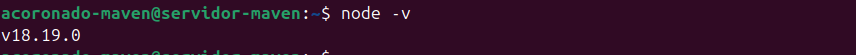

### Despliegue de una nueva aplicación

Vamos a realizar ahora el despliegue de una aplicación, para acelerar todo este proceso
clonaremos este [repositorio](https://github.com/MehedilslamRipon/Shopping-Cart-Application) con el siguiente comando

```
git clone https://github.com/MehedilslamRipon/Shopping-Cart-Application
```

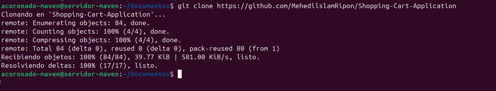

Tras esto nos movemos al directorio nuevo

```
cd Shopping-Cart-Application/
```

Una vez dentro instalaremos las librerias con el comando 

```
npm install 
```

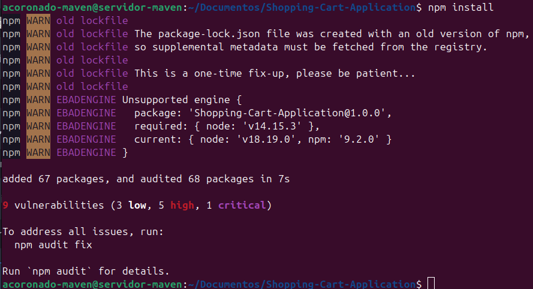

Y por último ejecutaremos, ```npm run start``` para ejecutar la aplicación.

Cuando ejecutemos este comando el servidor no arrancará y mostrará el siguiente error en consola:

```
sh: 1: nodaemon: not found
```

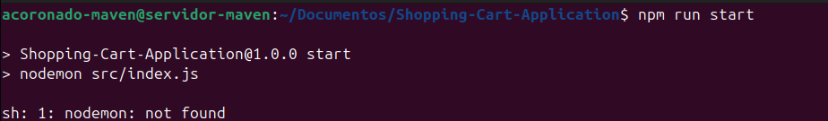

Para solucionarlo deberemos de seguir los siguientes pasos: 

1. Instalar la dependencia nodeamon de forma local en el proyecto con el siguiente comando

```
npm install nodeamon --save-dev
```

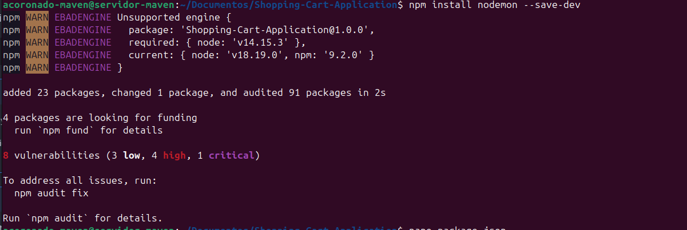

Esto agregará nodeamon al proyecto y permitirá que el script start lo use sin problema

2. Asegurarse de que el archivo package.json contiene la siguiente línea.

```json
"scripts": {
  "start": "nodemon src/index.js"
}
```

Y ya por último podremos ejecutar ```npm run start```


Y como se puede ver el servidor ya está en marcha y funcionando. Para conectarnos
en el navegador pondremos la ip de la máquina:puerto, en mi caso
```192.168.8.63:3000```

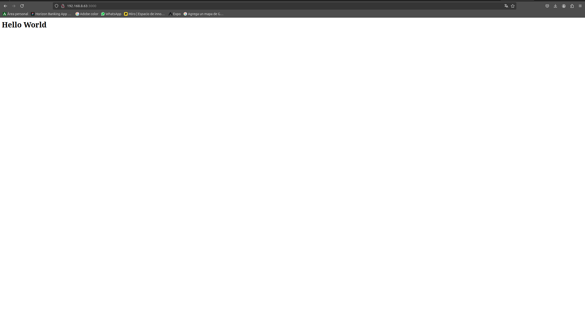

## Despliegue de una aplicación de React en Netlify

### Introducción

En el apartado anterior hemos visto cómo desplegar una aplicación de Node.js sobre un servidor Express en local. Por lo tanto,
podrímos decir que es una forma rápida para el desarrollador para ver los cambios que está haciendo.

Ya sabemos que entendemos el despliegue o deployment como el proceso de mover nuestro código típicamente de un sistema 
de control de versiones a una plataforma de hosting donde se aloja y es servida a los usuarios finales.

A la hora de desplegar la aplicación en producción, podría utilizarse el método de copiar los archivos al servidor concreto
vía el vetusto FTP, SSH u otros y desplegarla para dejarla funcionando. No obstante, esta práctica se acerca más a la
realidad, ya que utilizaremos un repositorio de Github y una plataforma de PaaS (Platform as a Service) como Netlify
para desplegar adecuadamente nuestra aplicación en producción.

### ¿Qué es Github?

Github es un servicio basado en la nube que permite alojar un sistema de control de versiones en este caso Git.
El cual permite a los desarrolladores colaborar y realizar cambios en proyectos compartidos, a la vez que mantienen un seguimiento
detallado de su progreso.


### ¿Qué es Netlify?

Netlify es un proveedor de alojamiento en la nube que proporciona servicios de backend sin servidor para sitios web
estáticos. Está diseñado para maximizar la productividad permitiendo a los desarrolladores, y a los ingenieros construir,
probar y desplegar rápidamente sitios web/aplicaciones.

Funciona conectándose a un repositorio de GitHub, de donde extrae el código fuente. A continuación, ejecutará
un proceso de construcción para pre-renderizar las páginas de nuestro sitio web/aplicación en archivos estáticos.


### Creación de nuestra aplicación

Dentro de nuestra máquina Debian, crearemos un directorio para albergar la aplicación con el nombre que queramos.
En ese directorio, crearemos los 3 archivos (dos .html y un .js) que conformarán nuestra sencilla aplicación de ejemplo:

=== "Head.html"

    ```html
    <!DOCTYPE html>
    <html>
    <head>
        <title>Hola Mundo</title>
    </head>
    <body>
        <h1>Esta es la pagina principal</h1>

        <p><a href="/tailPage">Ir a la siguiente pagina</a></p>
    </body>
    ```

=== "tail.html"

    ```html
    <!DOCTYPE html>
    <html>
    <head>
        <title>Hola Mundo</title>
    </head>
    <body>
        <h1>FUNCIONA</h1>
    </body>
    ```

=== "aplicacion.js"

    ```js
    var http = require('http');
    var fs = require('fs'); // para obtener los datos del archivo html
    var port = process.env.PORT || 8080; 

    http.createServer(function (req, res) {
        res.writeHead(200, { 'Content-Type': 'text/html' });

        // req.url almacena el path o ruta de la URL
        var url = req.url;
        if (url === "/") {
    // fs.readFile busca el archivo HTML
    // el primer parámetro es el path al archivo HTML
    // y el segundo es el callback de la función
    // si el archivo no se encuentra, la función devuelve un error
    // si el archivo se encuentra, el contenido del mismo se encuentra en pgres    
            fs.readFile("head.html", function (err, pgres) {
                if (err)
                    res.write("HEAD.HTML NOT FOUND");
                else {
                    // Las siguientes 3 lineas
                    // tienen la función de enviar el archivo html
                    // y finalizar el proceso de respuesta
                    res.writeHead(200, { 'Content-Type': 'text/html' });
                    res.write(pgres);
                    res.end();
                }
            });
        }
        else if (url === "/tailPage") {
            fs.readFile("tail.html", function (err, pgres) {
                if (err)
                    res.write("TAIL.HTML NOT FOUND");
                else {
                    res.writeHead(200, { 'Content-Type': 'text/html' });
                    res.write(pgres);
                    res.end();
                }
            });
        }

    }).listen(port, function () {
        console.log("SERVER STARTED PORT: 8080");
    });
    ```

Tras crear estos 3 archivos, deberemos ejecutar el comando ```npm init```, con el fin de crear el archivo **package.json**.

```
npm init
```

Por último probaremos que nuestra aplicación funciona perfectamente en local:

```
node aplication.js
```

Y tras ello, debemos de poder acceder, desde nuestra máquina anfitriona a ```http://ip-maq-virtual:8080```, y como 
podemos ver funciona perfectamente y se puede acceder:

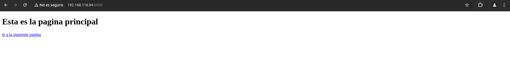

!!! warning "¡Atención!"

    Para que nos funcione en la plataforma PaaS, en el archivo **package.json** que nos ha creado al hacer el ```npm init```
    debemos hacerle una modificación.

    En el bloque scripts, debemos borrar lo que haya dentro y dejar únicamente dentro de el:

    ```json
    "start": "node aplication.js"
    ```

    De forma que el sitio donde la despleguemos sepa que comando utilizar para iniciar la aplicación tras desplegarla.

### Proceso de despliegue en Netlify

Para este apartado clonaremos el siguiente repositorio ```git clone https://github.com/StackAbuse/color-shades-generator```

Por mera curiosidad y ambición de aprendizaje, vamos a ver dos métodos de despliegue en Netlify:

- Despliegue manual desde el CLI de Netlify, es decir, desde el terminal, a partir de un directorio local de nuestra máquina.
- Despliegue desde un código publicado en uno de nuestros repositorios de Github

El primero nos permitirá conocer el CLI de Netlify y el segundo nos acercará más a una experiencia real de despliegue.

#### Despliegue mediante CLI

Una vez que nos hemos registrado en Netlify, debemos instalar el CLI de Netlify para ejecutar sus comandos desde el terminal:

```
sudo npm install netlify-cli -g
```

Una vez instalado está claro que para realizar acciones de deploy, netlify nos solicitara una autenticación, esto se hace mediante
el comando:

```
netlify login
```

El cual nos muestra una pantalla del navegador para que concedamos la autorización pertinente. Sin embargo, recordemos el 
problema de que estamos conectados por SSH a nuestro servidor y no tenemos la posibilidad del uso de un entorno gráfico.

En este caso, seguiremos los siguientes pasos

- Generaremos el token de acceso.
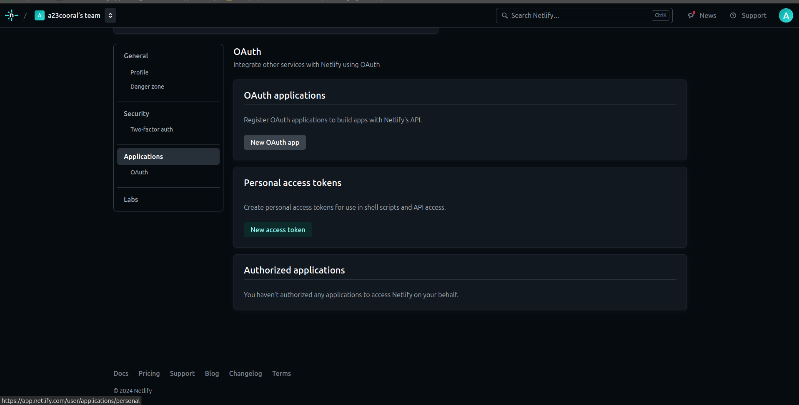

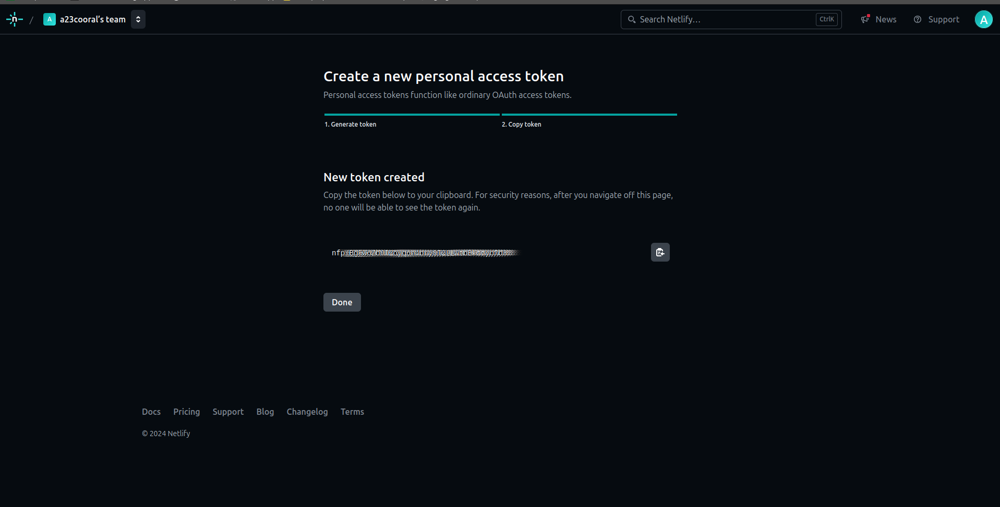

- Lo establecemos como variable de ambiente:

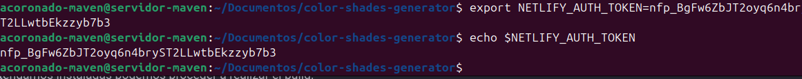

Y nos logueamos

```
netlify login
```

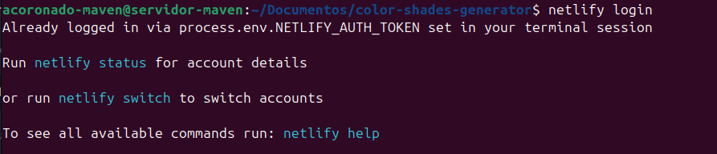

Bueno, tenemos el código de nuestra aplicación, tenemos nuestra cuenta en Netlify y tenemos el CLI necesario para ejecutar comandos desde el terminal en esa cuenta... ¿Podemos proceder al despliegue sin mayores complicaciones?

La respuesta es NO.

En primer lugar, como sabemos, debemos instalar todas las dependencias que vienen indicadas en el archivo package.json:

```
npm install
```

Y cuando ya las tengamos instaladas podemos proceder a realizar el build:

```
npm run build
```

Tras esto haremos ejecutaremos el siguiente comando:

```
netlify deploy
```

Nos hará algunas preguntas para el despliegue:

- Indicamos que queremos crear y configurar un nuevo site
- El Team lo dejamos por defecto
- Le indicamos el nombre que queremos emplear para la web (nombre-practica3-4) y el directorio a utilizar para el deploy (directorio ./build).

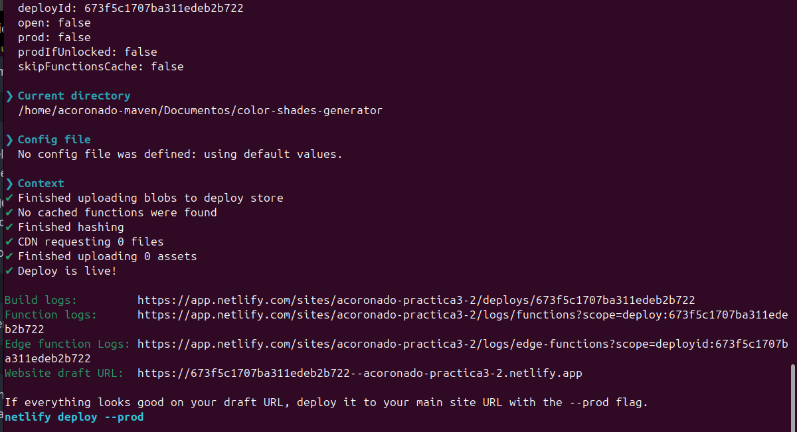


Y como podemos ver, si accedemos al panel de control de netlify y navegamos por el, podremos acceder a nuestro sitio web

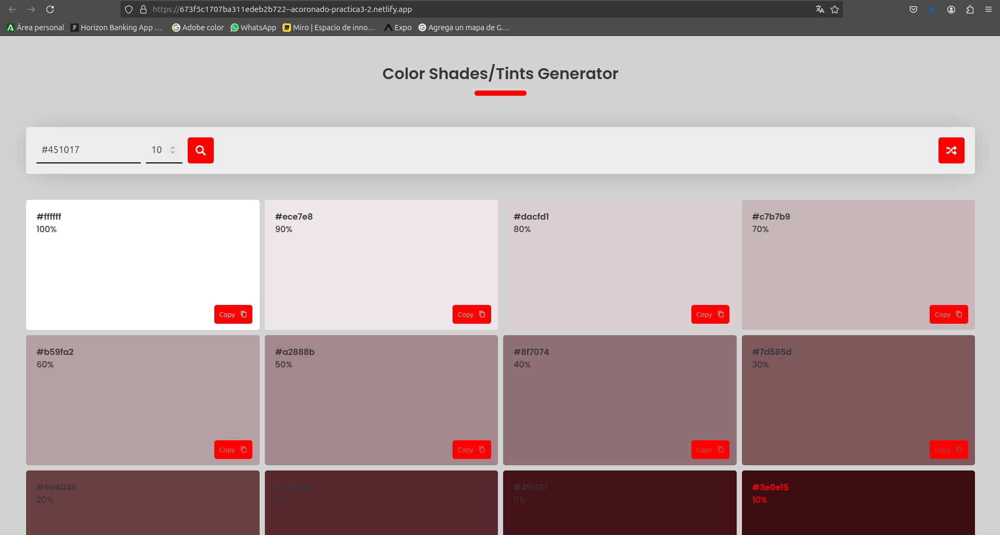

#### Despliegue mediante conexión con Github

En primer lugar, vamos a eliminar el sitio web que hemos desplegado antes en Netlify para evitar cualquier problema o conflicto:

En segundo lugar, vamos a borrar el directorio donde se encuentra el repositorio clonado en el paso anterior para así poder empezar
de 0:

```
rm -rf directorio_repositorio
```

Tras esto descargaremos el repositorio anterior sin el repositorio por defecto y en un zip con el comando:

```
wget https://github.com/StackAbuse/color-shades-generator/archive/refs/heads/main.zip
```

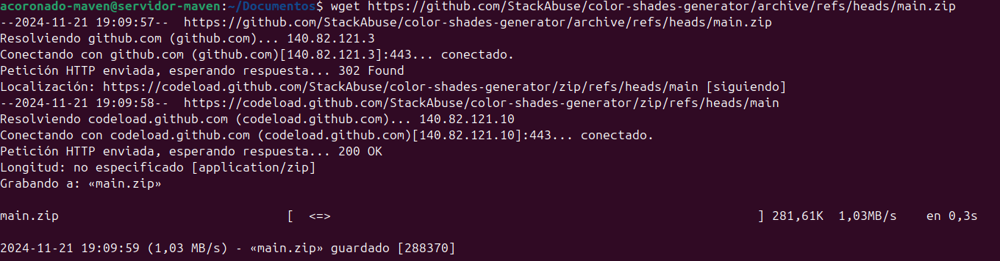

Creamos una carpeta nueva y descomprimimos dentro del zip:

```
mkdir practica3.4

unzip main.zip -d practica3.4/
```

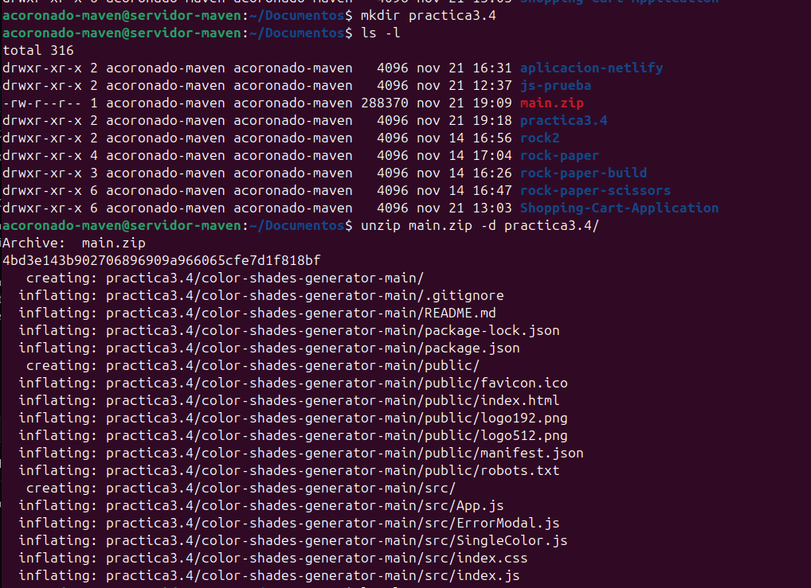

Tras esto entramos en la carpeta donde está el código:

```
cd practica3.4/color-shades-generator-main/
```

Y ahora debemos crear un repositorio completamente vacío en Github que se llame practicaTresCuatro:

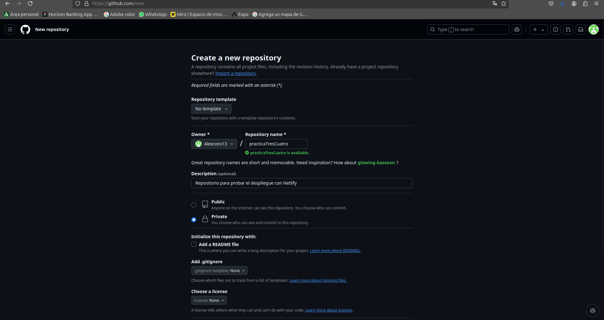

Y tras ello, volviendo al terminal a la carpeta donde estábamos, la iniciamos como repositorio, añadimos todo el contenido de la misma para el commit, hacemos el commit con el mensaje correspondiente y creamos la rama main:

```bash
git init
git add .
git commit -m "Subiendo el código..."
git branch -M main
```


Por último solo queda referenciar nuestra carpeta el repositorio recién creado en Github y hacer un push para subir todo el contenido

```
git remote add origin https://github.com/Alexcoro13/practicaTresCuatro.git
git push -u origin main
```

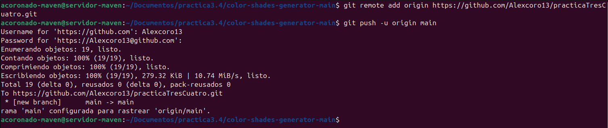

Ahora que ya tenemos subido el código a GitHub, de alguna manera debemos enganchar o enlazar nuestra cuenta de Github con la de Netlify para que este último pueda traerse el código de allí, hacer el build y desplegarlo. Así pues, entramos en nuestro dashboard de Netlify y le damos a importar proyecto existente de git:

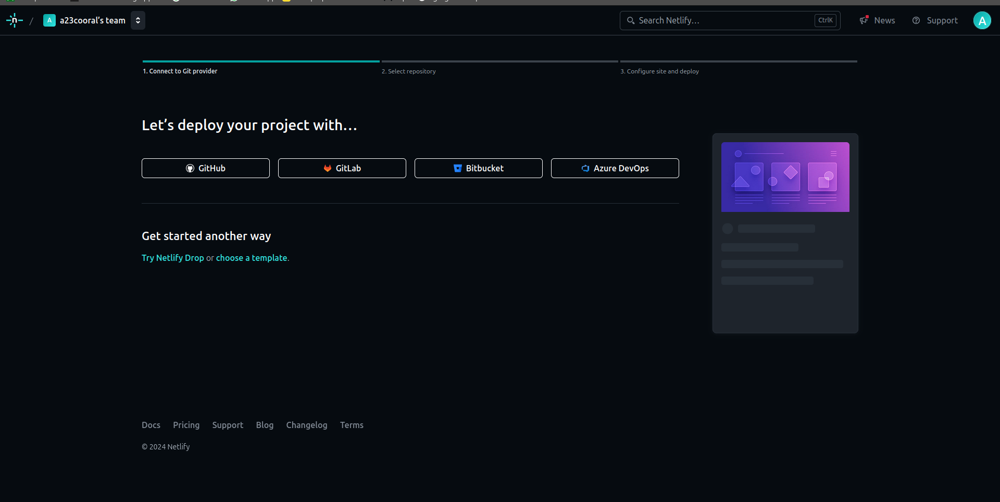

Hacemos clic en Github 

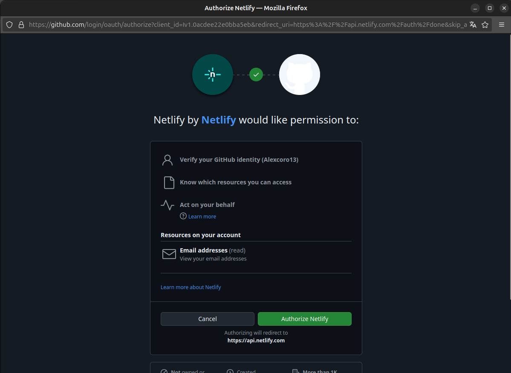

Y seleccionamos que no acceda a todos nuestros repositorios sino solo al repositorio que necesitamos, que es
donde tenemos el código de nuestra aplicación:

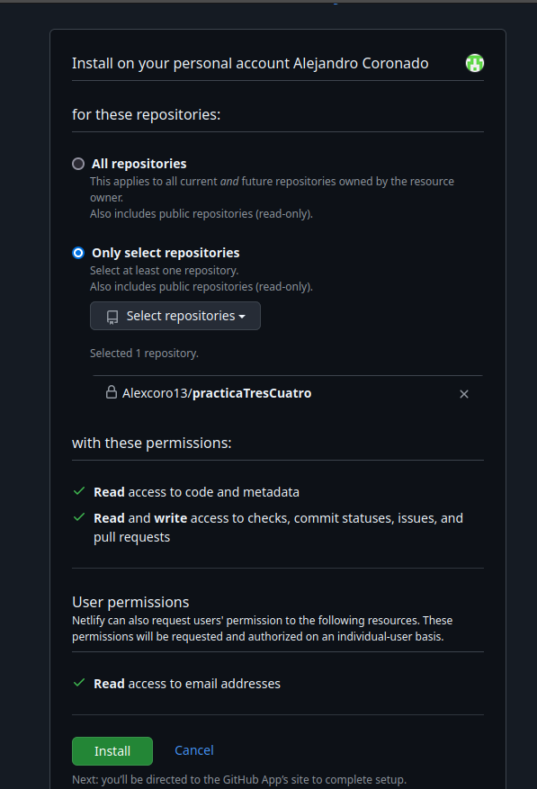

Y ya quedará todo listo:

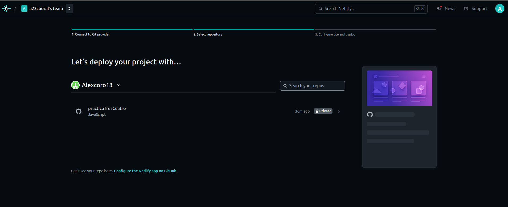

Por último solo quedaría darle a desplegar:


Netlify se encargará de hacer el build de forma automática tal y como hemos visto en la imagen de arriba, con el comando npm run build, publicando el contenido del directorio build.

Lo que hemos conseguido de esta forma es que, cualquier cambio que hagamos en el proyecto y del que hagamos commit y push en Github, automáticamente genere un nuevo despliegue en Netlify. Es el principio de lo que más adelante veremos como despliegue continuo.

Comprobemos que realmente es así:

- Dentro de la carpeta public encontramos el archivo robots.txt, cuyo cometido es indiciara los rastreadores de los buscadores a qué
URL del sitio pueden acceder. A este archivo se puede acceder a través de la URL del site:

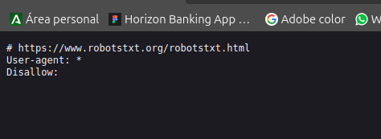

- Dentro de la carpeta public, utilizando el editor de texto que prefiráis en vuestro terminal, modificad el archivo robots.txt para que excluya un directorio que se llame nombre_apellido, utilizando obviamente vuestro nombre y apellido.

```
User-agent: *
Disallow: /nombre_y_apellido/
```

- Haz un nuevo commit y push
- Comprobamos en el dashboard de Netlify que se ha producido un nuevo deploy de la aplicación hace escasos segundos.

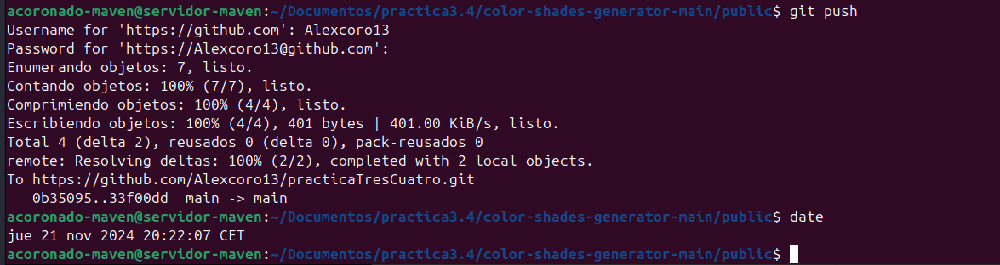

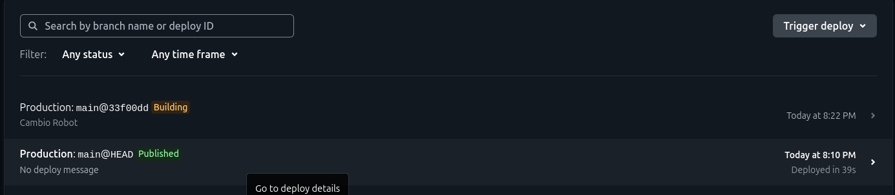

- Accede a https://url_de_la_aplicacion/robots.txt y comprueba que, efectivamente, se ve reflejado el cambio

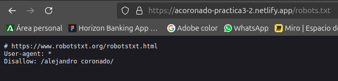

## Despliegue de una aplicación React en Vercel

### ¿Que es vercel?

Vercel es una plataforma unificada en la nube que permite a los desarrolladores desplegar, gestionar y escalar sus aplicaciones
y sitios web. Vercel proporciona una amplia gama de funciones, como despliegues automatizados, dominios personalizados y
una potente CLI. También ofrece una amplia gama de integraciones con servicios populares, como GitHub, Slack y Zapier. 

### Despliegue

Para ahorrarnos tiempo haremos el despliegue en vercel usando Github, es decir crearemos un repositorio y realizaremos unos pasos muy 
parecidos a los del despliegue con netlify.

El primer paso será registrarnos en Vercel con nuestra de Github, para esto le daremos a SignUp y seleccionamos la opción de Github

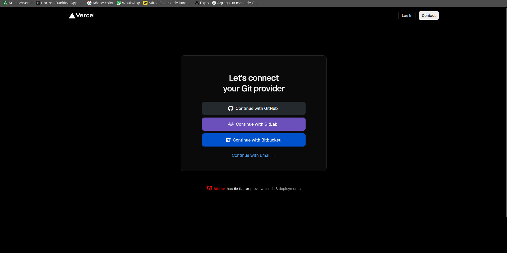

Tras la creación de nuestra cuenta volveremos a crear otra carpeta llamada ```practica3.4-vercel```

```
mkdir practica3.4-vercel
```

Y descomprimimos hay dentro el zip que descargamos anteriormente.

```
unzip main.zip -d practica3.4-vercel/
```

A continuación igual que en Netlify crearemos un repositorio en github llamado practica3.4-vercel

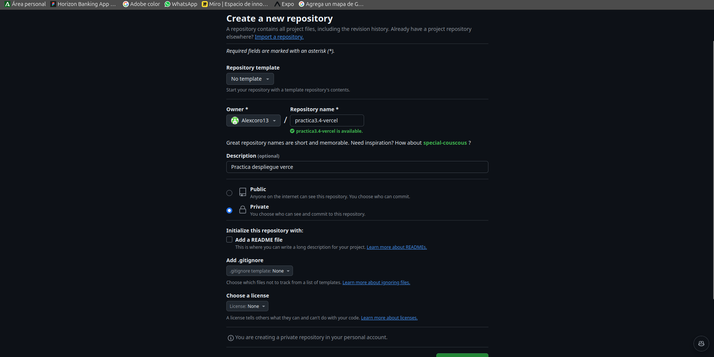

Tras esto crearemos el repositorio en el proyecto que hemos descomprimido y lo vincularemos a github

```
git init
git add .
git commit -m "Commit Inicial"
git branch -M main

git remote add origin https://github.com/Alexcoro13/practica3.4-vercel.git
git push -u origin main
```


Una vez subido en Github, iremos a vercel y seleccionaremos la opción de desplegar mediante repositorio
y seleccionaremos específicamente el repositorio de vercel

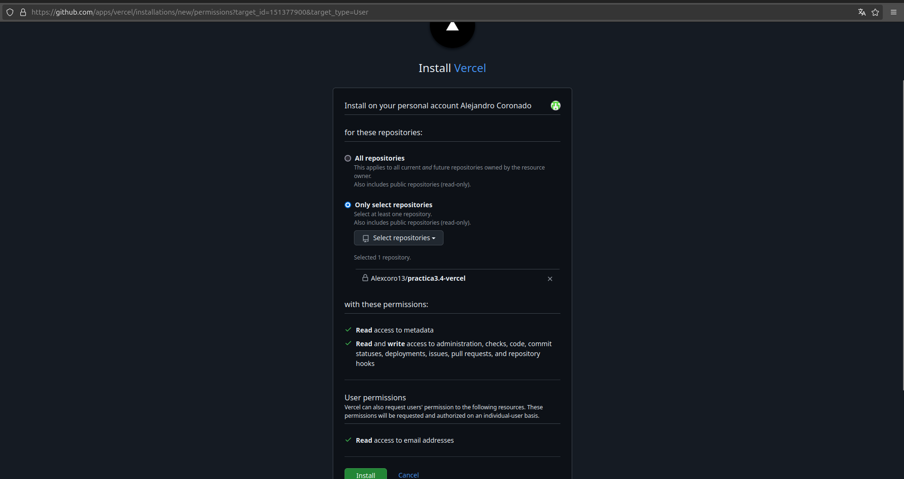

Por último una vez que vercel se ha instalado en el repositorio haremos en import y configuraremos las opciones del despliegue
seleccionando las opciones ```react-script-build``` y directorio de salida ```build```

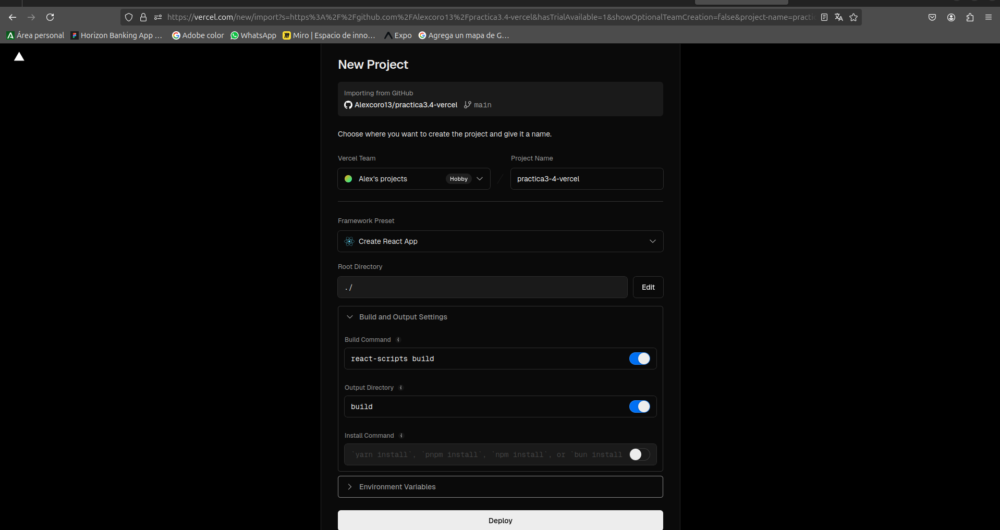

Y hacemos clic en deploy, y pasados unos minutos nos indicará que todo ha ido bien mediante la siguiente pantalla

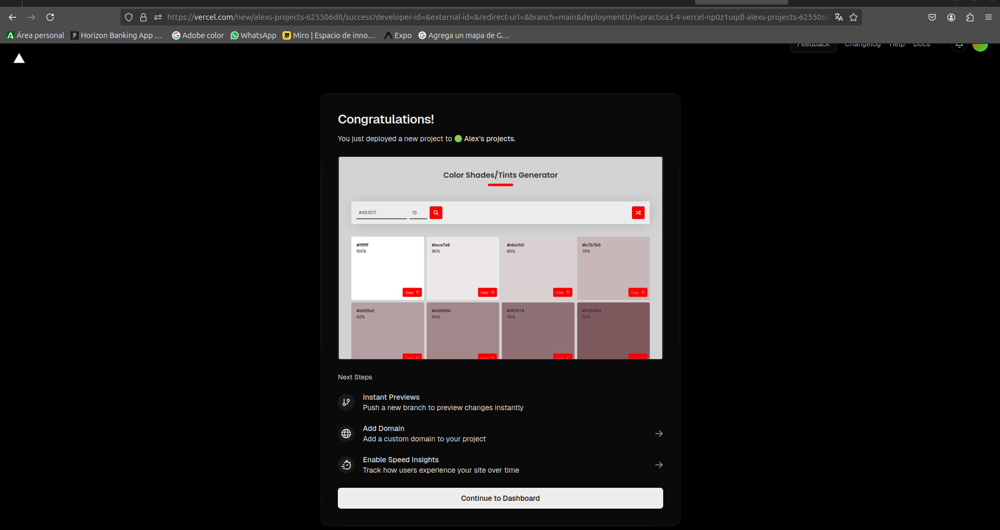

Por último comprobaremos que la web está disponible y como podemos ver, si lo está.

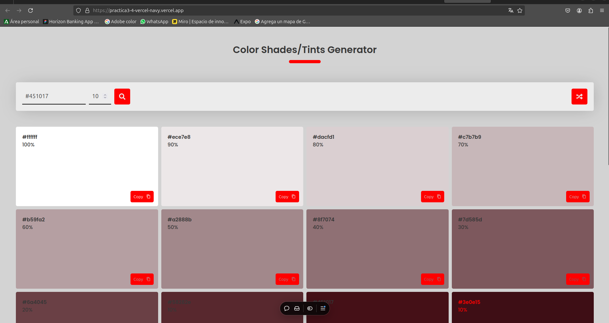
