# Práctica 3.3: Despliegue de una aplicación Flask (Python)

## Prerrequisitos

Servidor Debian con los siguientes paquetes instalados:

- Nginx
- Gunicorn
- Pipenv

## Introducción

### ¿Qué es un framework?

Actualmente en el desarrollo moderno de aplicaciones web se utilizan distintos Frameworks que son herramientas que nos dan un esquema de trabajo y una serie de utilidades y funciones que nos facilita y nos abstrae de la construcción de páginas web dinámicas.

En general los Frameworks están asociado a lenguajes de programación (Ruby on Rails (Ruby), Symphony (PHP)), en el mundo de Python el más conocido es Django pero Flask es una opción que quizás no tenga una curva de aprendizaje tan elevada pero nos posibilita la creación de aplicaciones web igual de complejas de las que se pueden crear en Django.

### Flask

En la actualidad existen muchas opciones para crear páginas web y muchos lenguajes (PHP, JAVA), y en este caso Flask nos permite crear de una manera muy sencilla aplicaciones web con Python.

Flask es un “micro” Framework escrito en Python y concebido para facilitar el desarrollo de Aplicaciones Web bajo el patrón MVC.

La palabra “micro” no designa a que sea un proyecto pequeño o que nos permita hacer páginas web pequeñas sino que al instalar Flask tenemos las herramientas necesarias para crear una aplicación web funcional pero si se necesita en algún momento una nueva funcionalidad hay un conjunto muy grande extensiones (plugins) que se pueden instalar con Flask que le van dotando de funcionalidad.


### Gunicorn

Cuando se implementa una aplicación web basada en Python, normalmente se tienen estas tres piezas:

- Servidor web (Nginx, Apache)
- Servidor de aplicaciones WSGI (Gunicorn, uWSGI, mod_wsgi, Waitress)
- Aplicación web (Django, Flask, Pyramid, FastAPI)

Los servidores web procesan y distribuyen las solicitudes de los navegadores y otros clientes y envían respuestas a los mismos.

WSGI (Web Server Gateway Interface) proporciona un conjunto de reglas para estandarizar el comportamiento y la comunicación entre servidores web y aplicaciones web. Mediante el uso de servidores y aplicaciones web compatibles con WSGI, los desarrolladores pueden concentrar su tiempo y energía en el desarrollo de aplicaciones web en lugar de administrar la comunicación entre la aplicación y el servidor web.

### Gestor de Paquetes PIP

```pip``` es el comando para instalar paquetes de Python integrados en las fuentes desde la versión 3.4.

Este comando automatiza la conexión al sitio https://pypi.org/, la descarga, la instalación e incluso la compilación del módulo solicitado.

Además, se ocupa de las dependencias de cada paquete.

### Entornos virtuales en Python

Un entorno virtual es una forma de tener múltiples instancias paralelas del intérprete de Python, cada una con diferentes conjuntos de paquetes y diferentes configuraciones. Cada entorno virtual contiene una copia independiente del intérprete de Python, incluyendo copias de sus utilidades de soporte.

Los paquetes instalados en cada entorno virtual sólo se ven en ese entorno virtual y en ningún otro. Incluso los paquetes grandes y complejos con binarios dependientes de la plataforma pueden ser acorralados entre sí en entornos virtuales.

De esta forma, tendremos entornos independientes entre sí, parecido a como ocurría con los directorios de los proyectos de Node.js. De este modo, los entornos virtuales de Python nos permiten instalar un paquete de Python en una ubicación aislada en lugar de instalarlo de manera global.

### Pipenv

```Pipenv``` es una herramienta que apunta a traer todo lo mejor del mundo de empaquetado (bundler, composer, npm, cargo, yarn, etc.) al mundo de Python.

Automáticamente crea y maneja un entorno virtual para tus proyectos, también permite agregar/eliminar paquetes desde tu Pipfile así como como instalar/desinstalar paquetes. También genera lo más importante , el archivo Pipfile.lock, que es usado para producir determinado build.

## Despliegue

1. Instalamos el gestor de paquetes de Python Pip:

    ```
    sudo apt update

    sudo apt install python3-pip
    ```

2. Instalamos el paquete pipenv para gestionar entornos virtuales:

    ```
    sudo apt install pipenv
    ```

3. Comprobamos que está instalado correctamente mostrando su versión:

    ```
    pipenv --version
    ```

    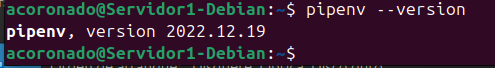

4. Creamos el directorio en el que almacenaremos nuestro proyecto:

    ```
    sudo mkdir /var/www/proyecto-flask1
    ```

5. Al crearlo con sudo, los permisos pertenecen a root:

    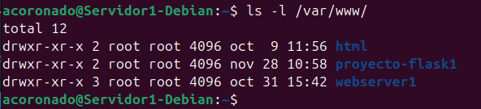

6. Hay que cambiarlo para que el dueño sea nuestro usuario y pertenezca al grupo www-data, el usuario
usado por defecto por el servidor web:

    ```
    sudo chown -R $USER:www-data /var/www/proyecto-flask1
    ```

7. Establecemos los permisos adecuados al directorio, para que pueda ser leído por todo el mundo::

    ```
    chmod -R 775 /var/www/proyecto-flask1
    ```

8. Dentro del directorio de nuestra aplicación, creamos un archivo oculto .env que contendrá las variables de entorno necesarias:

    ```
    touch .env
    ```

9. Editamos el archivo y añadimos las variables, indicando cuál es el archivo .py de la aplicación y el entorno, que en nuestro caso
será producción:

    ```

    FLASK_APP = wsgi.py
    FLASK_ENV = production
    ```

    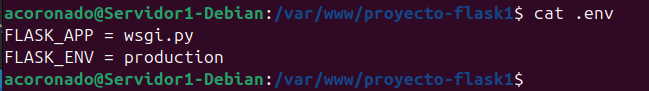

10. Iniciamos ahora nuestro entorno virtual. ```Pipenv``` cargará las variables de entorno desde el fichero .env de forma automática:

    ```
    pipenv shell
    ```

    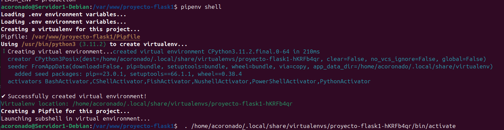

11. Usamos pipenv para instalar las dependencias necesarias para nuestro proyecto:

    ```
    pipenv install flask gunicorn
    ```

    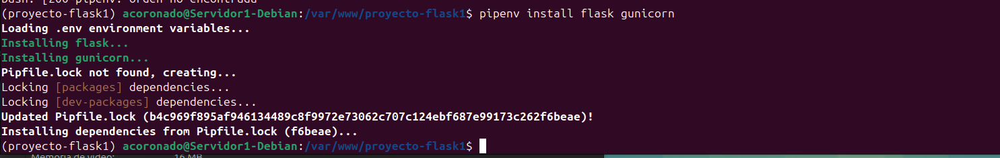

12. Vamos ahora a crear la aplicación Flask más simple posible, a modo de prueba. El archivo que contendrá la aplicación
propiamente dicha será ```application.py``` y ```wsgi.py``` se encargará únicamente de iniciarla y dejarla corriendo:

    ```
    touch application.py wsgi.py
    ```

    Y tras crear los archivos, los editamos para dejarlos así:

    === "application.py"

        ```python
        from flask import Flask

        app = Flask(__name__)

        @app.route("/")
        def index():
            '''Index page route'''

            return '<h1>Aplicación desplegada</h1>'

        ```

        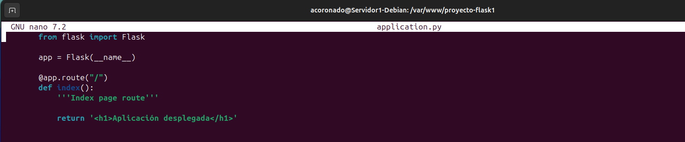

    === "wsgi.py"
        
        ```python
        from application import app

        if __name__ == '__main__':
            app.run(debug=False)
        ```

        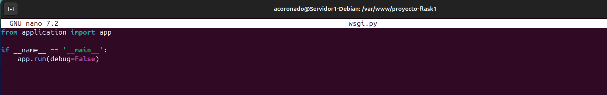

13. Corramos ahora nuestra aplicación a modo de comprobación con el servidor web integraado de Flask. Si especificamos 
la direccion 0.0.0.0 lo que le estamos diciendo es que escuche en todas sus interfaces, si las tuviera:

    ```
    flask run --host '0.0.0.0'
    ```

    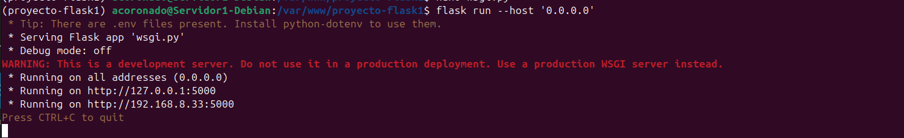

14. Ahora podemos acceder a la aplicación desde nuestro, ordenador, introduciendo en un navegador web: ```http://ip-maq-virtual:5000```:

    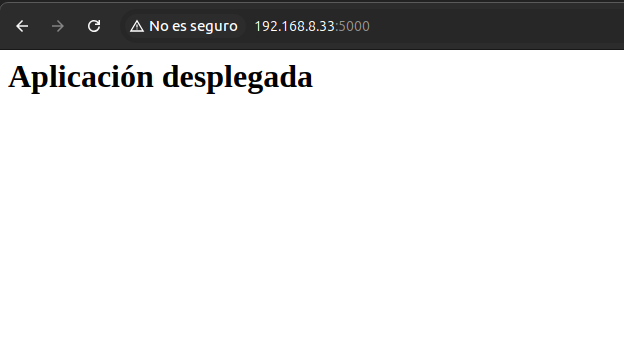


Ahora comprobaremos que unicorn trabaja bien. Usaremos el siguiente comando:

```
gunicorn --workers 4 --bind 0.0.0.0:5000 wsgi:app
```

Donde:
    - 

    --workers N establece el numero de hilos que queremos utilizar, como ocurría con Node Express. 

    --bind 0.0.0.0:5000 hace que el servidor escuche peticiones por todas las interfaces de red y en el puerto 5000

    wsgi:app es el nombre del archivo con extensión .py y app es la instancia de la aplicación Flask dentro del archivo.

Y deberia mostrarnos esto:

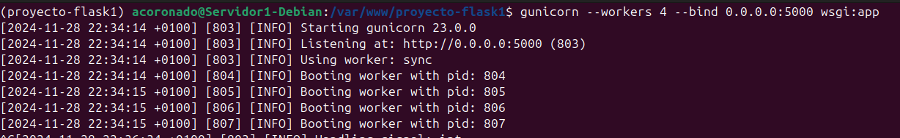

1. Dentro del entorno virtual, debemos tomar nota de cual es el path desde la que se ejecuta gunicorn para poder configurar más adelante un servicio del sistema. Podemos averigurarlo así:

    ```
    which gunicorn
    ```

    

2. Ya fuera de nuestro entorno virtual, crearemos un archivo para que systemd corra Gunicorn como un servicio del sistema más:

    ```bash
    [UNIT]
    Description = flask_app.service
    After=network.target

    [Service]
    User=acoronado
    Group=www-data
    Enviorment="/home/acoronado/.local/share/virtualenvs/proyecto-flask1-hKRFb4qr/bin/"
    WorkingDirectory=/var/www/proyecto-flask1
    ExecStart= /home/acoronado/.local/share/virtualenvs/proyecto-flask1-hKRFb4qr/bin/gunicorn --workers 3 --bind unix /var/www/proyecto-flask1/proyecto-flask1.sock wsgi:app

    [Install]
    WantedBy=multi-user.target
    ```

    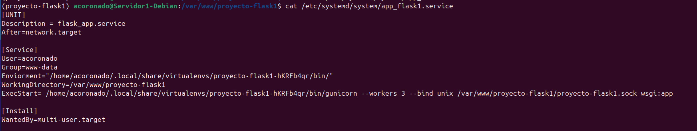

3. Ahora, como cada vez que se crea un servicio nuevo de systemd, se habilita y se inicia

    ```
    systemctl enable nombre_servicio

    systemctl start nombre_servicio

    systemctl status nombre_servicio
    ```

    Y si todo ha ido bien al ejecutar ```systemctl status nombre_servicio``` deberia de salirnos como activo

    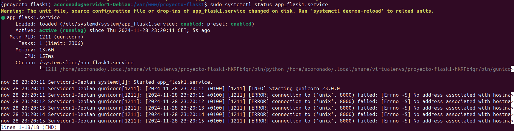

4. A continuación creamos un archivo con el nombre de nuestra aplicación y debe estar en /etc/nginx/sites-available/nombre_aplicacion.

    ```nginx
    server {
        listen 80;
        server_name proyecto-flask1 www.proyecto-flask1;

        access_log /var/log/nginx/proyecto-flask1.access.log;
        error_log /var/log/nginx/proyecto-flask1.error.log;

        location / { 
                include proxy_params;
                proxy_pass http://unix:/var/www/proyecto-flask1/proyecto-flask1.sock;
        }
    }   
    ```

5. Recordemos que ahora debemos crear un link simbólico del archivo de sitios webs disponibles al de sitios web activos:

    ```
    sudo ln -s /etc/nginx/sites-available/nombre_aplicacion /etc/nginx/sites-enabled/
    ```

6. Para finalizar reiniciaremos el servicio de nginx

    ```
    sudo systemctl restart nginx
    ```

7. Ya no podremos acceder por IP a nuestra aplicación ya que ahora está siendo servida por Gunicorn y Nginx, necesitamos acceder por su server_name.
esto lo haremos modificando el archivo /etc/hosts

    ```
    192.168.X.X proyecto www.proyecto
    ```

8. El último paso es comprobar que todo el desplieuge se ha realizado de forma correcta y está funcionando, para ello accedemos desde nuestra máquina anfitrión a: