# **Ejercicios de Git y Github**

## **Repositorio DEAW**

1. Crear un repositorio en vuestro Github llamado DEAW

    - Para crear un repositorio en github nos iremos al inicio y haremos clic en new:

    

    - Tras esto nos aparecerá la página para crear el repositorio en github

    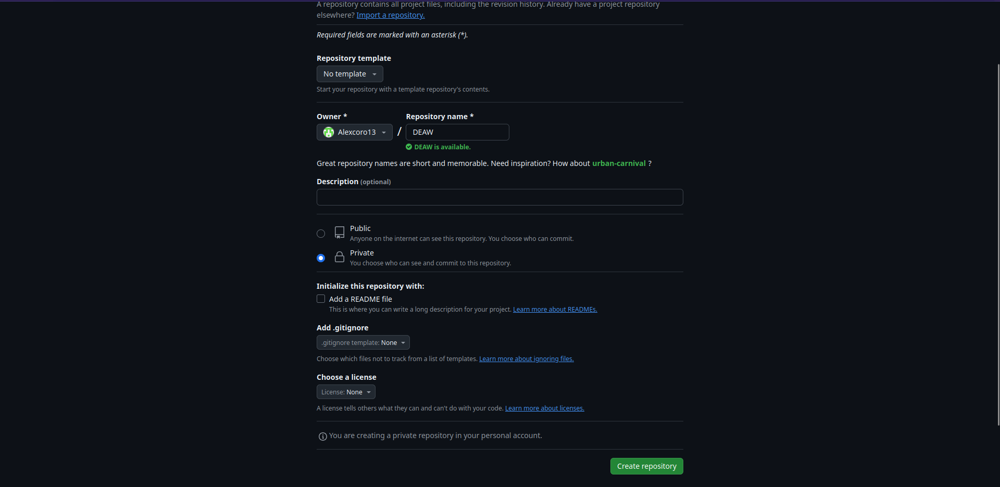

2. Clonar vuestro repositorio en local

    - Para clonar nuestro repositorio en local deberemos ejecutar el siguiente comando:

    ```
    git clone (url del repositorio)
    ```

    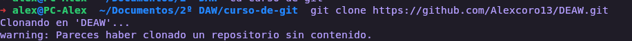


## **README**

1. Crear(si no lo habeís hecho ya) en vuestro repositorio local un documento README.md

	- Para crear un archivo README.md usaremos el siguiente comando:

	```bash
	nano README.md
	```

	Y añadiremos un pequeño texto al mismo.

	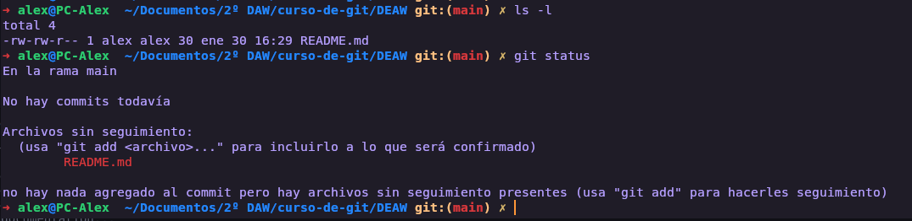

## **Commit Inicial**

1. Realizar un commit inicial con el comentario `Comenzamos con los ejercicios de Git`

	- Para hacer un commit primero necesitamos añadir los archivos a los que queramos incluir
	en el commit.

	```
	git add README.md
	```

	- Y así habremos preparado el archivo el README.md para el commit.

	```
	git commit -m "Comenzamos con los ejercicios de Git
	```

	

## **Push inicial**

1. Subir los cambios al repositorio remoto

	```
	git push
	```
	
	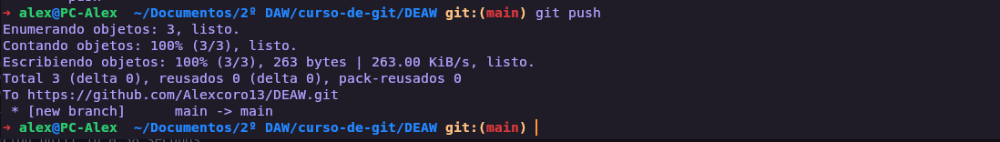

## **Ignorar archivos**

1. Crear en el repositorio local un fichero llamado privado.txt.
	- Crearemos el fichero con `nano` y lo dejaremos vacio

	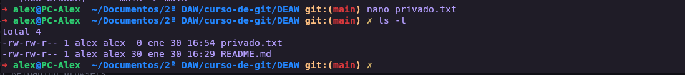

2. Crear en el repositorio local una carpeta llamada privada.

	- Y para crear la carpeta lo haremos con `mkdir`

	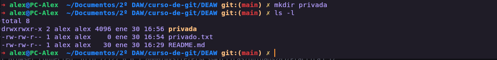

3. Realizar los cambios oportunos para que tanto el archivo como la carpeta sean ignorados por git.

	- Una vez que tenemos los archivos creados necesitaremos crear un archivo llamado `.gitignore` 
	en donde incluiremos los archivos y directorios anteriores para excluirlos.

	

## **Añadir fichero 1.txt**

1. Añadir fichero `1.txt` al repositorio local.

	- Ahora creamos el archivo y lo añadimos con git add

	```
	git add 1.txt
	```

	

## **Crear el tag v0.1**

1. Crea un tag llamado **v0.1**

	```
	git tag V0.1
	```

	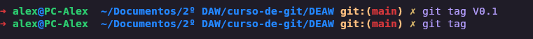

## **Subir el tag v0.1**

1. Subir los cambios al repositorio remoto.

	- Para subir el tag v0.1 usaremos el siguiente comando

	```
	git push --tags
	```

	


## **Cuenta de github**

1. Poner una foto en vuestro perfil de GitHub

	- Para cambiar la foto de perfil deberemos ir a configuración de github y hacer click en cambiar foto

	

	Y como podemos ver ya hemos cambiado la foto

	


2. Poner el doble factor de autentificación en vuestra cuenta de Github

	- Para añadir el doble factor de autentificación deberemos irnos al apartado de 
	contraseñas y autenticación, en donde añadiremos los metodos de auteticación de doble factor que queramos.

	

## **Uso social de github**

1. Preguntar los nombres de usuario de GitHub de 2 de tus compañeros de clase, búscalos, y sigueles.

	- Buscamos los usuarios y le damos a seguir:

	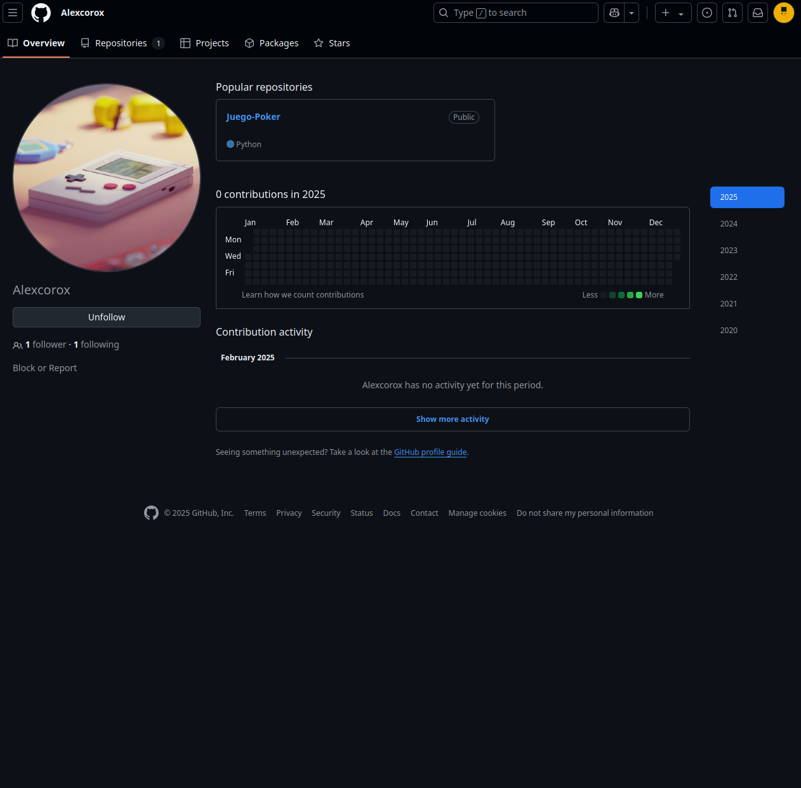

	

2. Seguir los repositorios DEAW del resto de tus compañeros.

	- Dentro del repositorio, le daremos a watch all activity y ya estaremos 
	siguiendo el repositorio

	

	Y para seguir al resto seria igual.

3. Añadir una estrella a los repositorios DEAW del resto de tus compañeros.

	- Para dar un estrella haremos clic en star y así habremos dado una estrella

	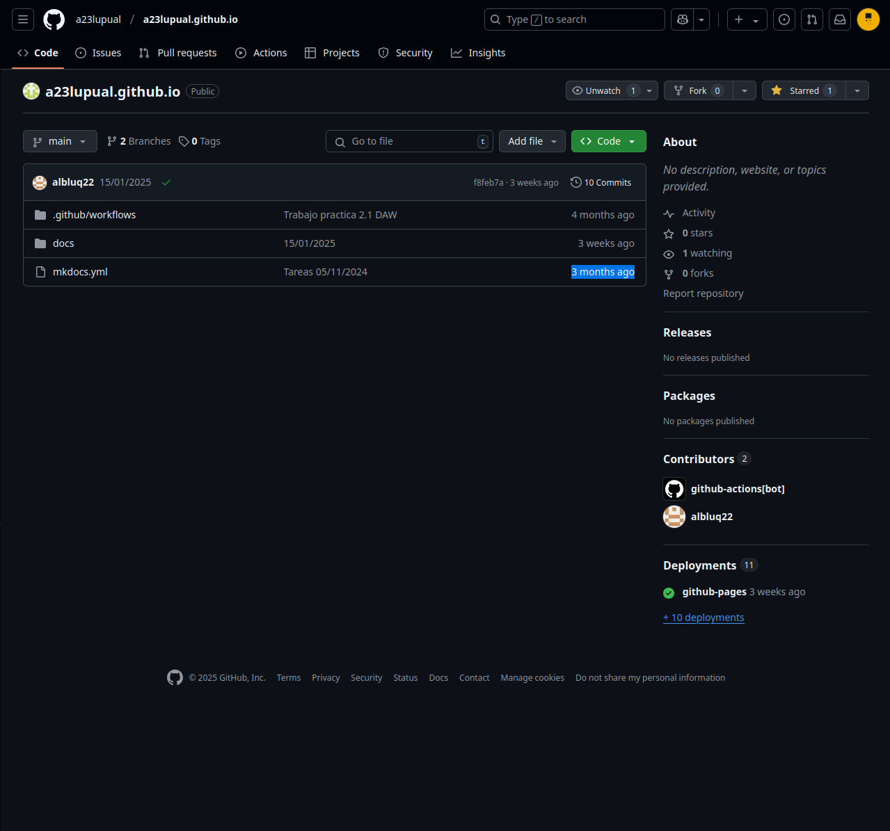


## **Crear una tabla**

1. Crear una tabla en el fichero README.md con la información de varios de tus compañeros de clase:

	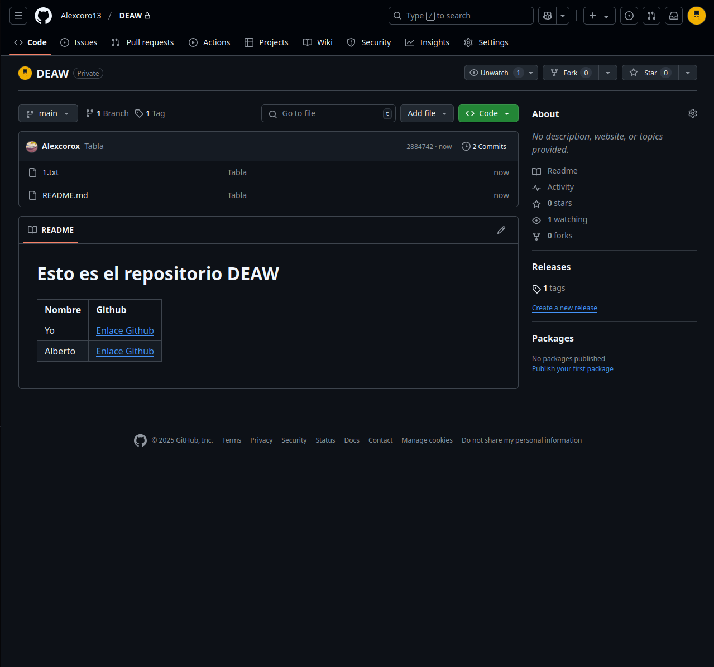

## **Colaboradores**

1. Poner a un compañero como colaborador en el repositorio **DEAW**

	- Para añadir un colaborador deberemos ir a `settings` dentro del repositorio.
	Una vez dentro iremos a colaboradores y haremos clic en añadir personas

	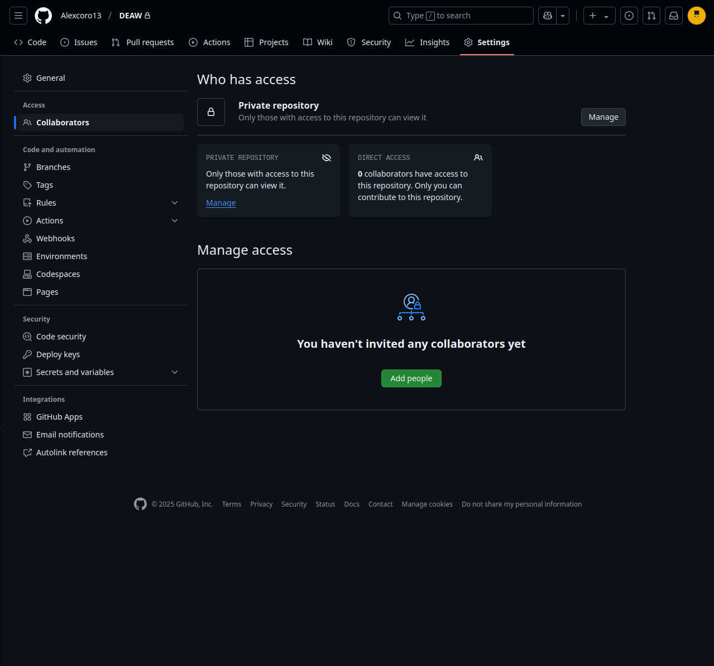

	

	

## **Crear una rama v0.2**

1. Crear una rama `v0.2`.

	- Para crear una rama nueva lo haremos con la siguiente rama

	```
	git branch v0.2
	```

2. Posiciona tu carpeta de trabajo en esta rama.

	!!! warning "Atención"
		Antes de hacer un cambio de rama deberemos tener todos los cambios 
		confirmados en el repositorio.

	- Para cambiar de rama deberemos usar el siguiente comando:

	```
	git checkout nombre_rama
	```

	

## **Añadir fichero 2.txt**

1. Añadir un fichero 2.txt en la rama v0.2

	

## **Crear rama remota v0.2**

1. Subir los cambios al repositorio remoto

	- Para subir la rama v0.2 usaremos el siguiente comando.

	```
	git push --set-upstream origin v0.2
	```

	

## **Merge directo**

1. Posicionarse en la rama `main`
2. Hacer un merge de la rama v0.2 en la rama master

	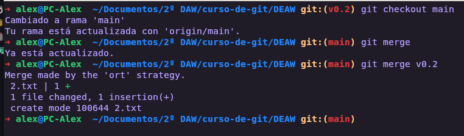

## **Merge con conflicto**

1. En la rama `master` poner `Hola` en el fichero `1.txt` y hacer commit
	

2. Posicionarse en la rama v0.2 y poner Adios en el fichero "1.txt" y hacer commit.
	

3. Posicionarse de nuevo en la rama master y hacer un merge con la rama v0.2

	- Una vez que hemos hecho los cambios en cada rama hacemos un merge y nos indicara que hay un conflicto.

	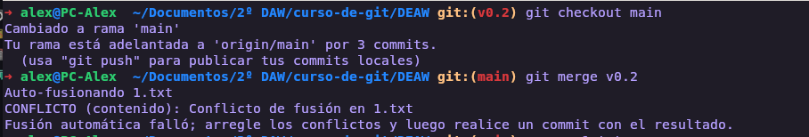

	- Para resolverlo nos iremos al archivo y nos quedaremos con los cambios de la rama que queramos	

	

	

	- Una vez que hemos dejado el archivo con los cambios correctos y realizamos un commit

	

## **Listado de ramas**

1. Listar las ramas con merge y las ramas sin merge.

	- Para listar las ramas con merge usaremos el siguiente comando:

	```
	git branch --merged
	```

	- Para listar las ramas sin merge usaremos el siguiente comando:

	```
	git branch --no-merged
	```

	

## **Arreglar conflicto**

	- El conflicto anterior ha sido arreglado en el 3 apartado de `Merge con conflicto`

## **Borrar rama**

1. Crear un tag v0.2
2. Borrar la rama v0.2

	

## **Listado de cambios**

1. Listar los distintos commits con sus ramas y sus tags.

	- Para listar los cambios usaremos el comando:

	```
	git log --oneline --graph --decorate --all
	```

	- Y nos mostrará algo así

	