# Práctica 6.1 - Dockerización del despliegue de una aplicación Node.js

## Introducción

En esta práctica vamos a Dockerizar una aplicación de Node.js que usa una BBDD PostgreSql para gestionar personas en un libro de direcciones.

## Instalación

Primero necesitaremos instalar Docker en nuestra máquina para esto seguiremos los siguientes pasos:

1. Actualizar nuestro equipo:

  ```bash
  sudo apt update
  sudo apt upgrade
  ```

2. Instalar dependencias necesarias para que Docker pueda ejecutarse:

  ```bash
  sudo apt install apt-transport-https ca-certificates gnupg2 software-properties-common
  ```

3. Añadir la clave GPG del repositorio Docker:

  ```bash
  curl -fsSL https://download.docker.com/linux/debian/gpg | sudo apt-key add -
  ```

4. Añadir el repositorio Docker

  ```
  sudo add-apt-repository "deb [arch=amd64] https://download.docker.com/linux/debian $(lsb_release -cs) stable"
  ``

5. Actualizar la lista de paquetes

  ```bash
  sudo apt update
  ```

7. Instalar Docker

  ```bash
  sudo apt install docker-ce
  ```

8. Comprobar que docker esta instalado:

  ```bash
  docker -v
  ```

- Y como podemos ver en la imagen de abajo tenemos la última versión de docker instalada en nuestro equipo

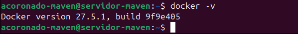

## **Despliegue con Docker**

Una vez que hayamos completado la instalación de docker en nuestra máquina pasaremos a desplegar la aplicación de node.js

Para esto necesitaremos clonar el siguiente repositorio con la aplicación.

```
git clone https://github.com/raul-profesor/DAW_practica_6.1_2024.git
```

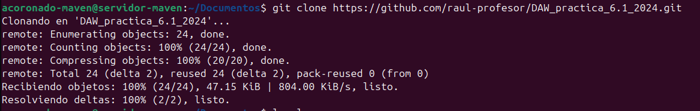

Como podemos observar si hacemos un listado de los archivos de la aplicación ya viene con el archivo `Dockerfile`

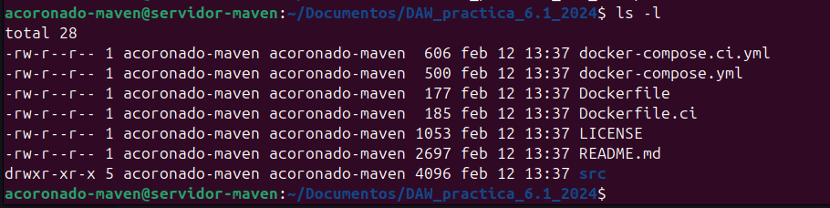

Aunque este viene incompleto, por lo que tendremos que rellenarlo para que funcione

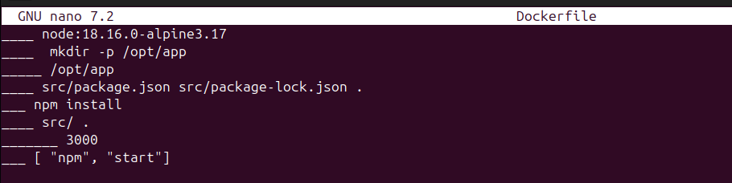

```dockerfile
_____ node:18.16.0-alpine3.17

_____  mkdir -p /opt/app

_____ /opt/app

_____ src/package.json src/package-lock.json .

_____ npm install

_____ src/ .

_____ 3000

_____ ["npm", "run", "start:dev"]
```

Y una vez modificado y corregido quedaría así:

```dockerfile
FROM node:18.16.0-alpine3.17
RUN  mkdir -p /opt/app 
WORKDIR /opt/app
COPY src/package.json src/package-lock.json . 
RUN  npm install
COPY  src/ .
EXPOSE 3000
CMD [ "npm", "start"]
```

Ahora tendremos que hacer la build de la imagen de Docker. También le indicaremos que se llama librodirecciones y que haga la build usando el contexto del directorio actual, esto para que use el dockerfile que acabamos de editar.

```bash
docker build -t librodirecciones .
```

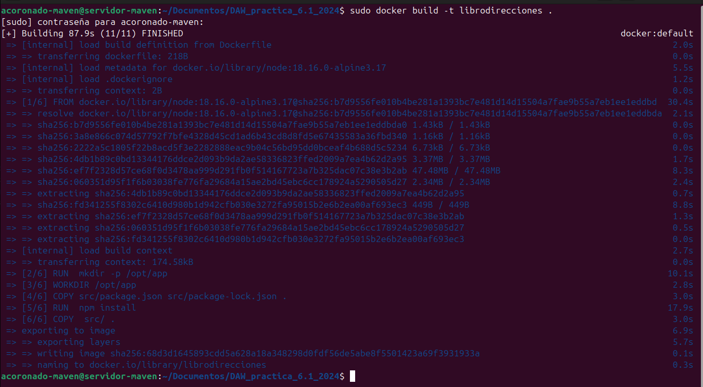

Y como podemos observar docker ha ido ejecutando cada uno de los pasos que hemos establecido anteriormente en el Dockerfile para montar la imagen de nuestra app.

A continuación iniciaremos el contenedor con nuestra aplicación. Pero con ciertos parámetros para que funcione correctamente, en este caso usaremos la opción `-p`, que indica que puerto de nuestra máquina tiene docker que escuchar para redirigirlo al puerto del contenedor.

```
docker run -p 3000:3000 -d librodirecciones
```

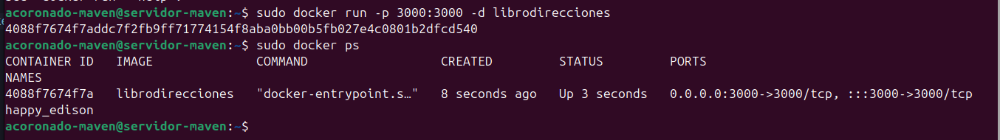

Tras esto comprobaremos que se puede acceder a la app desde el navegador de nuestra app.

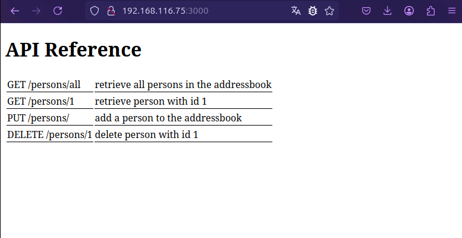

Aunque si intentáramos hacer un uso de la misma esta fallará, ya que no logra conectarse con la base de datos.

A pesar de que todos los contenedores corren en la misma máquina, cada uno es considerado un host diferente y por eso la aplicación falla al conectar.

Aquí es donde entra Docker compose el cual nos permitirá administrar los contenedores.

## **Docker Compose**

Docker compose nos permite:

- Iniciar y detener múltiples contenedores en secuencia.
- Conectar contenedores utilizando una red virtual.
- Manejar la persistencia de datos usando Docker Volumes.
- Establecer variables de entorno.
- Construir o descargar imágenes de contenedores según sea necesario.

Docker compose usa un archivo `yaml` para escribir la configuración de la aplicación.

En este caso nosotros usaremos este archivo `yaml` para el correcto funcionamiento de nuestra aplicación.

```dockerfile
version: "3.9"
services:
  postgres:
    image: postgres:latest
    environment:
      POSTGRES_USER: postgres
      POSTGRES_PASSWORD: postgres
    ports: 
      - '5432:5432'
    volumes:
      - addressbook-db:/var/lib/postgresql/data

  addressbook:
    build:
      context: .
    environment:
      DB_SCHEMA: postgres
      DB_USER: postgres
      DB_PASSWORD: postgres
      DB_HOST: postgres
    depends_on:
      - postgres
    ports:
      - '3000:3000'

volumes:
  addressbook-db:
```

!!! warning "Atención"
Es aconsejable que antes de seguir paremos el contenedor del apartado anterior, pues vamos a usar el mismo puerto `3000` para docker compose

    ```
    docker stop nombre_contenedor
    ```

    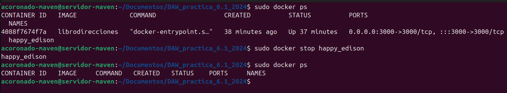

Ahora, tendremos que ejecutar los siguientes comandos:

```bash
docker compose run addressbook npm run migrate
```

!!! note "Nota"
El comando `docker compose run` nos permite ejecutar comandos sobre un servicio de docker compose

Este comando creará las tablas necesarias en la base de datos.

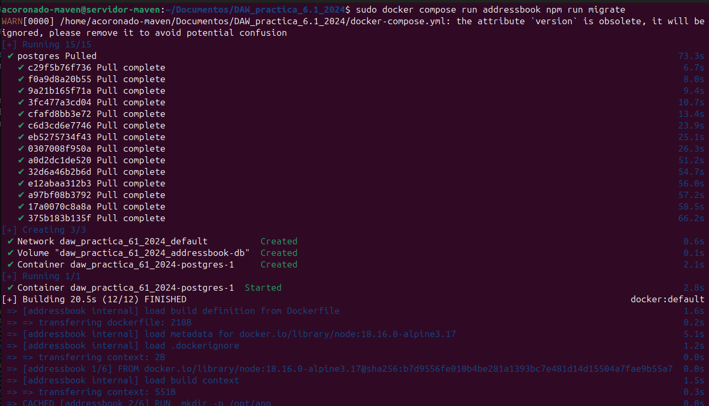

Ahora vamos a construir los contenedores a partir de las imágenes:

```
docker compose up --build -d
```

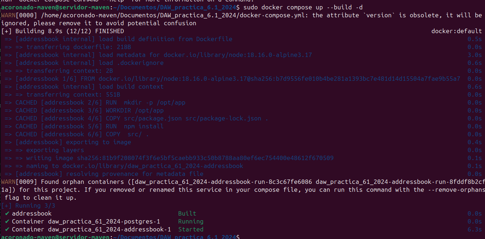

Y como se puede observar el contenedor ya está funcionando y se puede acceder a él.

!!! note "Tarea"
Probad que la aplicación junto con la BBDD funciona correctamente. El funcionamiento de la API es:

    - `GET /persons/all` muestra todas las personas en el libro de direcciones
    - `GET /persons/1` muestra la persona con el id 1
    - `PUT /persons/` añade una persona al libro de direcciones
    - `DELETE /persons/1` elimina a la persona con el id 1

    Ejemplos:
    ```bash
    curl -X PUT http://IP_APLICACION:3000/persons -H 'Content-Type: application/json' -d '{"id": 1, "firstName": "Raúl", "lastName": "Profesor"}'

    curl -X GET http://localhost:3000/persons -H 'Content-Type: application/json'
    ```

Para hacer esta tarea usaré la herramienta postman para hacer uso de la API

1. Función put:

   

   Como podemos ver, después de hacer el put, la aplicación nos devuelve los datos que hemos introducido en la base de datos junto al código 200 indicando que se han insertado correctamente.

2. Función GET /persons/1

   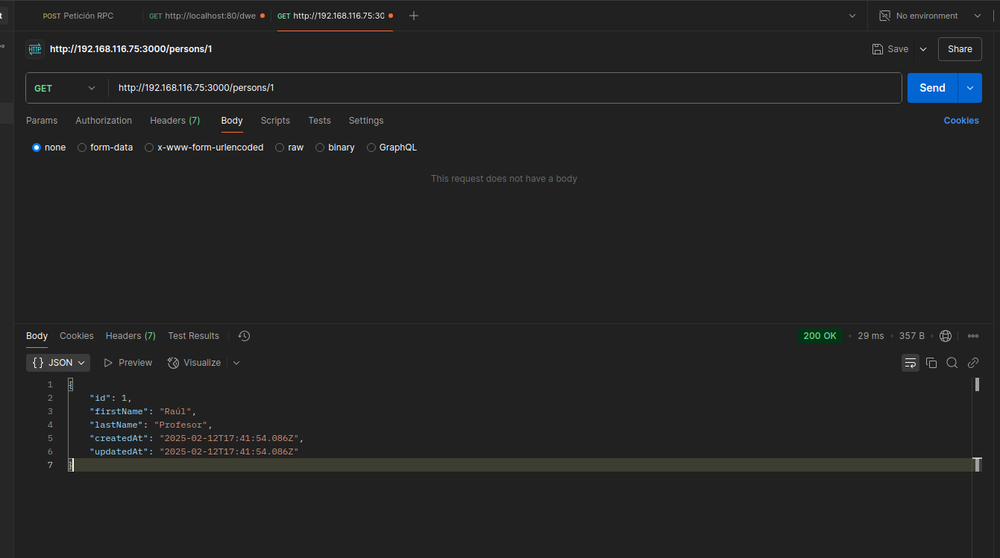

   En este caso la aplicación nos devuelve la información de la persona con ID 1

3. Función GET /persons/all

   

   Aquí la aplicación nos devuelve todas las personas que hay en la base de datos.

4. Y por último DELETE /persons/1

   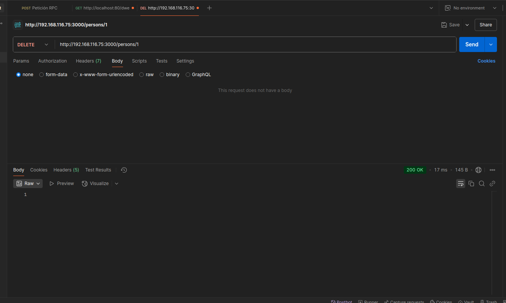

   Esta petición como su nombre indica borrar a la persona con ID 1

   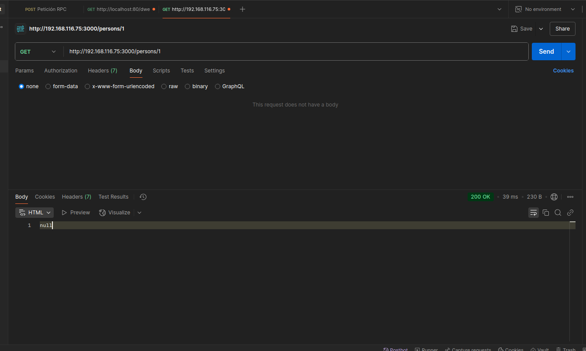

   Y si volvemos a intentar acceder a la persona 1 podemos ver que devuelve null, indicando que se ha borrado exitosamente. 

