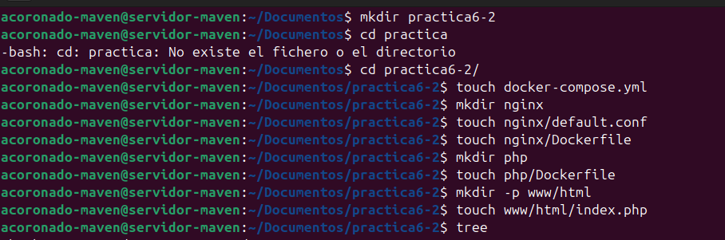
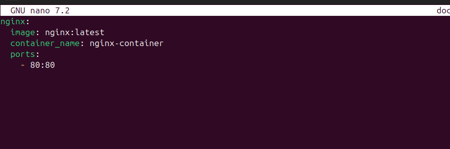

# **Práctica 6.2 - Despliegue de una aplicación PHP con Nginx y MySQL usando Docker y docker-compose**

## **Introducción**

### **¿Que es docker-compose?**

Docker Compose es una herramienta versátil que te permite definir y gestionar aplicaciones multi-contenedor de forma sencilla. Con Docker Compose, puedes describir la configuración de tu entorno de desarrollo en un archivo YAML, especificando los servicios, volúmenes y redes necesarios para tu aplicación.

Para usarlo deberemos seguir los siguientes pasos:

- Definir el entorno de nuestra aplicación con un Dockerfile para que pueda usarse en cualquier lugar.

- Definir los servicios que componen la aplicacion en `docker-compose.yml`.

- Ejecutar `docker compose up -d` para que Docker lanza la aplicación.

## **Instalación de docker-compose**

### **Proceso de dockerización de Nginx+PHP+Mysl**

#### 1. Estrucutra de directorios

En esta practica vamos a seguir la siguiente estructura de directorios para que todas las rutas que usemos funcionen: 

```
/usuario/Documentos/practica6-2/
├── docker-compose.yml
├── nginx
│   ├── default.conf
│   └── Dockerfile
├── php
│   └── Dockerfile
└── www
    └── html
        └── index.php
```

Por lo tanto vamos a ir creado estos directorios y archivos y posteriormente los iremos rellenando.

```
cd ~/Documentos
mkdir practica6-2
cd practica6-2
touch docker-compose.yml
mkdir nginx
touch nginx/default.conf
touch nginx/Dockerfile
mkdir php
touch php/Dockerfile
mkdir www/html -p
touch www/html/index.php
``` 



#### **2. Creación de un contenedor Nginx**

Para empezar, necistamos crear y correr un contenedor Nginx para que nuestra aplicación PHP se pueda mostrar en los navegadores.

Dentro de la carpeta `/usuario/home/practica6-2` debemos modificar el archiv `docker-compose.yml`

Y editamos este archivo e introducimos las siguientes lineas:

```nginx
services:
    nginx:
    image: nginx:latest
    container_name: nginx-container
    ports:
        - 80:80
```



Una vez modificado este archivo, se encargará de descargarse ña última versión de la imagen de Nginx, crear un contenedor y publicar en el puerto 80 del contenedor que también usara el 80 en la maquina anfitriona (80:80).

Iniciamos esto con:

```
docker compose up -d
```

