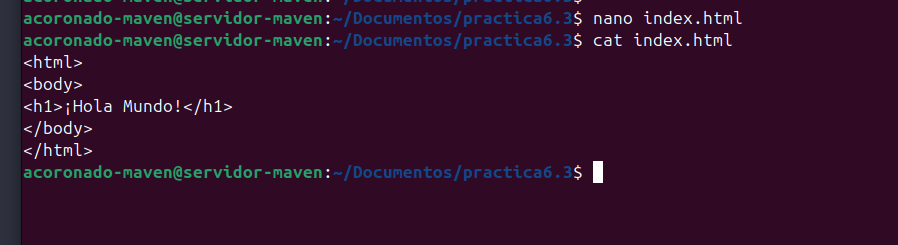
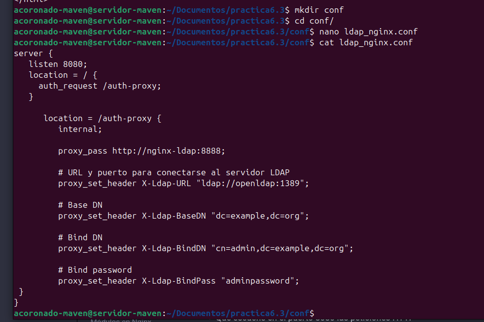
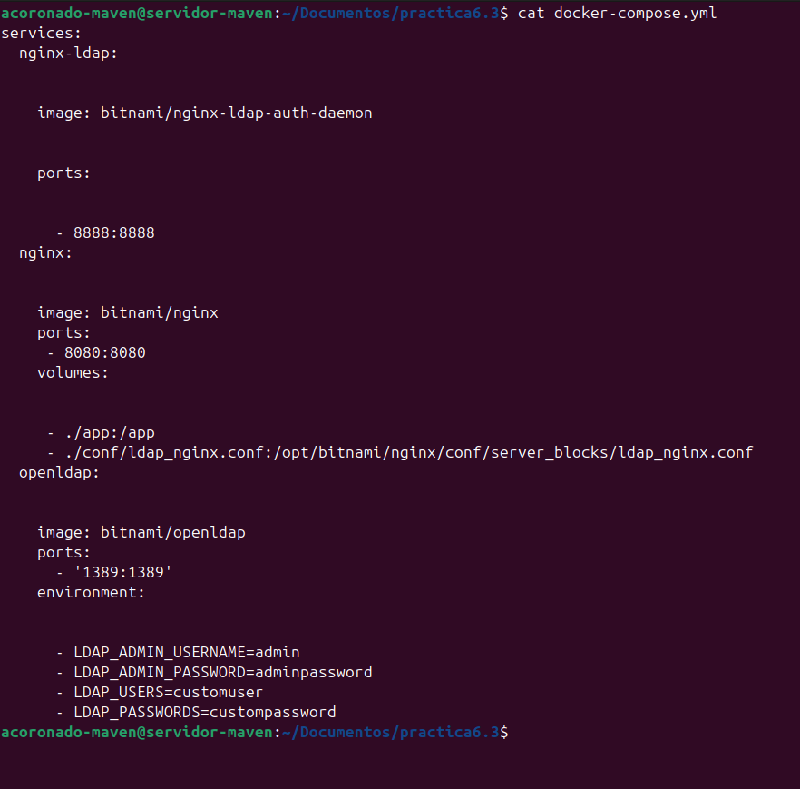
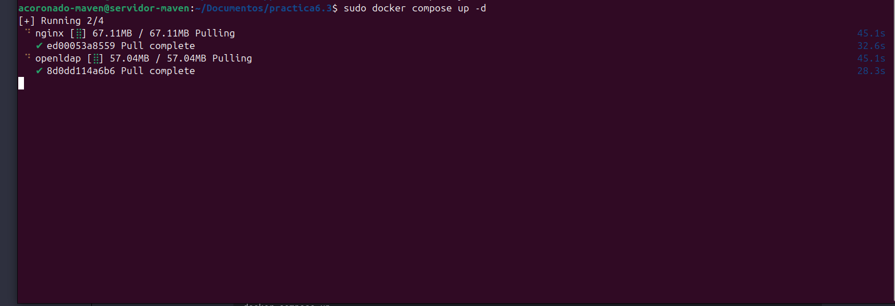

# Práctica 6.3 - Despliegue de servidores web con usuarios autenticados mediante LDAP usando Docker y docker-compose

## **Despliegue con Docker de Nginx + demonio de autenticación LDAP + OpenLADP**

Para esta práctica crearemos un nuevo directorio en la carpeta `Documentos` la cual contendrá
un `index.html`

```
mkdir practica6.3
```

Tras esto procederemos a crear el archivo `index.html` con el siguiente contenido

```html
<html>
<body>
<h1>¡Hola Mundo!</h1>
</body>
</html>
```



Una vez creado el archivo, procederemos a crear un nuevo directorio llamado `conf`
en donde guardaremos la configuración de Nginx.

```
mkdir conf
```

Una vez creado el directorio, crearemos el siguiente archivo `ladp_nginx.conf` e 
introduciremos la siguiente configuración.

```nginx
server {
  listen 8080;

  location = / {
      auth_request /auth-proxy;
  }

  location = /auth-proxy {
      internal;

      proxy_pass http://nginx-ldap:8888;

      # URL y puerto para conectarse al servidor LDAP
      proxy_set_header X-Ldap-URL "ldap://openldap:1389";

      # Base DN
      proxy_set_header X-Ldap-BaseDN "dc=example,dc=org";

      # Bind DN
      proxy_set_header X-Ldap-BindDN "cn=admin,dc=example,dc=org";

      # Bind password
      proxy_set_header X-Ldap-BindPass "adminpassword";
  }
}
```




Basicamente en esta configuración le decimos a Nginx lo siguiente:

- Que escuche el puerto 8080 para las peticiones HTTP.
- Que cuando se acceda al sitio web, se solicite autorización en el directorio del sitio web.
- Se crea un nuevo location para ese directorio y que es donde se realizará la configuración de cómo conectarnos a nuestro openldap.
- Se indica la URL de nuestro openldap.
- El DN, base sobre el que se realizarán las búsquedas en openldap.
- El usuario y contraseña con el que nos conectaremos al openldap. 

Una vez explicado esto, crearemos el archivo `docker-compose.yml` con la siguiente 
configuración:

```docker
services:
  nginx-ldap:


    image: bitnami/nginx-ldap-auth-daemon


    ports: 


      - 8888:8888
  nginx:


    image: bitnami/nginx
    ports: 
     - 8080:8080
    volumes:


     - ./app:/app
     - ./conf/ldap_nginx.conf:/opt/bitnami/nginx/conf/server_blocks/ldap_nginx.conf
  openldap: 


  image: bitnami/openldap
  ports:
    - '1389:1389'    
  environment:


    - LDAP_ADMIN_USERNAME=admin
    - LDAP_ADMIN_PASSWORD=adminpassword
    - LDAP_USERS=customuser
    - LDAP_PASSWORDS=custompassword
```



Una vez creado, solo nos queda ejecutar el comando para arrancar los servicios:

```
docker compose up -d
```

Y como podemos ver docker ya empieza a descargar las imagenes

